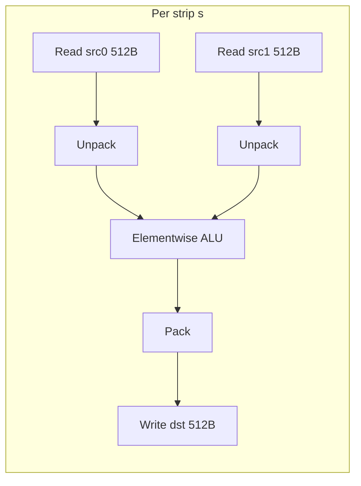
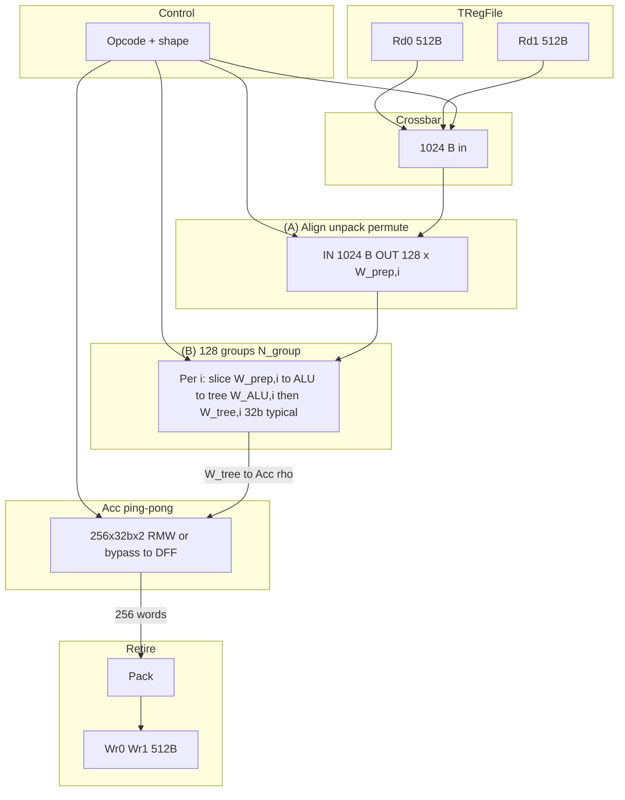
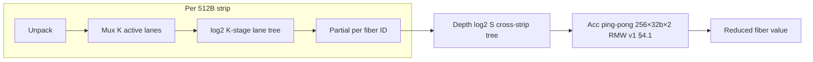

# VEC-4K-v2: Vector Unit for 4 KB PTO Tiles with Staging Registers and Per-Port Transpose

## 1. Purpose and Scope

This document specifies **VEC-4K-v2**, an evolution of [`vector4k.md`](vector4k.md) (VEC-4K v0.24) that paires the same **4 KB tile register file** ([`tregfile4k.md`](tregfile4k.md)) with a **restructured vector execution unit**. The functional ISA subset is unchanged from VEC-4K (§1 of [`vector4k.md`](vector4k.md)): elementwise tile–tile, tile–scalar, axis reduce / expand, and selected complex instructions (**TMRGSORT**, **TSORT32**, **TGATHER**, **TCI**, …).

**What is new in v2 (vs. [`vector4k.md`](vector4k.md)):**

1. **Up to three tile operands per instruction** (`A`, `B` = value tiles; `C` = per-element bitmask) — fetched through the **same** two 512 B read ports in a **variable-length operand-fetch phase** (§3, §6). Full-tile (unmasked) instructions skip the `C` fetch entirely.
2. **Up to two tile results per instruction** (`D0`, `D1`) — retired through the **same** two 512 B write ports.
3. **Per-read-port `is_transpose` bit — forwarded to the TRegFile** (**[`tregfile4k.md`](tregfile4k.md) §7**) so that any of `A`, `B`, `C` can be fetched in **row-mode or col-mode at full 512 B/cy** with no additional VEC-side datapath logic (§3.3). The staging register consumes the delivered strips in whichever mode TRegFile produced; element-level fixup for the non-aligned `W` regimes of [`tregfile4k.md`](tregfile4k.md) §7.5 is absorbed by the stage (A) align/unpack/permute block (§5.2). [`tregfile4k.md`](tregfile4k.md) §6 **rule R2** (uniform transpose per epoch) applies as a scheduling constraint — mixed-mode 3-operand instructions pay one extra epoch (§6).
4. **Tile-level metadata (32 b per tile register):** `shape.x`, `shape.y`, and `format ∈ {fp32, fp16, fp8, fp4}`. The metadata travels with the tile through the staging registers and drives the align/unpack/permute stage and the reduction-tree depth (§2.2, §5).
5. **Explicit staging registers** between the TRegFile read ports and the 512 B compute datapath: **`SA`, `SB`, `SC` (operand tile staging)**, **`SOP` (opcode + control staging)**, and **`SX`, `SY` (scalar staging)** (§4). Scalar operands may be sourced from the **scalar GPR register file**, from an **immediate** field of the instruction word, from a **tile element** `[r, c]`, or from an **ACC slot**; the source is encoded in the instruction word's `sx_src` / `sy_src` selectors and the corresponding 5-bit GPR index / immediate / tile-element pointer / ACC slot id (§4.3). GPR and immediate scalars are captured at issue and do not occupy any vector-side read-port cycles.
6. **Variable-length operand-fetch phase** — the number of cycles from "instruction issue" to "operand ready" depends on the number of tile operands, the TRegFile epoch alignment, and any port-sharing pressure (§6).
7. **Native 3-source `TFMA` — `D = A·B + C` with three tile-register operands (§7.6).** The classic FMA pattern `y = γ·x̂ + β` (final affine in LayerNorm / RMSNorm), Welford `μ_new = δ·inv_n + μ_old`, and elementwise `gelu` / `swiglu` / sin/cos kernels need a **third value-tile operand** that is **not** the accumulator. v2 promotes operand `C` to a **dual role** (mask **or** value tile, selected by the issue-time `c_role` bit, §3.3c) and binds a third VEC-side TRegFile read port (`R1` = Port C) so all three tiles fetch **in parallel within one 8-cy epoch** — same throughput as a 2-source op. Justification: ~2× throughput vs. emulated `MUL` + `ADD`, and one final rounding instead of two (avoids precision loss in narrow-format accumulation). Hardware cost: ~0 — the stage (B) per-lane FMA already supports `A·B + Z`; the only delta is binding port `R1` and routing `SC` value-mode read into the existing `MUX_Z` (§5.8).

8. **Three novel PTO instructions enabled by the v2 pipeline (§7.5):**
   - **`TINV`** — tile matrix inverse for square matrices up to **128×128 FP32 (16 tiles)** / 64×64 FP8 (single tile); Gauss–Jordan with Acc-resident pivot row and in-ALU Newton–Raphson reciprocal refinement, all microcode-driven, ~33 K beats for 128×128 FP32. Reuses the unified ALU + Acc feedback, `tilelet_xpose`, and per-lane predicate path; only new datapath addition is a small `RECIP` / `RSQRT` LUT+refine block on stage (B) (~50 K gate system-wide).
   - **`TROWRANGE_MUL`** — column-wise product over a dynamic row sub-range `[r_start, r_end)` (range from scalar GPRs), ~10 beats per call. Reuses the existing ACCUM / INIT / READOUT machinery with `alu_op = MUL` and a tiny (~100-gate) combinational predicate synthesiser for the row-range mask. Replaces the 3-pass `exp(sum(log(...)))` emulation with a single tile-resident pass.
   - **`TMRGSORT`** — full-tile mergesort / bitonic sort over any `N = 2^p` up to 8192 (FP4 tile), via a single **reconfigurable 256-lane perfect-shuffle + 128-way compare-swap** primitive activated by new `SHUFFLE_CAS_{UP,DOWN}` alu_ops. A microcode layer-schedule runs `p(p+1)/2 × ⌈N/256⌉` beats total (e.g. 36 beats for N=256, 220 beats for N=1024 FP32, 2.9 K beats for N=8192 FP4). Emits value + index tiles in one instruction via dual retire. Supports partial / predicated sort for free via the per-lane mask gate. New hardware cost ≈ ~130 K gate, roughly breakeven with v1's hard-wired `TSORT32` / `TMRGSORT` networks that it replaces, but supports all power-of-2 sort sizes in one piece of silicon.

The **compute datapath width remains 512 B** and the **TRegFile port count (2R + 2W × 512 B)** is unchanged (§3.1). Scheduling templates, reduction-tree depth formulas, Acc ping-pong, and `#W` / `K_outer` are **all carried over** from [`vector4k.md`](vector4k.md) §4–§9; v2 changes how **operands are delivered and staged**, not how they are computed.

> **Key architectural choice.** VEC-4K-v2 has **no input crossbar** between the staging registers and the compute pipeline. Instead, each compute beat is directly driven by a **microcode "beat instruction"** latched in `SOP` (§5.4) that nominates, for each of the up-to-three ALU operand slots, **which staging register** (`SA` / `SB` / `SC`), **which 512 B tilelet** (strip index `0..7` within the tile), and whether to apply a **tilelet-level transpose** (`tilelet_xpose`). The tilelet-level transpose is the same 8 × 8 chunk-grid transpose that [`tregfile4k.md`](tregfile4k.md) §7 implements at its read port — we reuse the algorithm locally inside VEC by organising each staging register with a **wrapped-diagonal bank skew** (§4.2.1) so that a tilelet can be delivered in either row-mode or col-mode per beat at full 512 B/cy, at zero scheduling cost. Element-level fixup for non-aligned `W` regimes reuses the existing stage (A) align / unpack / permute block ([`vector4k.md`](vector4k.md) §4.1 (A), [`tregfile4k.md`](tregfile4k.md) §7.5). The per-operand `is_transpose` bit on the TRegFile read port (§3.3) is retained as an optional tile-level pre-transpose (useful when one view of a tile is needed many times in a row), but the primary VEC-v2 transpose mechanism is the per-beat staging-side `tilelet_xpose`.
>
> **Consequence for reduction workloads.** With microcode-controlled per-beat tilelet dispatch and the accumulator RMW / ping-pong path of [`vector4k.md`](vector4k.md) §4.1, col-axis reductions (summing across the `R` axis) are expressed naturally as an accumulator-accumulate loop that processes one 512 B row-slice per beat (§5.6). Row-axis reductions (summing across the `C` axis) are rewritten as col-axis reductions on the tilelet-transposed operand — microcode flips `tilelet_xpose` on the relevant staging read and reuses the same accumulator pattern (§5.6.2). Narrow tiles (`W = C·E < 512 B`, multiple logical rows per strip) require a **final cross-slot accumulator merge** after the per-strip accumulate loop; §5.6.3 formalises this pattern. §5.7 walks through worked examples for both wide and narrow shapes for row-reduce and col-reduce, with microcode pseudo-code.
>
> **Operand role of C — mask / predicate only.** Unlike operands `A` and `B`, which are value tiles, operand `C` is specifically a **per-element bitmask** (1 bit per logical element of the active format) indicating which lanes of `A` / `B` participate in the ALU operation (§3.3c, §4.2.2). Instructions that do not need a mask (the common "full-tile" case) **do not fetch `C` at all** — this saves one operand-fetch epoch (§6.2) — and the stage (B) mask input defaults to `IMM_ALL_ONES` so every lane is enabled. True 3-value ternary operations (e.g. `TFMA` with an in-tile addend) use the accumulator feedback path (§5.5, §5.8) as their third value input, not the `C` tile.

> VEC-4K-v2 reintroduces the **narrow storage widths** (`fp8`, `fp4`) that [`vector4k.md`](vector4k.md) v0.24 removed. The `format` field in the tile-register metadata (§2.2) is **4 bits wide** to cover all encodings; the reduction tree still widens to FP32 in internal accumulate paths.

> **Self-contained reading.** §1–§10 below describe the VEC-4K-v2 architecture in full. Sections that say "unchanged from [`vector4k.md`](vector4k.md) §X" or "All op categories of `vector4k.md` §5 carry over" rely on a v1 baseline that is **also reproduced in this document, verbatim** in the **Appendix V1** at the end (§A.1 inheriting v1 §3.2; §A.2 inheriting v1 §4.2; §A.3 v1 §4.3; §A.4 v1 §4.4 worked examples A–E; §A.5 v1 §5 instruction categories baseline; §A.6 v1 §6 cross-lane summary baseline; §A.7 v1 §7 row-reduce datapath diagram; §A.8 v1 §9 legal `(format, R×C)` enumeration with all formulas, tables, and reduction-tree complexity analysis; §A.9 v1 §8 implementation notes baseline). Each appendix subsection is explicitly marked `(v1 → v2: 内容未变更, 完整复制自 vector4k.md §X)` so a reader of `vector4k_v2.md` alone obtains the complete and current design without consulting v1.

---

## 2. Tile, Format, and Tile-Register Model

### 2.1 Storage Invariant

Each logical tile occupies exactly **4096 bytes** in the TRegFile. Logical shape is **R × C**, both powers of two, row-major (same rule as [`vector4k.md`](vector4k.md) §2.1).

VEC-4K-v2 supports **four** logical formats, distinguished by the **storage bytes per element `E`**:

| `format` | Logical name | `E` (bytes / element) | Elements per 4 KB tile (`N = 4096 / E`) |
|----------|--------------|-----------------------|------------------------------------------|
| **`0b0000`** | **FP32**         | 4   | 1024 |
| **`0b0001`** | **FP16 / BF16**  | 2   | 2048 |
| **`0b0010`** | **FP8** (E4M3 / E5M2) | 1 | 4096 |
| **`0b0011`** | **FP4** (MXFP4 / HiFP4, packed nibbles) | 0.5 | 8192 |
| `0b01xx`–`0b11xx` | reserved | — | — |

Internal ALU / reducer operands are widened to **FP32** where required by ISA numerics (associative reduce, accumulate); pack / unpack at the align stage (**§5.2**) handles narrow-to-wide on ingest and wide-to-narrow on retire. FP8 and FP4 paths are **lanes-only** through the compute stage (no packed arithmetic in the reduce tree).

`elem_per_strip = 512 / E` — **128** FP32, **256** FP16/BF16, **512** FP8, **1024** FP4 logical elements per 512 B strip.

### 2.2 Tile-register metadata (32 bits per tile register)

Each entry of the TRegFile carries a **32-bit metadata word** alongside the 4096 B payload. The metadata is allocated per tile register (not per strip) and is **read together** with the first strip of the tile:

```
┌─────────────────────────────────────────────────────────────────────┐
│                    tile-register metadata (32 b)                     │
├────────────┬────────────┬───────────┬─────────┬────────────────────┤
│ shape.x    │ shape.y    │ format    │ flags   │ reserved           │
│ [13:0]     │ [27:14]    │ [31:28]   │ see §2.2│                    │
│ 14 b       │ 14 b       │ 4 b       │ (in flags overlay)          │
└────────────┴────────────┴───────────┴─────────┴────────────────────┘
```

| Field | Width | Range | Meaning |
|-------|-------|-------|---------|
| **`shape.x`** | 14 b | `1 … 8192` | Number of **columns `C`** (logical row length). Power-of-two values are required by §2.1; non-power-of-two encodings are reserved for future extensions. |
| **`shape.y`** | 14 b | `1 … 8192` | Number of **rows `R`**. Same power-of-two rule. |
| **`format`** | 4 b | §2.1 | Logical format code; selects `E` and unpack policy at stage **(A)** (§5.2). |
| **`flags`** | — | (aliased with high bits of `reserved`) | Optional per-tile hints: `arg_tile` (tile carries value∥index pairs for `TROWARG*` / `TCOLARG*`), `scalar_tile` (tile is a packed scalar broadcast source, §4.3), `prefetch_hint` (VEC may stream this tile sooner than others). Encoded by microcode. |

The metadata is written by the producing instruction (either an ISA-level `TSETMETA` or implicitly by the op that created the tile) and cannot change while the tile register is the target of any in-flight operand fetch. Consumers read the metadata **once** at operand fetch time; the decoded `E`, `R`, `C`, `format` are latched into the opcode staging register (**`SOP`**, §4.4) and remain valid for the entire compute phase of the instruction.

> Note: the **32-bit** metadata is orthogonal to the **`is_transpose`** bit on the **read port** (§3.3). `is_transpose` is per-read-op, per-port, and lives in the issue packet; the metadata lives with the tile register.

### 2.3 Shape–format consistency

A tile register is **legal** iff `shape.x · shape.y · E = 4096`. Microcode is responsible for checking this at tile allocation; the VEC compute stage assumes legality and does **not** verify it per cycle.

---

## 3. TRegFile Interface

### 3.1 Ports (v2: 3 read + 2 write, expanded from v1's 2R / 2W)

| Direction | Width | Count | Aggregate | v1 → v2 |
|-----------|-------|-------|-----------|---------|
| Read      | 512 B | **3** | **1536 B/cycle** | **v2 增量** (v1: 2 read ports). The third read port supports native 3-tile ops (`TFMA` family, §7.6); when no instruction in flight needs a third value tile, the port is idle and the kernel collapses to v1-equivalent 2-port operation. |
| Write     | 512 B | 2     | **1024 B/cycle** | unchanged from v1 |

Ports attach to the **8R / 8W TRegFile-4K** ([`tregfile4k.md`](tregfile4k.md) §3). VEC-4K-v2 binds **three** of the eight physical read ports — by convention **R0 = Port A** (phase 0), **R4 = Port B** (phase 4), **R1 = Port C** (phase 1) — and **two** of the eight physical write ports (**W0** = `D0`, **W4** = `D1`). The 3rd read port (R1) is the only structural change vs. [`vector4k.md`](vector4k.md) §3.1; everything else is identical: same 8-cycle epoch cadence, same `(reg_idx, is_transpose)` per epoch, same R2 uniform-transpose rule across all 3 active reads in any epoch ([`tregfile4k.md`](tregfile4k.md) §6).

> **Why a 3rd VEC read port (and not 2 epochs of fetch).** A real 3-source FMA `D = A·B + C` is the canonical kernel for LayerNorm / RMSNorm final affine (`y = γ·x̂ + β`), Welford incremental update (`μ_new = δ·inv_n + μ_old`, `M2_new = δ·δ_2 + M2_old`), Welford state merge (§7.6), `gelu` / `swiglu` activations, sin/cos polynomials, and any kernel where one operand is **not** the previous accumulator value (so v1's `TFMA_ACC D = A·B + Acc` does not apply). Without the 3rd read port, fetching three tiles takes **2 epochs = 16 cy** and halves throughput; with the 3rd port, fetch is **1 epoch = 8 cy**, matching binary ops and doubling the `TFMA` rate. The cost is one additional VEC-side read-port binding inside an already-8R TRegFile — zero new SRAM, zero new bank-conflict pressure (the diagonal skew already guarantees conflict-free 8-port read, [`tregfile4k.md`](tregfile4k.md) §4). For workloads that never issue a 3-tile op (pure elementwise / cube / reduce), R1 simply stays idle — energy is gated.

Each read port consumes one **`{reg_idx, is_transpose}`** pair per epoch (8 cycles; §3.2) and delivers **512 B/cy** across the epoch. Strips may be **row-mode** (linear bytes `s·512 … s·512+511` for strip `s`) or **col-mode** (8 × 8 chunk-grid transpose, [`tregfile4k.md`](tregfile4k.md) §7). The `is_transpose` bit is produced by VEC-4K-v2 (from the issue packet) and consumed by the TRegFile read port.

**Operand roles.** The three ISA-level tile operands have distinct payload semantics and distinct fetch policies. Operand `C` carries a **`c_role` selector** in the issue packet that picks between two payload interpretations (§3.3c).

| Operand | Role | Payload | Fetched when | Storage |
|---------|------|---------|--------------|---------|
| **A** | Value tile (primary) | `R × C × E` bytes of tile data | Always | `SA` (§4.2) |
| **B** | Value tile (secondary, optional) | `R × C × E` bytes of tile data | When the op is binary or ternary (`N_val ≥ 2`) | `SB` (§4.2) |
| **C** | **Dual role — `c_role = MASK`**: per-element bitmask (1 bit per element of `A` / `B`, selecting which lanes participate). **`c_role = VALUE`**: a third **full value tile** for native 3-source ops such as `TFMA D = A·B + C` (§7.6). | `c_role = MASK` → `⌈R · C / 8⌉` bytes of packed mask bits; `c_role = VALUE` → `R × C × E` bytes of tile data | `c_role = MASK` and `has_mask = 1`, **OR** `c_role = VALUE` and `N_val = 3` (e.g. `TFMA`, `TFNMA`, `TLERP`); skipped for full-tile binary / unary ops | `SC` (§4.2.2) — the same 4 KB diagonal-skew flip-flop array; `c_role` selects between the 128 × 1 b lane-predicate read port (mask mode) and the 512 B/cy value-tilelet read port (value mode) |

When `C` is not fetched, the stage (B) ALU's mask input defaults to `IMM_ALL_ONES` (§5.8) and every lane participates unconditionally; the value-FMA addend (`src_Z`) defaults to `IMM_ZERO` so `alu_op = FMA` collapses to `MUL` if a kernel mistakenly issues FMA without `c_role = VALUE`. Issue-time hardware checks `(c_role, has_mask, N_val)` for legality. Two value tiles plus a mask in one instruction (`A`, `B`, `C_mask`) requires a 16 cy fetch (one epoch for `A`+`B` + one piggyback strip for the mask, §6.2); three value tiles (`A`, `B`, `C_value`) fetch in parallel in **one** 8 cy epoch using a third VEC-side TRegFile read port (R1, §3.3a).

### 3.2 Strip / epoch model

- **Strip** = 512 B = one port beat.
- **Epoch** = 8 cycles = one full 4 KB tile on one read port.
- **Dual-port epoch**: two tiles × 8 strips on two read ports = **two 4 KB tiles consumed in 8 cycles**, as in [`vector4k.md`](vector4k.md) §3.2. For **masked** instructions (§3.3c, §6.3), the small mask payload (1–2 strips) piggybacks on an idle port cycle within a value-tile epoch — no extra epoch is needed in the common case.

### 3.3 Two transpose points: tregfile read port and staging-read tilelet xpose

VEC-4K-v2 exposes **two** orthogonal chunk-grid transpose mechanisms, both reusing the [`tregfile4k.md`](tregfile4k.md) §7 algorithm at 64 B sub-chunk granularity. Microcode chooses per-tile / per-beat which one to enable:

| Transpose point | Granularity | Control | When to use |
|------------------|-------------|---------|-------------|
| **TRegFile read port** — per-operand `is_transpose` at fetch time (§3.3a) | Whole tile, set once at operand fetch; [`tregfile4k.md`](tregfile4k.md) §7.4 col-mode | One bit in the issue packet, forwarded to R0 / R4 | When the compute phase re-reads the same tilelet many times and would prefer a pre-transposed cached view |
| **Staging read port** — per-beat `tilelet_xpose` at dispatch time (§3.3b, §4.2.1, §5.4) | Per 512 B tilelet, selectable every compute beat; chunk-grid (8 × 8 of 64 B chunks) | One bit per operand slot in each beat of the microcode program in `SOP` | Primary mechanism — default for reduction / reshape workloads; no scheduling cost |

#### 3.3a TRegFile read-port `is_transpose` (per-operand, [`tregfile4k.md`](tregfile4k.md) §7)

Each operand (`A`, `B`, `C`) carries an optional `is_transpose` bit in the issue packet. VEC-4K-v2 **forwards** this bit to the TRegFile read port that fetches the operand, reusing [`tregfile4k.md`](tregfile4k.md) §7.

| Operand | Read port (TRegFile) | Stored in | `is_transpose` realized by |
|---------|----------------------|-----------|----------------------------|
| **A**   | Port A (R0)          | `SA` | TRegFile-4K col-mode read on R0 ([`tregfile4k.md`](tregfile4k.md) §7) |
| **B**   | Port B (R4)          | `SB` | TRegFile-4K col-mode read on R4 |
| **C**   | **`c_role = VALUE`** (e.g. `TFMA`): Port C (**R1**, dedicated 3rd VEC-side read port — §3.1, [`tregfile4k.md`](tregfile4k.md) §3 reserves all 8 read ports). **`c_role = MASK`**: Port A **or** Port B (whichever is free during the value-tile epoch — the small mask payload of 1–2 strips piggybacks on idle cycles). | `SC` | TRegFile-4K col-mode read on whichever port fetches C |

**Mechanics.** Each read-port epoch takes 8 cycles and delivers one 4 KB tile. When `is_transpose = 0`, the 8 strips are row-mode (strip `s` = chunk-grid row `s` = bytes `s·512..s·512+511` of the source tile). When `is_transpose = 1`, the 8 strips are col-mode (strip `s` = chunk-grid column `s` = the 8 chunks `{(0,s), (1,s), …, (7,s)}` concatenated, i.e. the 8 × 8 chunk-grid transpose of the source tile; see [`tregfile4k.md`](tregfile4k.md) §7.4–§7.5). Strips are written into `SA` / `SB` / `SC` in **arrival order**: strip `s` goes to staging bytes `s·512 … s·512+511` regardless of mode, so the staging register always contains exactly what TRegFile delivered — no transpose is performed inside VEC.

**Consequences for scheduling.**

1. **`tregfile4k.md` §6 rule R2 applies.** The two physical read ports active in any 8-cycle TRegFile epoch must use the **same** `is_transpose` value; mixing `0` and `1` within one epoch is illegal. For 2-operand instructions this is the norm when both operands share the mode. For 3-operand instructions (and 2-op instructions with mismatched modes) microcode must split the fetch into two epochs — see §6.2 / §6.3 for the cycle accounting (`xpose_mismatch` term).
2. **Transpose granularity = chunk-grid (64 B).** The col-mode delivery from [`tregfile4k.md`](tregfile4k.md) §7.5 is an 8 × 8 chunk-grid transpose. For shapes where a logical row fits in one chunk (`W = C·E ≤ 64 B`) or is exactly one strip (`W = 512 B`), the delivery is element-level valid and stage (A) forwards it unchanged. For the other `W ∈ {128, 256, 1024, 2048, 4096}` regimes, stage (A) runs a byte-segment recombine (§5.2) that reuses the existing [`vector4k.md`](vector4k.md) §4.1 (A) align / unpack / permute block. This is exactly the downstream responsibility [`tregfile4k.md`](tregfile4k.md) §7.5 already places on col-mode consumers.
3. **Per-operand, not per-beat.** The TRegFile-side `is_transpose` is chosen once per operand fetch (one bit in `SOP` per operand slot). For per-beat flexibility, use the staging-side `tilelet_xpose` (§3.3b) instead — it is the primary mechanism and costs nothing at the TRegFile epoch level.

#### 3.3b Staging read-port `tilelet_xpose` (per-beat, primary mechanism)

Independently of the TRegFile-side bit, each compute beat's microcode (§5.4) carries a `tilelet_xpose` bit **per operand slot**. When set, the staging register (`SA` / `SB` / `SC`) delivers the **chunk-grid transpose** of the nominated tilelet (strip index `s ∈ 0..7`) for that beat. The delivery is produced by the staging register's diagonal-skew read datapath (§4.2.1), which is a local instantiation of the [`tregfile4k.md`](tregfile4k.md) §7.4 read datapath: a bank-select mux + 64 B output rotator driven by `{tilelet_xpose, s}`.

| `tilelet_xpose` | Tilelet delivered | Output byte `[l·64 … l·64+63]` holds |
|-----------------|--------------------|---------------------------------------|
| 0 (row-mode)    | chunk-grid row `s` of the staged tile | logical chunk `(s, l)` of the cached tile |
| 1 (col-mode)    | chunk-grid column `s` of the staged tile | logical chunk `(l, s)` of the cached tile, i.e. the 8 × 8 chunk-grid transpose |

Both modes run at **512 B/cy** with no extra cycles. The bit can flip every beat and is independent across the three operand slots (a given beat can e.g. read `SA` row-mode and `SB` col-mode in the same beat). Element-level fixup for the non-aligned `W` regimes is still the responsibility of stage (A) (§5.3 / [`tregfile4k.md`](tregfile4k.md) §7.5); the staging boundary only guarantees chunk-grid correctness.

Because `tilelet_xpose` is realised **inside** the VEC staging register (no TRegFile round-trip), it is unaffected by [`tregfile4k.md`](tregfile4k.md) §6 rule R2 and does not interact with operand-fetch scheduling.

#### 3.3c Operand `C` — dual role: per-element bitmask **or** value tile

Operand `C` carries an issue-time **`c_role`** selector that picks between two payload interpretations of the same `SC` staging register. The selector is one bit in the issue packet; both modes share the same diagonal-skew flip-flop layout (§4.2.2), the same write rotator, and the same fill rate (512 B / cy through the bound read port). Only the *read-side* differs:

| `c_role` | SC payload | SC read port | Used by |
|----------|------------|--------------|---------|
| **`MASK`** | Packed per-element bitmask (1 bit per logical element of the ALU's operating format) | **128 × 1 b lane-predicate** output → stage (B) ALU mask input | Masked elementwise (`TADD_M`, `TMUL_M`, …), masked reductions, `TSELECT` (§7.4), masked sort, masked gather |
| **`VALUE`** | A third **full value tile** with the same row-major `(r, c)` layout as `A` / `B` | **512 B / cy value-tilelet** output → stage (B) ALU `MUX_Z` input (§5.8) | Native 3-source ops: `TFMA D = A·B + C` (§7.6), `TFNMA`, `TLERP D = A·(1-C) + B·C`, future ternary kernels |

The `SC` staging register is **always 4 KB** (matching `SA` / `SB`, §4.2) regardless of mode; this avoids a second physical layout. Unused storage is don't-care — for `c_role = MASK` only the low `R · C / 8` bytes are written, and for FP32-tile masks this is 128 B (well within a single strip).

##### 3.3c.1 Mask mode (`c_role = MASK`) — unchanged from v0.16

When `c_role = MASK`, layout is row-major over the `R × C` element grid of the associated value tile:

```
  mask_bit(r, c) = SC[ (r · C + c) / 8 ].bit[ (r · C + c) % 8 ]
```

Total mask size is `R · C / 8` bytes. For a 4 KB FP32 tile this is 1024 elements → 128 B (well within a single strip); for FP16 it is 256 B; for FP4 it is 1024 B (2 strips).

**Fetch policy.** The issue packet carries a `has_mask` bit. When `has_mask = 0` the mask tile is **not read** — no TRegFile epoch is consumed for `C`, and the stage (B) mask input is tied to `IMM_ALL_ONES` statically by the microcode assembler. When `has_mask = 1`, microcode fetches `C` from TRegFile, short-circuiting to cover only the strips actually needed (`⌈R · C / (8 · 512)⌉`), trading one full 8-cycle epoch for as few as 1–2 strip cycles that piggyback on a value-tile epoch (§6.2, §6.3). The mask read uses the existing 2-port (R0 / R4) binding — the new R1 port is **not** used for masks, since the payload is too small to amortise an extra port.

##### 3.3c.2 Value mode (`c_role = VALUE`) — v2.1 增量, enables native 3-source TFMA

When `c_role = VALUE`, `SC` is read as a 512 B / cy value-tilelet (same datapath as `SA` / `SB`, §4.2.1). The microcode beat word's `src_C` field nominates `{strip_index s, tilelet_xpose xp}` per beat just like `src_A` / `src_B` (§5.4); the staged value enters the stage (B) ALU through the per-lane `MUX_Z` (§5.8), where it serves as the FMA addend (`A·B + Z` with `Z = SC[s]`).

**Fetch policy.** The issue packet's `c_role = VALUE` triggers a **3-port parallel fetch** in one epoch:

- **R0** ← tile `A` (Port A, phase 0)
- **R4** ← tile `B` (Port B, phase 4)
- **R1** ← tile `C` (Port C, phase 1; v2.1 增量 — see §3.1)

All three reads share the same 8-cycle epoch cadence and (per [`tregfile4k.md`](tregfile4k.md) §6 R2) the **same** `is_transpose` value. An instruction with mismatched `is_transpose_*` across the three operands splits the fetch into two epochs (16 cy); the common-case kernels for `TFMA` (LayerNorm `γ · x̂ + β`, Welford updates, etc.) all use uniform transpose, so the **typical fetch cost is 8 cy** — the same as a binary op (§6.2).

**Mask compatibility.** A 3-source value-FMA can still be **conditionally executed** by setting both `c_role = VALUE` and a separate `pred_src` field that points the lane-predicate input at one of `IMM_ALL_ONES` (default), `ACC_FLAG_*`, or a static immediate produced by the row-range predicate synthesiser (§7.5.2). The `SC` register cannot simultaneously carry both a mask and a value; for the rare case of a masked-3-source-FMA the kernel splits into two instructions (compute unconditional `TFMA`, then `TSELECT` with the mask).

##### 3.3c.3 Transpose for both modes

The `c_role = MASK` mask, conceptually, has the same logical `(r, c)` layout as the value tile; `is_transpose_C` and `tilelet_xpose` of the `SC` read port transpose the mask the same way they transpose a value tile, so masked-transpose ops stay consistent without extra handling. For `c_role = VALUE`, transpose semantics are identical to `SA` / `SB` (§3.3a, §3.3b) — the value tile is just a third operand, indistinguishable from a value-tile read on `SA` / `SB` from the staging-register perspective.

### 3.4 Read semantics (unchanged)

Read ports present **only** full 512 B bank-group strips. **No RF gather** ([`vector4k.md`](vector4k.md) §3.1, [`tregfile4k.md`](tregfile4k.md) §3). Column mux / sub-strip element extraction still happens **in VEC** after a strip lands in its staging buffer (§4, §5).

### 3.5 On-chip buffers

- **Staging registers `SA`, `SB`** — value-tile buffers: **diagonal-skewed flip-flop arrays**, 64 × 64 B sub-banks = 4096 B each plus metadata (§4.2, §4.2.1). Write port accepts a full 512 B strip per cycle through a 3-bit 8-way 64 B rotator; read port delivers 512 B/cy (128-lane data) in row-mode or col-mode selected by the microcode's `tilelet_xpose` bit (§3.3b).
- **Staging register `SC`** — **mask buffer**: same 4 KB diagonal-skew physical layout as `SA` / `SB` (§4.2.2), but its primary read port is a **128 × 1 b** lane-predicate output fed to the stage (B) ALU mask input (§5.8). Only the low `R · C / 8` bytes are written (the fetch typically takes 1–2 strip cycles, not a full 8-cycle epoch); unused regions are don't-care. `SC` is **not fetched at all** when `has_mask = 0`, in which case the mask input is tied to `IMM_ALL_ONES`.
- **Acc** — unchanged from [`vector4k.md`](vector4k.md) §4.1: **256 × 32 b × 2** ping-pong (**`N_run = 512`**).
- **Scalar broadcast / staging** — **§4.3**.

---

## 4. Staging Register File

VEC-4K-v2 introduces an explicit **staging register file** between the read ports and the 512 B compute datapath. The goals are:

- **Decouple** the TRegFile epoch cadence from the compute pipeline, so that the compute stage can start as soon as each operand lands (possibly out-of-order).
- Hold the **full 4 KB tile** for each operand while the reduction tree and `#W` waves of `TCOL*` iterate.
- Carry the **32-bit metadata** and the **`is_transpose`** bit alongside the payload.

### 4.1 Layout

```text
  ┌──────────────────────────────────────────────────────────────────────────┐
  │                        Read ports  (R0=A, R4=B)                           │
  │               512 B/cy                      512 B/cy                      │
  └────────────┬────────────────────────────────┬────────────────────────────┘
               │                                │
               ▼                                ▼
       ┌────────────────┐                ┌────────────────┐
       │  SA staging    │                │  SB staging    │
       │  • 4096 B data │                │  • 4096 B data │
       │  • 32 b meta   │                │  • 32 b meta   │
       │  • 1 b xpose   │                │  • 1 b xpose   │
       │  • valid / vld │                │  • valid / vld │
       └─────┬──────────┘                └─────┬──────────┘
             │                                  │
             │       ┌────────────────┐         │
             └──────▶│  SC staging    │◀────────┘   (optional 3rd operand;
                     │  • 4096 B data │             filled by whichever read
                     │  • 32 b meta   │             port is free during the
                     │  • 1 b xpose   │             second operand-fetch epoch;
                     │  • valid / vld │             §6.3)
                     └───────┬────────┘
                             │
                             ▼
               ┌────────────────────────────────────────────┐
               │  Scalar staging:  SX, SY                   │
               │    • 64 b scalar value                     │
               │    • source tag: GPR / IMM / TILE / ACC    │
               │    • filled at issue from scalar GPR RF    │
               │      (GPR/IMM: 0 vector-side cycles)       │
               │    • valid / broadcast mode                │
               └────────────────────────────────────────────┘
                             │
                             ▼
               ┌────────────────────────────────────────────┐
               │  Opcode / control staging:  SOP            │
               │    • opcode                                │
               │    • decoded (E, R, C) triples for A/B/C   │
               │    • per-port is_transpose latched         │
               │    • ucode_{base,len} (§5.4 microcode)     │
               │    • #W / K_outer / f parameters           │
               │    • retire mask (D0 / D1, widths)         │
               └────────────┬───────────────────────────────┘
                            │
                            ▼
                compute datapath (microcode-driven, align, 128 groups, Acc, pack)
                            │
                            ▼
                 ┌────────────────────────────┐
                 │  Write ports  (W0=D0, W4=D1)│
                 │  512 B/cy each             │
                 └────────────────────────────┘
```

### 4.2 Operand staging registers `SA`, `SB`, `SC`

`SA` and `SB` are **value-tile** buffers; `SC` is a **mask-tile** buffer (§3.3c). All three use the same 4 KB **diagonal-skewed flip-flop array** organisation (64 sub-banks × 64 B) for uniformity of the write datapath, but `SC` is read through a narrower **128 × 1 b lane-predicate** port (§4.2.2) rather than the 512 B value-tilelet port used for `SA` / `SB`. Each register holds **one full 4 KB tile** plus its metadata and per-operand control bits, with the **wrapped-diagonal skew** of [`tregfile4k.md`](tregfile4k.md) §2 / §7 allowing either row-mode or col-mode delivery (`tilelet_xpose ∈ {0, 1}`, §3.3b) at full port rate.

| Property | Size / behaviour |
|----------|------------------|
| Data payload | **4096 B** (= 64 × 64 B flip-flop sub-banks) |
| Storage layout | Logical chunk `(g, l)` at sub-bank `8·g + ((l + g) mod 8)` — same diagonal skew as [`tregfile4k.md`](tregfile4k.md) §2 |
| Fill rate | **512 B / cy** via the attached read port, through one 8-way 64 B write rotator steered by the arriving strip's chunk-grid row `g(t)` |
| Drain rate | **512 B / cy** to any ALU operand slot (§5.4), selected by a per-beat `{strip_index s, tilelet_xpose xp}` pair; bank-select mux + output rotator implement row/col-mode ([`tregfile4k.md`](tregfile4k.md) §7.4) |
| Double-buffering | **optional** — implementation may add a shadow tile so that the next instruction’s operand fetch can overlap with this instruction’s compute phase |
| Metadata | **32 b** latched on the **first** strip arrival |
| Strip-valid bits | **8 b** (one per chunk-grid row `g`) — compute can start on a tilelet as soon as the chunk-grid row(s) it needs are written, **without** waiting for the full tile |

The strip-valid bitmap is what makes the **variable-length operand-fetch phase** (§6) compatible with the microcode-driven beat schedule: the beat program (§5.4) nominates `{source, s, xp}` per operand slot, and the compute stage stalls for at most one cycle if the nominated tilelet needs sub-banks that are not yet marked valid.

> **Why three staging registers?** Predicated / masked ops (`TSELECT`, masked `TADD` / `TMUL`, `TGATHER` with selection mask, `TROWEXPAND*` with enable mask) need a per-element enable signal in addition to up to two value tiles. `SC` carries that mask. Full-tile ops don't fetch `SC` at all; the mask input to stage (B) defaults to `IMM_ALL_ONES` (§5.8).

#### 4.2.1 Diagonal-skew staging register (shared read datapath with [`tregfile4k.md`](tregfile4k.md) §7)

Because each staging register absorbs only 512 B/cy on the write side (one TRegFile strip) and delivers only 512 B/cy on the read side, a full-generality byte crossbar is unnecessary. Instead, we apply the [`tregfile4k.md`](tregfile4k.md) §2 / §7 diagonal-skew trick locally inside VEC: store the tile diagonally, and select row-mode or col-mode at the **read** port via a small bank-select mux + 64 B rotator.

**Storage layout.** The 4096 B flip-flop array is partitioned into **64 sub-banks of 64 B** each, arranged in 8 sub-bank groups `G0..G7` (8 sub-banks per group). Viewing the tile as an 8 × 8 chunk grid of 64 B chunks, logical chunk `(g, l)` is stored at

```
  bank_group = g                                   ← pure wiring
  bank_local = (l + g) mod 8                       ← 3-bit rotator on write
  bank_id    = 8·g + bank_local                    ← 0..63
```

This is the same wrapped-diagonal placement that makes [`tregfile4k.md`](tregfile4k.md) §7 col-mode bank-conflict-free.

**Write datapath.** TRegFile read ports deliver 512 B strips in whatever mode the operand-fetch `is_transpose` bit selected (§3.3a). The strip arriving at cycle `t` carries chunk-grid row `g(t)` (row-mode delivery) or chunk-grid column `g(t)` (col-mode delivery) of the source tile. A fixed 3-bit 8-way 64 B rotator, steered by `g(t)`, places logical lane `l` (= input byte position `l·64..l·64+63`) at physical `bank_local = (l + g) mod 8`. The write rotator is the same size and steering rule as the [`tregfile4k.md`](tregfile4k.md) §3 / §7.3 write-side rotator. For the purposes of staging, the *semantics* of chunks stored at `(g, l)` follow the mode TRegFile used: after row-mode fetch the staged "chunk `(g, l)`" is logical tile chunk `(g, l)`; after col-mode fetch it is logical tile chunk `(l, g)` (pre-transposed).

**Read datapath.** For each compute beat, the microcode nominates `{strip_index s, tilelet_xpose xp}` per operand slot. The staging register produces one 512 B tilelet per slot:

```
       ┌───────── xp = 0 (row-mode) ────────────────┐
       │ fetch 8 sub-banks of G_s, locals 0..7      │
       │ output rotator: rotate-left by s            │
       │ output lane l carries staged chunk (s, l)   │
       └────────────────────────────────────────────┘
       ┌───────── xp = 1 (col-mode) ────────────────┐
       │ fetch 1 sub-bank per group along diagonal:  │
       │   bank_i = 8·i + (s + i) mod 8, i = 0..7    │
       │ output rotator: identity                    │
       │ output lane i carries staged chunk (i, s)   │
       └────────────────────────────────────────────┘
```

Both modes fill the 512 B output bus every cycle. Read-side hardware = one bank-select mux (2-input per sub-bank) + one 64 B output rotator (active in row-mode only). `xp` may flip between beats, and may differ across the three operand slots in the same beat (SA col-mode + SB row-mode is legal).

**Element-level fixup (delegated to stage (A)).** Chunk-grid transpose is at 64 B granularity. For tile row widths `W = C·E`:

| `W` regime | Col-mode tilelet content | Element-level fixup (stage (A), §5.3) |
|------------|---------------------------|----------------------------------------|
| `W ≤ 64 B` (row fits in 1 chunk) | `512/W` whole rows per tilelet, 8 groups of `64/W` consecutive rows, stride `R/8` | None — stage (A) identity |
| `W = 512 B` (row = 1 strip) | 8 × 64 B slices from 8 distinct rows (one 16-FP32 col-band per row) | None when the ALU is per-lane element-wise; §5.6.2 walks through the accumulator pattern for reductions |
| `W ∈ {128, 256, 1024, 2048, 4096}` | 8 × 64 B row-segments from 8 distinct rows | Stage (A) byte-segment recombine (reuses [`vector4k.md`](vector4k.md) §4.1 (A) align / unpack / permute) |

**Cost (reference implementation, per staging register):**

| Block | Size |
|-------|------|
| Sub-bank storage | 64 × 64 B flip-flops = 4096 B |
| Write rotator | 1 × 8-way 64 B 3-bit rotator |
| Read bank-select mux | 2-input mux per sub-bank (row-mode path vs col-mode path), driven by `{xp, s}` |
| Read output rotator | 1 × 8-way 64 B 3-bit rotator (active in row-mode; bypassed in col-mode) |
| Strip-valid bitmap | 8 b per register |

**Per-cycle read / write conflict.** Since the 4096 B store is flip-flops (not 1R1W SRAM), a sub-bank can be written and read in the same cycle if the implementation exposes independent write and read ports per sub-bank. Early-start compute (§6) uses the strip-valid bitmap to order things; the write rotator targets the group `G_{g(t)}` currently arriving while the read side targets already-valid sub-banks.

#### 4.2.2 `SC` read path — lane-predicate expansion

`SC` shares the §4.2.1 write datapath with `SA` / `SB` (diagonal-skew, 64 × 64 B sub-banks, full row-mode / col-mode reads available), but its **primary output** is a **128-lane, 1-bit-per-lane predicate bus** that feeds the stage (B) ALU mask input (§5.8). A per-beat microcode field `mask_strip_index ∈ 0..7` selects which 64-bit chunk of packed mask bits is delivered; a small unpacker fans those 512 bits out to the 128 lane predicates according to the active format:

| Format | Elements per 128-lane group | Mask bits needed per beat | SC bytes read per beat |
|--------|------------------------------|----------------------------|--------------------------|
| FP32 / INT32 | 128 | 128 | 16 B |
| FP16 / BF16  | 256 (2 sub-lanes per 32-b group) | 256 | 32 B |
| FP8          | 512 (4 sub-lanes) | 512 | 64 B |
| FP4          | 1024 (8 sub-lanes, serialized as 2 sub-beats) | 1024 | 128 B |

For all formats the mask fits **in well under one 512 B tilelet**, so the SC read port typically consumes only a 16 B–128 B slice per beat; the bank-select mux of §4.2.1 is configured to emit the right slice, and the output rotator is bypassed (mask bits don't need a chunk-grid rotate — the unpacker handles lane ordering directly).

**Fetch short-circuit.** Since the total mask payload for a 4 KB tile at any format is at most 1024 B (2 strips), microcode fetches `SC` in **1 or 2 strip cycles** rather than a full 8-cycle TRegFile epoch when `has_mask = 1`. When `has_mask = 0`, `SC` is not accessed at all — no read port is allocated, no storage is written, and the stage (B) mask input is steered to `IMM_ALL_ONES` (§5.8) for every beat of the compute phase.

**Same-tile transpose behavior.** `is_transpose_C` and `tilelet_xpose` on an `SC` read reinterpret the packed-bitmap layout consistently with the value-tile transpose (§3.3a, §3.3b): a mask that's row-mode for its `A` partner stays row-mode; a mask paired with a col-mode `A` is fetched / read col-mode so element `(r, c)` lines up with the corresponding value lane.

### 4.3 Scalar staging `SX`, `SY`

Two **scalar** staging slots carry per-instruction scalar parameters:

| Slot | Width | Typical content |
|------|-------|-----------------|
| **`SX`** | 64 b (value) + 8 b (tag) | Primary scalar: immediate (`TADDS`), threshold (`TCMPS`), scale (`TMULS`, `TDEQUANT`), base (`TCI`) |
| **`SY`** | 64 b (value) + 8 b (tag) | Secondary scalar: stride (`TCI`), offset (`TCOLEXPAND*`), second compare operand, or FP packing metadata (`TCVT`) |

The **tag** distinguishes four source kinds; the first two are the common case:

- **Scalar GPR** (the PTO ISA encodes `sx_gpr`, `sy_gpr` — 5-bit register indices into the scalar general-purpose register file). At issue time the scalar GPR register file performs one 64-bit read for each used scalar slot and forwards the value directly into `SX` / `SY`. This is the normal way a PTO tile instruction takes non-immediate scalars — e.g. `TADDS Tdst, Tsrc, r5` (broadcast-add `r5`), `TMULS Tdst, Tsrc, r3` (scalar multiply by `r3`), `TDEQUANT Tdst, Tsrc, r1, r2` (scale `r1`, zero-point `r2`). The GPR file sits on the scalar-issue side of the core and is shared with the ordinary scalar pipeline; VEC-4K-v2 only sees the 64 b value that arrives with the instruction packet.
- **Immediate** (value is a literal field of the instruction word; common for small constants, compare thresholds, shift amounts).
- **Tile-element** (value is element `[r,c]` of some tile register, fetched as a **single-element read** — either by reading one strip and mux'ing, or by a dedicated "scalar tile" marked with the `scalar_tile` flag in metadata §2.2).
- **ACC slot** (value is slot `ρ` of the Acc ping-pong, e.g. after an in-place reduce; enables `TROWEXPAND*` with on-chip `v[r]`).

The instruction word reserves one 2-bit `sx_src ∈ {GPR, IMM, TILE, ACC}` selector and one 2-bit `sy_src` selector (plus the associated 5-bit GPR index / 16-bit immediate / tile-element pointer / ACC slot id payload). The selected value is latched into the corresponding `(value, tag)` slot **at instruction issue**, before the operand-fetch prologue (§6) begins — scalar GPR reads and immediate captures happen on the issue cycle itself and complete in 0 VEC-pipeline cycles, so **SX / SY are always valid by the time the first microcode beat fires**. Tile-element and ACC-slot sources that require a vector-side read instead piggyback on an idle read-port slot during the operand-fetch prologue (see §6.3 rule 4).

Scalars are **broadcast** across all 128 groups of stage (B) (§5.2) when referenced as an ALU operand (microcode `src_A` / `src_B` / `src_Z ∈ {SX, SY}`); they do **not** consume read-port bandwidth beyond the one scalar-GPR read at issue (or zero cycles for immediate). A beat that does not name `SX` / `SY` as a source leaves them untouched — the scalars persist for the duration of the compute phase.

### 4.4 Opcode / control staging `SOP`

`SOP` latches the **decoded instruction word** plus the **per-operand metadata union** at operand-fetch entry:

| Field | Width (approx) | Purpose |
|-------|----------------|---------|
| `opcode` | 8–10 b | PTO opcode id |
| `format_A`, `R_A`, `C_A` | 4 + 14 + 14 | Copied from `SA.meta` at first strip of A |
| `format_B`, `R_B`, `C_B` | 4 + 14 + 14 | Copied from `SB.meta` |
| `format_C`, `R_C`, `C_C` | 4 + 14 + 14 | Copied from `SC.meta` when `has_mask = 1`; otherwise unused. `format_C` is the *value-tile* format that the mask addresses (the mask itself is always 1 bit/element); `R_C = R_A`, `C_C = C_A` is the normal case |
| `has_mask` | 1 b | `0` = full-tile op (skip `SC` fetch, ALU mask input → `IMM_ALL_ONES`, §5.8); `1` = fetch `SC` (§3.3c, §4.2.2) and feed its lane-predicate bus to the ALU mask input |
| `is_xpose_A`, `is_xpose_B`, `is_xpose_C` | 1 + 1 + 1 | Latched from issue packet — **tregfile-side** transpose (§3.3a); the per-beat `tilelet_xpose_*` lives in the microcode word below. `is_xpose_C` is ignored when `has_mask = 0` |
| `retire_mask` | 2 b | Bit0 = `D0` written, bit1 = `D1` written |
| `retire_format_0`, `retire_format_1` | 4 + 4 | Format of each result tile (may differ from operand formats, e.g. `TCVT`) |
| `ucode_base`, `ucode_len` | 8 + 6 | Start address and length (in beats) of the microcode program driving the compute phase (§5.4); the microcode emits one **beat word** per compute cycle |
| `#W`, `K_outer`, `f` | 6 + 6 + 6 | `TCOL*` / `TROW*` wave parameters ([`vector4k.md`](vector4k.md) §5.3.2); resolved by the selected microcode program |
| `N_tree_en`, `N_acc_en` | 7 + 10 | Tree / Acc enable masks (bypass unused groups). **In the recommended baseline** (§5.8.1) the cross-group reducer network is physically absent, so `N_tree_en` is tied to `0` at synthesis time and the bits are reserved for an optional implementation that keeps the network. `N_acc_en` (Acc sub-bank enables) is always present and always driven live |

All fields are **stable** for the entire compute phase (operand fetch may update valid bits but must not change the latched metadata).

---

## 5. Vector Datapath Overview

### 5.1 High-level flow — no crossbar, microcode-driven tilelet dispatch

```text
  ┌────────────────────────────────────────────────────────────────────┐
  │     TRegFile-4K (R0=A, R4=B; W0=D0, W4=D1)                          │
  │  R0 (512B/cy, is_xpose_A)   R4 (512B/cy, is_xpose_B)               │
  └──────────┬──────────────────────────────┬───────────────────────────┘
             │                              │
             ▼                              ▼
        ┌──────────┐                   ┌──────────┐                  ┌──────────┐
        │ SA       │                   │ SB       │                  │ SC       │
        │ 4 KB FF  │                   │ 4 KB FF  │                  │ 4 KB FF  │
        │ diagonal │                   │ diagonal │                  │ diagonal │
        │ skew     │                   │ skew     │                  │ skew     │
        │ r/c read │                   │ r/c read │                  │ r/c read │
        └──────┬───┘                   └───┬──────┘                  └────┬─────┘
               │ 512B/cy per beat          │ 512B/cy per beat             │ 512B/cy per beat
               │  (s, xp) from μop         │  (s, xp) from μop            │  (s, xp) from μop
               ▼                           ▼                              ▼
       ┌─────────────────────────────────────────────────────────────────────────┐
       │           3 × 512 B OPERAND BUSES   (direct — no crossbar)              │
       │           +  SX / SY scalar broadcast (single 32/64 b, splayed to 128)   │
       └───────────────────────────────────────────────────────────┬──────────────┘
                                                                   │
                                                                   ▼
         ┌───────────────────────────────────────────────────────────┐
         │  (A) ALIGN / UNPACK / PERMUTE   (per operand slot)         │
         │    • format-aware unpack (fp32 / fp16 / bf16 / fp8 / fp4)  │
         │    • col-mode byte-segment recombine for non-aligned W     │
         │    • scalar broadcast splice                               │
         │    OUT: up to 3 × 128-slice operand streams                │
         └───────────────────────────┬───────────────────────────────┘
                                     ▼
         ┌───────────────────────────────────────────────────────────┐
         │  (B) 128 COMPUTE GROUPS  (shared with accumulator, §5.8)   │
         │    • per-slot input MUX: {operand_pipe, ACC_LO, ACC_HI,    │
         │                           SX, SY}  ← src_* from μop        │
         │    • ALU  (W_ALU,i bits) — 2 or 3 inputs                   │
         │    • reduce tree (W_tree,i bits; bypass on elementwise)    │
         └───────────────────────────┬───────────────────────────────┘
                                     ▼                            ▲
         ┌───────────────────────────────────────────────────────────┐
         │  ACC  (256 × 32 b × 2 ping-pong, split into LO/HI 128-slot │
         │        sub-banks, each 1R1W; no dedicated RMW adder)       │
         │   write ← μop acc_op (INIT/ACCUM/MERGE_STAGE/READOUT/NONE) │
         │   read  → feeds back into ALU input MUX above (two channels│
         │           LO + HI can be read concurrently)                │
         └───────────────────────────┬───────────────────────────────┘
                                     ▼
         ┌───────────────────────────────────────────────────────────┐
         │  Pack  (retire_format_0, retire_format_1)                 │
         └───────────┬───────────────────────────┬───────────────────┘
                     ▼                           ▼
              ┌──────────────┐            ┌──────────────┐
              │ D0 → Wr0     │            │ D1 → Wr4     │
              │ 512 B/cy     │            │ 512 B/cy     │
              └──────────────┘            └──────────────┘
                (retire_mask[0])            (retire_mask[1])
```

### 5.2 Why no crossbar

In VEC-4K v1 ([`vector4k.md`](vector4k.md) §4.1) and in VEC-4K-v2 drafts up to v0.4, a crossbar between the staging / port outputs and stage (A) served two needs: (i) swap which read port feeds which ALU operand slot, and (ii) route a col-mode fixup input alongside the row-mode stream. In v0.5 both needs dissolve:

1. **Operand-slot assignment** is now an explicit microcode field per beat (`src_{A,B,Z} ∈ {SA, SB, SX, SY, ACC_READ_LO, ACC_READ_HI, IMM_ZERO}`, and `mask_src ∈ {SC_mask, IMM_ALL_ONES, IMM_FROM_SOP}`, §5.4). Each value staging register (SA, SB) directly drives one of the two 512 B value-operand buses entering stage (A); SC drives the 1-bit-per-lane mask bus independently. The microcode pre-decided which register feeds which slot for each beat, so no arbitration is needed.
2. **Col-mode view selection** is now done **inside** each staging register (per-beat `tilelet_xpose`, §3.3b, §4.2.1). Stage (A) receives a fully-resolved 512 B tilelet in the requested mode and only has to run the element-level fixup (when `W ∈ {128, 256, 1024, 2048, 4096}`).

The datapath is therefore a **straight 2-lane value pipe** from `{SA, SB}` to stage (A) plus a **1-bit-per-lane mask sideband** from `SC`, with a scalar sideband (`SX`, `SY`) broadcast to 128 lanes on demand.

### 5.3 Stage (A) — format-aware unpack and element-level fixup

Stage (A) has two independent per-value-slot pipes (one each for the A, B inputs to the ALU) and a parallel 128-lane mask unpack lane. Each value pipe receives a 512 B tilelet per beat and performs:

1. **Format unpack** for `E ∈ {4, 2, 1, 0.5}`, widening to a 128-slot FP32-shaped operand stream. For `fp4`, a 512 B beat (**1024 logical elements**) is serialised into two back-to-back 128-slice sub-beats; microcode compensates by issuing two beats of the same `{src, s, xp}` pair with an fp4 sub-beat counter.
2. **Col-mode element-level fixup** when the tilelet arrived with `tilelet_xpose = 1` and the operand's `W = C·E` is in the non-aligned regime `{128, 256, 1024, 2048, 4096}`. This is the same shape-parameterized byte-segment recombine [`tregfile4k.md`](tregfile4k.md) §7.5 expects of any col-mode consumer, reusing the [`vector4k.md`](vector4k.md) §4.1 (A) align / unpack / permute block.
3. **Scalar splice.** When the beat names `SX` or `SY` as an operand slot source, stage (A) broadcasts the scalar value (after tag-driven extraction, §4.3) across all 128 lanes of that slot.

For the two aligned regimes (`W ≤ 64 B` or `W = 512 B`) stage (A) is identity for both row-mode and col-mode tilelets — no fixup is required.

### 5.4 Microcode beat format

`SOP.ucode_{base,len}` names a program of `ucode_len ≤ 64` **beat words**, one per compute cycle. Each beat word is ~64 bits wide and specifies:

| Field | Width | Description |
|-------|------:|-------------|
| `src_A`, `src_B`, `src_Z` | 3 × 3 b | **Value-input** source per ALU slot — drives the per-slot input MUX at stage (B) (§5.8): `{SA, SB, SX_broadcast, SY_broadcast, ACC_READ_LO, ACC_READ_HI, IMM_ZERO, —}`. `A` / `B` are the two primary inputs; `Z` is the optional 3rd value input (FMA addend) — typically set to `ACC_READ_*` for FMA-accumulate or to `—` for non-FMA beats. **Note:** `SC` is *not* a value source — it only feeds the mask input via `mask_src` below (§3.3c). `—` = slot unused. |
| `s_A`, `s_B`              | 2 × 3 b | Strip / tilelet index `∈ 0..7` for each value slot that sources from a staging register (`SA` / `SB`). The `Z` slot, when it sources `ACC_READ_*`, uses `acc_slot` below instead |
| `xp_A`, `xp_B`            | 2 × 1 b | Per-slot `tilelet_xpose` (§3.3b) — `1 = col-mode`, `0 = row-mode`. Ignored for `SX` / `SY` / `ACC_readback` / `IMM_ZERO` sources |
| `mask_src`                | 2 b     | **Mask-input** source: `{SC_mask, IMM_ALL_ONES, IMM_FROM_SOP, —}`. Defaults to `IMM_ALL_ONES` when `SOP.has_mask = 0` (the microcode assembler sets this statically). `SC_mask` reads through the `SC` lane-predicate port (§4.2.2) |
| `mask_strip`              | 3 b     | Strip (or sub-strip) index of `SC` to present on the mask bus this beat; ignored unless `mask_src = SC_mask` |
| `alu_op`                  | 5 b     | ALU operation at this beat (`ADD`, `SUB`, `MUL`, `FMA`, `FNMA` *= –A·B+Z*, `MAX`, `MIN`, `CMP`, `AND`, `XOR`, `PASS_A`, `PASS_B`, `SELECT`, **`RECIP`**, **`RSQRT`**, **`SHUFFLE_CAS_UP`**, **`SHUFFLE_CAS_DOWN`**, …). Overrides `SOP.opcode` per beat so that reduction loops can mix `PASS` (load) and `ADD` (accumulate) beats. `SELECT` uses the mask bus directly as its predicate. `RECIP` / `RSQRT` return the ~11-bit approximate reciprocal / reciprocal-square-root of `src_A` lane-wise, intended as a seed for 2–3 FMA-based Newton–Raphson refinement beats (used by `TINV`, §7.5.1). The reciprocal unit is a small per-group LUT + mantissa-shift block sharing the stage-(B) FMA's mantissa path; adding it costs ~50 K gate system-wide. `SHUFFLE_CAS_{UP,DOWN}` drive the 256-lane shuffle + compare-swap primitive (§7.5.3): inputs `(src_A, src_B)` are two 128-lane strips forming a 256-lane vector, an extra 3-bit **`shuffle_stride`** field (`2^0..2^7` = `{1, 2, 4, 8, 16, 32, 64, 128}`, reusing `xp_A` + `s_A` low bits of the beat word when `alu_op = SHUFFLE_CAS_*`) selects the log-stride butterfly permutation, and the 128 per-pair comparators emit `(min, max)` for `UP` or `(max, min)` for `DOWN`. Output is two 128-lane strips written back via `wr_en_D0 / D1` or to staging (§7.5.3). |
| `acc_op`                  | 3 b     | Accumulator behaviour: `{NONE, INIT, ACCUM, MERGE_STAGE, READOUT}` — see §5.5 |
| `acc_slot`                | 4 b     | Dual-use field (§5.5.1). **When `acc_op ∈ {ACCUM, INIT, READOUT}`**: low 2 b select LO / HI × ping-pong plane 0 / 1 (v0.9 semantics); upper 2 b unused / tied 0. **When `acc_op = MERGE_STAGE`**: bits `[2:0]` = `merge_bit ∈ 0..7` (the fold stride = `2^merge_bit`); bit `[3]` = `merge_base_parity` for partial-plane / per-row folds (§5.7.2, §5.7.3). The assembler forces `[2:0] = 7` for non-merge beats so the read MUX degenerates to the identity `LO = Acc[0..127], HI = Acc[128..255]` view |
| `wr_en_D0`, `wr_en_D1`    | 2 × 1 b | If set, the beat's pack / retire output is committed to `D0` / `D1` write port (targeting the next strip slot at the write port's FSM) |
| `wr_strip_D0`, `wr_strip_D1` | 2 × 3 b | Strip index to present on each write port when the corresponding `wr_en_*` is set |

The microcode program is a **read-only ROM lookup** keyed by opcode category + shape regime (`(opcode, W-regime, R-regime, format)`); microcode can be re-generated by a software assembler per workload without RTL change. `ucode_len` is typically 8 beats (plain element-wise on a single tile) through ~40 beats (narrow-tile col-reduce with accumulator merge).

Each beat word traces a straight path from `{src_*, s_*, xp_*}` through the staging-register read datapath (§4.2.1) to stage (A) to stage (B) to Acc to (optional) pack → `D0` / `D1`. No control state outlives the beat itself; the only state carried across beats is the accumulator ping-pong plane and the per-operand strip-valid bitmap.

### 5.5 Accumulator — banked dual-read, ALU-mediated RMW

The accumulator retains the 256 × 32 b × 2 ping-pong capacity of [`vector4k.md`](vector4k.md) §4.1 but reorganises its read / write ports so that the stage (B) ALU (§5.8) is the **only** arithmetic unit in the datapath — there is no separate accumulator adder.

**Physical layout.** Each of the two ping-pong planes is split into two 128-slot sub-banks:

```
  Plane P (= 0 or 1):
    sub-bank P.LO:  acc_slot  0 .. 127     ← 1R1W port (read_LO, write_LO)
    sub-bank P.HI:  acc_slot 128 .. 255    ← 1R1W port (read_HI, write_HI)
```

The split is by slot index; each sub-bank has one read port and one write port. Two reads from different sub-banks are concurrent; two reads inside the same sub-bank still serialise, but microcode never schedules that case (§5.6.3 `MERGE_STAGE` always pairs a low-range slot with a high-range slot, and `ACCUM` only touches one sub-bank per beat).

**Feedback to ALU input.** Each of the stage (B) ALU operand-input MUXes accepts `ACC_READ_LO` or `ACC_READ_HI` as a source (§5.4, §5.8); so `acc[k]` is just another operand the ALU can consume. The ALU output flows back to a write port of the same or the other sub-bank on the same beat — that is the "RMW" path.

**`acc_op` field — routing only, no arithmetic.** The microcode `acc_op` field is now a pure routing selector for the Acc write port (the arithmetic lives in `src_*` + `alu_op`):

| `acc_op` | Write-port behaviour (read / ALU routing is in `src_*`) |
|----------|---------------------------------------------------------|
| `NONE`        | Acc write ports idle; ALU output goes to Pack (bypass). Used for element-wise ops. |
| `INIT`        | ALU output written to `acc[acc_slot]`, overwriting the old value. First beat of a reduction pass — microcode normally pairs with `alu_op = PASS_A` so the ALU acts as a load. |
| `ACCUM`       | ALU output written to `acc[acc_slot]`. Pair with `src_B = ACC_READ_LO / HI` and `alu_op = ADD` (or `MAX`, …). For GEMM-style **FMA-accumulate**, use `src_A = SA, src_B = SB, src_Z = ACC_READ_*, alu_op = FMA`. Functionally identical to the previous "Acc RMW add" but performed by the stage (B) ALU via the feedback MUX. |
| `MERGE_STAGE` | Same write port as `ACCUM` but `src_A = ACC_READ_LO, src_B = ACC_READ_HI, alu_op = ADD` (or `MAX` for `argmax`-style merges). Both ALU inputs come from the Acc sub-banks; the stage (A) operand pipe is idle this beat. Writes back to the low sub-bank by default. |
| `READOUT`     | Read `acc[acc_slot]` through the ALU (`src_A = ACC_READ_{LO,HI}, alu_op = PASS_A`) and forward to Pack; Acc write ports idle. |

The same reduction programs of §5.6 and §5.7 remain valid with exactly the pseudo-code already shown — the `acc_op` keywords now denote the write-port behaviour while the read-back + arithmetic flows through the stage (B) ALU automatically. The concrete microcode-assembler expansion of `ACCUM` is

```
# microcode macro: ACCUM_ADD(op_src, op_slot, op_xp, k)
BEAT:
    src_A   = op_src      # SA / SB / SC (operand pipe)
    s_A     = op_slot
    xp_A    = op_xp
    src_B   = (k < 128 ? ACC_READ_LO : ACC_READ_HI)   # the one holding acc[k]
    alu_op  = ADD
    acc_op  = ACCUM
    acc_slot = k
```

and a `MERGE_STAGE` beat that halves the partial-sum count in narrow-tile reductions (§5.6.3) is

```
# microcode macro: MERGE_STAGE_ADD(lo_base, hi_base, width)
BEAT:
    src_A     = ACC_READ_LO   # slot = lo_base
    src_B     = ACC_READ_HI   # slot = hi_base
    alu_op    = ADD
    acc_op    = MERGE_STAGE
    acc_slot  = lo_base       # write destination
```

Microcode can equally issue `MAX` / `MIN` / `OR` at `MERGE_STAGE` beats to fold partial argmax / argmin / bitmask reductions — again entirely through the shared stage (B) ALU.

#### 5.5.1 Accumulator feedback MUX — `MERGE_STAGE` pair-selection network

The `MERGE_STAGE` beat asks the ALU, for every lane `k ∈ 0..127` in parallel, to consume the pair `(Acc[a_k], Acc[b_k])` and write the result back to `Acc[a_k]`, where the pair is chosen by a **microcode-programmable fold-bit** `merge_bit ∈ 0..7`:

```
  b_k = a_k ⊕ (1 << merge_bit)            # paired at stride 2^merge_bit
```

All nine `MERGE_STAGE` beats appearing in §5.6.3 / §5.7.2 / §5.7.3 / §5.7.4 are instances of this primitive with different `merge_bit` values (7 for LO↔HI, 6 for stride-64, 5 for stride-32, …, 0 for stride-1). This subsection specifies the physical layout and MUX network that realise it in **one cycle with no structural hazard**, and shows how the simpler `ACCUM` / `INIT` / `READOUT` access patterns fall out as a degenerate case of the same hardware.

**Physical layout — parity-indexed two-bank plane.** Each ping-pong plane holds 256 × 32 b in flip-flops, partitioned into two sub-banks by the **parity of the slot index**:

```
  bank(s)  = s[7] ⊕ s[6] ⊕ s[5] ⊕ s[4] ⊕ s[3] ⊕ s[2] ⊕ s[1] ⊕ s[0]   # XOR of all 8 bits
  intra(s) = s[6:0]                                                     # 7-bit intra-bank index

  Bank 0  (128 × 32 b, 1R1W, flip-flop)  ← slots with parity(s) = 0   e.g. {0, 3, 5, 6, 9, 10, 12, 15, …}
  Bank 1  (128 × 32 b, 1R1W, flip-flop)  ← slots with parity(s) = 1   e.g. {1, 2, 4, 7, 8, 11, 13, 14, …}
```

Parity-based partitioning is the *key* structural trick: any pair `(s, s ⊕ (1 << k))` for **any** `k ∈ 0..7` has opposite parity, hence the two pair members are **always in different banks**. This eliminates bank conflicts at every fold stride `2^k` and is what lets a single beat service all 128 lanes.

> The "sub-bank split by slot index" language in the earlier §5.5 paragraph refers to *this* parity split — the names `LO`, `HI` are preserved only as shorthands for the two ALU operand buses produced by the MUX network below, not as address ranges. At `merge_bit = 7` the MUX collapses to the familiar `LO = Acc[0..127]`, `HI = Acc[128..255]` view (see the fallback table below).

**Per-lane pair-address generator.** For each lane `k`, the address of the "canonical low" slot is produced by a tiny combinational block:

```
  a_k = insert_bit_zero(k, merge_bit)     # 8-bit output: bit merge_bit forced to 0, other 7 bits = k
  b_k = a_k | (1 << merge_bit)            # same 7 remaining bits, fold-bit set to 1
  bank_of_a_k = parity(a_k) = parity(k)   # because the forced-zero bit contributes 0 to the parity
```

where `insert_bit_zero(k, p)` is a 3-bit-controlled bit-shifter: `{k[6:p], 1'b0, k[p-1:0]}`. The total hardware per lane is one 8-mux → 3 gate levels, trivially combinational.

A useful consequence of `parity(a_k) = parity(k)`: the bank routing of lane `k` is **fixed independent of `merge_bit`** — lanes with even `parity(k)` always read/write Bank 0, odd lanes Bank 1. Only the *intra-bank address* `a_k[6:0]` varies with `merge_bit`.

**Read-side MUX network.** Each beat reads all 128 slots from each bank (the flip-flop register file exposes every slot combinationally), producing two 128 × 32 b = 512 B read planes `V_0` and `V_1`. A **3-bit-controlled 128→128 shuffle** per plane then steers the correct slot to each lane:

```
  Bank 0 output (128 × 32 b)  ──┐
                                 ├─▶  shuffle[merge_bit]  ─▶  U_0[k] = V_0[ intra(a_k if parity(k)=0 else b_k) ]
  Bank 1 output (128 × 32 b)  ──┤
                                 └─▶  shuffle[merge_bit]  ─▶  U_1[k] = V_1[ intra(b_k if parity(k)=0 else a_k) ]
```

The shuffle is implemented as a **two-level MUX tree**: `merge_bit[2]` selects among {stride ≤ 8, stride ≥ 16} butterflies, `merge_bit[1:0]` selects the specific butterfly stage. Area ≈ `128 × 32 b × 8:1 = 32 Kb × 3` MUX levels, roughly comparable to the ALU input-select layer (§5.8). Only 8 static permutations are needed — one per `merge_bit` value — so gate sharing across stages keeps the tree small.

**Swap MUX (per-lane 2:1).** The two shuffled buses `U_0`, `U_1` carry `{Acc[a_k], Acc[b_k]}` but in an order that depends on `parity(k)`. A per-lane 2:1 MUX keyed on `parity(k)` presents them to the ALU as `(LO, HI)`:

```
  if parity(k) = 0:   LO[k] = U_0[k],  HI[k] = U_1[k]
  else:               LO[k] = U_1[k],  HI[k] = U_0[k]
```

Cost: 128 × 32 b × 2:1 = one wired-OR layer, negligible vs. the ALU.

**ALU input.** `LO` and `HI` feed the stage (B) value-input MUXes (§5.8) as the `ACC_READ_LO` and `ACC_READ_HI` sources. `MERGE_STAGE` beats drive `src_A = ACC_READ_LO`, `src_B = ACC_READ_HI`, `alu_op = ADD` (or `MAX` / `MIN` / `OR` / `XOR` for non-sum merges); the 128-lane ALU produces 128 results in parallel.

**Write-back network.** The ALU's 128 × 32 b output `W[k]` is routed back via the **inverse** of the read-side shuffle + swap:

```
  lane k  ──▶  bank parity(k)  at intra-bank address a_k[6:0]
```

Because `parity(a_k) = parity(k)` is fixed, bank selection is a per-lane static routing (lane 0 → bank 0, lane 1 → bank 1, lane 2 → bank 1, lane 3 → bank 0, …). Only the *within-bank address* depends on `merge_bit`, via the same 3-bit-controlled permutation used on the read side. Per-bank area: one 64→64 reconfigurable permutation (since each bank receives exactly 64 writes per `MERGE_STAGE` beat, one per even-parity or odd-parity lane).

The paired slot `Acc[b_k]` is **not** written — its old value remains in the opposite bank. Subsequent `MERGE_STAGE` beats with a smaller `merge_bit` only touch canonical-low slots again (fold-bit = 0 of the new merge axis), so the untouched half becomes stale-but-unreferenced and never influences downstream beats. After a complete `log₂(W/E)`-beat fold chain only the final canonical-low slot of each fold chain carries useful data; Pack / retire then reads exactly those slots.

**Fallback for `ACCUM` / `INIT` / `READOUT` — the degenerate `merge_bit = 7` case.** These non-merge `acc_op` modes use the **same** physical machinery with `merge_bit` hard-wired to 7 and `HI` used either as the accumulate read-back or as a spare FMA addend path:

| `acc_op`  | `merge_bit` | `a_k` pattern | Effective mapping |
|-----------|-------------|---------------|-------------------|
| `ACCUM` (`acc_slot` → LO half) | 7 | `a_k = k`  (bit 7 forced 0, k∈0..127) | Read `LO[k] = Acc[k]`, HI idle or = `Acc[k+128]` (FMA addend). Write lane `k` → `Acc[k]`. |
| `ACCUM` (`acc_slot` → HI half) | 7 | `a_k = k + 128`  (bit 7 set by `acc_slot[0]`) | Read `LO[k] = Acc[k+128]`, HI idle. Write lane `k` → `Acc[k+128]`. |
| `INIT`    | 7 | `a_k = k` | Read suppressed; write lane `k` → `Acc[a_k]` with stage-A unpack output. |
| `READOUT` | 7 | `a_k = k` | Read `LO[k] = Acc[k]`, forward to Pack; write ports idle. |

With `merge_bit = 7` the read shuffle is the identity permutation, the swap MUX settles to `LO = Bank of parity 0 ∪ Bank of parity 1 = Acc[0..127]` automatically, and the network reproduces the v1-style `LO / HI` halves without any special casing in the microcode assembler.

**Microcode encoding (extension to §5.4).** `acc_slot` is widened from 2 b (v0.9) to 4 b:

- Bits `[2:0]` = `merge_bit` when `acc_op = MERGE_STAGE`; otherwise (ACCUM / INIT / READOUT) these bits are forced to 7 by the assembler and the field picks LO / HI + ping-pong plane (the original 4-state semantics of v0.9 are preserved).
- Bit `[3]` = `merge_base_parity` for partial-plane merges (e.g. the wide-row-reduce's 16-wide per-row fold uses bit 3 to mark "only even-indexed rows participate in this beat"). For full-plane merges bit 3 = 0.

**Cost summary.**

| Block | Approx. size | Note |
|-------|--------------|------|
| Per-plane flip-flop storage | 256 × 32 b = 8 Kb | unchanged from [`vector4k.md`](vector4k.md) §4.1 |
| Ping-pong duplication | × 2 | 16 Kb per VEC instance |
| Read shuffle MUX (per plane, × 2 banks) | 8-way 128 × 32 b permutation | ~0.5 × ALU input-layer area |
| Swap MUX | 128 × 32 b × 2:1 | 1 per lane, controlled by `parity(k)` |
| Write-back MUX | 8-way 64 × 32 b permutation per bank | same configuration input as read-side |
| **Net v2 vs. v1 (§5.8.1)** | +~1 ALU-input-layer's worth of MUX | absorbed by the simultaneous removal of the v1 dedicated Acc RMW adder; net area change ≈ 0 |

**Pipeline implications.** The `MERGE_STAGE` read → shuffle → ALU → write path closes in a single beat for 1-cycle ALU ops (`ADD`, `MAX`, `AND`, …). Back-to-back `MERGE_STAGE` beats at decreasing `merge_bit` never touch the same slot twice (each beat reads from both banks but writes only half), so no RAW hazard arises and no pipeline bubbles are needed. This is what allows the 4-beat fold chain of §5.7.2 (16 within-row partials → 1 row-sum) to run at 1 beat / cycle.

### 5.6 Reduction strategy

The combination of microcode-controlled tilelet dispatch, per-beat `tilelet_xpose`, and accumulator RMW gives VEC-v2 a simple, uniform way to express both axis reductions (`TCOL*`, `TROW*`) without any crossbar or dedicated reduce-tree schedule. The recipes below cover all legal tile shapes.

#### 5.6.1 Col-axis reduce (`TCOL*`) — primary pattern

`TCOL*` sums along the `R` axis of the `R × C` tile, producing a `1 × C` output. Per-element structure: each output column `j` = `Σ_i A[i, j]`. For tiles wide enough that each logical row occupies one or more full 512 B strips (`W = C·E ≥ 512 B`), the pattern is a direct accumulator loop:

```
# pseudo-code, tile A: R × C, W = C·E bytes, assume W = k · 512 (k = 1 for W = 512, k = 2 for W = 1024, etc.)
# output D0: 1 × C row-vector, packed into k strips

FOR j_band IN 0 .. k-1:              # which 512 B slice of the logical row
    acc_op = INIT                     # first beat of this col-band overwrites acc
    FOR row_i IN 0 .. R-1:            # every logical row
        s = row_i * k + j_band         # which strip of A holds row row_i's j_band-th slice
        BEAT:
            src_A = SA, s_A = s, xp_A = 0     # row-mode tilelet
            src_B = —                          # unary accumulate-add
            alu_op = PASS_A
            acc_op = (row_i == 0) ? INIT : ACCUM
            acc_slot = j_band
    BEAT:                             # one retire beat per col-band
        src_A = ACC_readback, acc_slot = j_band
        wr_en_D0 = 1, wr_strip_D0 = j_band
```

Total beats: `k · R + k` = `k · (R + 1)`. For the canonical `W = 512 B, R = 8` case this is `1 · 9 = 9` compute beats + fetch overhead, matching [`vector4k.md`](vector4k.md) §5.3's `#W = 1` template.

#### 5.6.2 Row-axis reduce (`TROW*`) via tilelet transpose (recommended baseline)

`TROW*` sums along the `C` axis, producing an `R × 1` output. Per-element structure: each output row `i` = `Σ_j A[i, j]`. The **recommended baseline** (no cross-group reducer network, §5.8.1) expresses row-reduce as a two-phase operation: (1) a col-axis-style `ACCUM` loop on the tilelet-transposed view of the operand, which collects row-sums as multiple partials per row spread across 128 lane-slots, followed by (2) a short `MERGE_STAGE` phase that folds those partials down to one sum per row. Both phases stay strictly lane-aligned; no data crosses a group boundary.

For the canonical `W = 512 B, R = 8` shape (one full row per strip), a col-mode staged read of strip `s` delivers chunk `(i, s)` of the tile on output lane `i` for `i = 0..7` — that is, the 16-FP32 col-band `[s·16 .. s·16+15]` from each of the 8 rows, one slice per lane-group of 16. After 8 `ACCUM` beats (one per col-band), the accumulator plane holds row-sums stored as **16 partial copies per row**, one per `k ∈ 0..15` within-row position. A chain of `log₂(16) = 4` `MERGE_STAGE` beats then folds the 16 within-row partials down to 1:

```
# pseudo-code, tile A: R × C with W = 512 B, R = 8 (canonical wide one-row-per-strip shape)
# output D0: 8 × 1 col-vector, packed into strip 0

# ---- phase 1: xpose-accumulate (8 beats) ----
FOR s IN 0 .. 7:                               # 8 col-band beats
    BEAT:
        src_A   = SA, s_A = s, xp_A = 1        # COL-MODE tilelet — chunk (i, s)
        alu_op  = PASS_A                        # per-lane identity, sum via acc_op
        acc_op  = (s == 0) ? INIT : ACCUM
        acc_slot = 0

# after phase 1: for g ∈ 0..7, k ∈ 0..15
#   acc[16·g + k] = Σ_{s=0..7} A[g, s·16 + k]   # 16 within-row partials per row

# ---- phase 2: within-row halving merge (log2(16) = 4 beats) ----
FOR stride IN {8, 4, 2, 1}:                    # halve the within-row k-axis each beat
    BEAT:
        acc_op   = MERGE_STAGE
        acc_slot = within-row, stride           # acc[16·g + k] += acc[16·g + k + stride]
                                               # for k ∈ 0..stride-1, g ∈ 0..7

# after phase 2: acc[16·g] = Σ_{j=0..127} A[g, j]   for g ∈ 0..7   (eight row-sums)

# ---- retire ----
BEAT:
    src_A = ACC_readback, acc_slot = 0
    wr_en_D0 = 1, wr_strip_D0 = 0               # pack slots {0, 16, 32, …, 112} → strip[0..7]
```

> **Why tilelet_xpose converts row-reduce into col-reduce.** In row-mode, strip `s` = logical row `s` of the tile (under `W = 512 B`), so accumulating strips across `s` would sum *different rows* — i.e. a col-axis reduction. In col-mode, strip `s` = chunk-grid column `s`, which means the same chunk-grid column (= the same col-band `[s·16 .. s·16+15]`) from every row is packed into one tilelet; accumulating across `s` now sums *different col-bands of each row into that row's own slot* — i.e. a row-axis reduction, spread over 16-FP32 sub-groups on each lane. The 16-way spread is then folded in-Acc by `MERGE_STAGE` without any cross-group wiring.

Total beats: `R + log₂(512 / E) + 1` when `W = 512 B` and the format is `E`-byte (`log₂(16) = 4` for FP32). For FP16 / BF16 (`E = 2`) the within-row fold is `log₂(32) = 5` beats; for FP8 (`E = 1`) it is `log₂(64) = 6` beats. For the same `W = 512 B` shape with `R < 8` the microcode fills the unused chunk-grid rows with implicit zero on initialization. For wider `W ∈ {1024, 2048, 4096}` the col-mode tilelet delivers 8 × 64 B row-segments per beat; stage (A)'s byte-segment recombine (§5.3) presents the right element-level slices to the per-lane ALU, and the same `ACCUM` + `MERGE_STAGE` pattern runs over a proportionally longer strip count.

> **Alternative configuration (§5.8.1, *not* recommended).** An implementation that keeps a cross-group reducer network of [`vector4k.md`](vector4k.md) §4.1 / §5.3.2 can collapse the `log₂` `MERGE_STAGE` beats into the pack stage of a single final beat, trimming phase 2 to 1 beat. The beat saving applies **only** to `TROW*` and comes at the cost of an additional 128-lane cross-group adder network in stage (B). See §5.7.2-alt for the corresponding 9-beat microcode.

#### 5.6.3 Narrow-tile reductions (`W = C·E < 512 B`) — final-stage accumulator merge

When a logical row is smaller than 512 B, each strip packs `512/W` full logical rows. The col-axis reduction of §5.6.1 is then more efficient — the accumulator can hold **`512/W` separate partial sums, stacked side-by-side**, because one strip contributes to that many partial sums in one beat. But because the per-strip ALU does element-wise add across 128 lanes (`alu_op = PASS_A` + `acc_op = ACCUM`), all `512/W` partial sums are produced in parallel: each 128-lane beat adds "row `r·(512/W) + k`" to accumulator slot `k` (`k = 0 .. 512/W − 1`).

After the initial per-strip loop, Acc contains `512/W` independent column-vector partials that still need to be summed together into the final `1 × C` answer. This is the **final accumulator merge** pass, which uses `acc_op = MERGE_STAGE` to hierarchically halve the partial count per beat:

```
# phase 1: per-strip accumulate (R / (512/W) strips total, i.e. 8 strips for a 4 KB tile)
acc_op = INIT
FOR strip_s IN 0 .. 7:
    BEAT:
        src_A = SA, s_A = strip_s, xp_A = 0
        alu_op = PASS_A
        acc_op = (strip_s == 0) ? INIT : ACCUM
        acc_slot = 0                             # all 512/W partials share the 128-slot plane

# after phase 1: acc[0 .. 127] = (512/W) × (C in FP32 slots)
#                partial_k[j]  = Σ_{row r ≡ k (mod 512/W)}  A[r, j]     for k = 0 .. 512/W − 1
#                                                                          j = 0 .. C − 1

# phase 2: hierarchical merge — log2(512/W) beats
FOR half IN log2(512/W) DOWNTO 1:              # e.g. 512/W = 8  →  halves = {4, 2, 1}
    BEAT:
        acc_op   = MERGE_STAGE
        acc_slot = <pair (low, high) in this halving step>
        # computes acc[low-band] ← acc[low-band] + acc[high-band]  across 128 lanes

# after phase 2: acc[0 .. C−1] = final col-axis sum (C ≤ 128 elements)

BEAT:                                          # retire
    src_A = ACC_readback, acc_slot = 0
    wr_en_D0 = 1, wr_strip_D0 = 0
```

Total beats: `R + log2(512/W) + 1`. For `W = 64 B` (i.e. `512/W = 8`), that is `R + 3 + 1 = R + 4` beats; for a 4 KB tile `R = 64` gives `68` beats, vs. the `R = 64` strip replays a v1 `TCOL*` would have needed (also ~64 beats, but with multi-wave accumulator management, [`vector4k.md`](vector4k.md) §5.3.2). The narrow-tile path wins by collapsing `#W` to 1 and replacing per-wave reduction control with a flat microcode loop.

Narrow-tile **row-reduce** is the dual problem — each strip already packs `512/W` full logical rows, each `W`-byte wide. The recommended baseline (no cross-group network) handles it by **per-strip accumulate + per-strip merge + drain-into-persistent-collector**:

1. `ACCUM` strip `s` into a scratch plane: each beat places `512/W` logical rows × `W/E` within-row partials into the 128 Acc slots (all `R / (512/W)` strips contribute if `R > 512/W`, otherwise just one strip is needed).
2. After all strips are accumulated, run `log₂(W/E)` `MERGE_STAGE` beats to fold the within-row partials down to one sum per row (same mechanics as the wide case above, just a smaller fold factor).
3. When the resulting `R` row-sums do not fit in one 128-slot plane (`R > 128`), the microcode splits the operation into `K_outer = ⌈R / 128⌉` outer waves, each processing a row-band. This is analogous to [`vector4k.md`](vector4k.md) §5.3.2's `K_outer` loop and typically covers all practical `(R, W)` corners — the worst case (e.g. `R = 64, C = 16`, 1024 within-row partials → overflows one plane) uses `K_outer = 2` at a total cost of ~24 beats (§5.7.4).

Stage (B) stays strictly lane-aligned for every beat of the above; the only "cross-lane" work is the `MERGE_STAGE` pair-merge within a sub-bank, which uses the Acc's own LO/HI read ports (§5.5) rather than a compute-group tree.

> **Alternative configuration.** An implementation carrying the optional cross-group reducer network can collapse each strip's within-row fold into the ALU beat itself (emitting `512/W` ready row-sums per beat), reducing the narrow-row-reduce cost to roughly `R / (512/W) + 1` beats — e.g. 9 beats for `R = 64, C = 16` vs. 49 beats in the recommended baseline (§5.7.4 scaling note gives the intermediate-`W` penalties, which taper rapidly to ≤2× as `W` approaches 512 B). See §5.7.4-alt.

### 5.7 Worked microcode examples

The four shape regimes below cover the corners of the wide / narrow × row-reduce / col-reduce space. All examples use FP32 (`E = 4`).

#### 5.7.1 Wide col-reduce — `R = 8, C = 128` (`W = 512 B`)

Tile layout: each logical row occupies exactly one 512 B strip. Output: `1 × 128` row-vector (one strip).

```
# 9 compute beats
BEAT 0:  src_A=SA, s_A=0, xp_A=0;  alu=PASS_A;  acc=INIT,  slot=0
BEAT 1:  src_A=SA, s_A=1, xp_A=0;  alu=PASS_A;  acc=ACCUM, slot=0
BEAT 2:  src_A=SA, s_A=2, xp_A=0;  alu=PASS_A;  acc=ACCUM, slot=0
BEAT 3:  src_A=SA, s_A=3, xp_A=0;  alu=PASS_A;  acc=ACCUM, slot=0
BEAT 4:  src_A=SA, s_A=4, xp_A=0;  alu=PASS_A;  acc=ACCUM, slot=0
BEAT 5:  src_A=SA, s_A=5, xp_A=0;  alu=PASS_A;  acc=ACCUM, slot=0
BEAT 6:  src_A=SA, s_A=6, xp_A=0;  alu=PASS_A;  acc=ACCUM, slot=0
BEAT 7:  src_A=SA, s_A=7, xp_A=0;  alu=PASS_A;  acc=ACCUM, slot=0
BEAT 8:  src_A=ACC_readback, slot=0;  wr_en_D0=1, wr_strip_D0=0
```

After BEAT 7, `acc[0..127]` = `Σ_{i=0..7} A[i, ·]`. BEAT 8 retires it as strip 0 of `D0`. Total: 9 beats.

#### 5.7.2 Wide row-reduce via tilelet_xpose — same shape, but reduce along `C` (recommended baseline)

Output: `8 × 1` col-vector (packed into strip 0 of `D0` at FP32 positions 0..7; remainder padded by Pack).

The recommended baseline (no cross-group reducer network) does **8 `ACCUM` beats with `xp_A = 1`, then 4 `MERGE_STAGE` beats with stride 8/4/2/1 along the within-row dimension, then 1 retire beat — total 13 compute beats**:

```
# ---- phase 1: xpose-accumulate (8 beats) ----
BEAT 0:  src_A=SA, s_A=0, xp_A=1;  alu=PASS_A;  acc=INIT,  slot=0
BEAT 1:  src_A=SA, s_A=1, xp_A=1;  alu=PASS_A;  acc=ACCUM, slot=0
BEAT 2:  src_A=SA, s_A=2, xp_A=1;  alu=PASS_A;  acc=ACCUM, slot=0
BEAT 3:  src_A=SA, s_A=3, xp_A=1;  alu=PASS_A;  acc=ACCUM, slot=0
BEAT 4:  src_A=SA, s_A=4, xp_A=1;  alu=PASS_A;  acc=ACCUM, slot=0
BEAT 5:  src_A=SA, s_A=5, xp_A=1;  alu=PASS_A;  acc=ACCUM, slot=0
BEAT 6:  src_A=SA, s_A=6, xp_A=1;  alu=PASS_A;  acc=ACCUM, slot=0
BEAT 7:  src_A=SA, s_A=7, xp_A=1;  alu=PASS_A;  acc=ACCUM, slot=0

# after phase 1: for g ∈ 0..7, k ∈ 0..15,
#   acc[16g + k] = Σ_{s=0..7} A[g, s·16 + k]    # 8 rows × 16 within-row partials each

# ---- phase 2: within-row halving merge (log2(16) = 4 beats) ----
BEAT 8:   acc=MERGE_STAGE, acc_slot={merge_bit=3}   # stride 2^3 = 8 slots
          # acc[16g + k] += acc[16g + k + 8]   for k ∈ 0..7, g ∈ 0..7
BEAT 9:   acc=MERGE_STAGE, acc_slot={merge_bit=2}   # stride 4
BEAT 10:  acc=MERGE_STAGE, acc_slot={merge_bit=1}   # stride 2
BEAT 11:  acc=MERGE_STAGE, acc_slot={merge_bit=0}   # stride 1
          # after beat 11: acc[16g] = Σ_{j=0..127} A[g, j]  for g = 0..7

# ---- retire ----
BEAT 12:  src_A = ACC_readback, acc_slot = 0
          wr_en_D0 = 1, wr_strip_D0 = 0
          # Pack gathers slots {0, 16, 32, 48, 64, 80, 96, 112} into strip[0..7]
```

Stage-by-stage data:

- Beat 0: `SA.read(s=0, xp=1)` delivers chunk-grid column 0 = 8 × 64 B slices, one per chunk-grid row `g`. For `W = 512 B`, chunk-grid row `g` = logical row `g`; so slice `g` holds logical row `g`, cols 0..15 (16 FP32 = 64 B). After INIT, `acc[16g..16g+15] = A[g, 0..15]` for `g = 0..7`.
- Beats 1–7: col-band `s → acc[16g..16g+15] += A[g, s·16 .. s·16+15]`. After beat 7, each row's sum lives as **16 copies spread across 16 consecutive Acc slots** — all strictly lane-aligned.
- Beats 8–11: in-Acc pair-merge at strides 8, 4, 2, 1 along the within-row axis (`k ∈ 0..15`). Implementation reuses the stage (B) ALU via `src_A = ACC_READ_LO, src_B = ACC_READ_HI, alu_op = ADD` (§5.5); the sub-bank LO/HI split is programmed by the microcode assembler to pair slots at the requested stride. No cross-group fold of any kind.
- Beat 12: retire — Pack picks one slot per row (slot `16·g + 0` for `g = 0..7`) and emits 8 FP32 values into positions 0..7 of strip 0 of `D0`.

**Cost summary:** 13 compute beats vs. 9 for `TCOL*` on the same shape (§5.7.1). The 4-beat overhead is the inherent cost of folding the 16 within-row partials without a cross-group adder.

##### 5.7.2-alt Wide row-reduce with cross-group reducer network (alternative configuration, *not* recommended)

An implementation that keeps the [`vector4k.md`](vector4k.md) §4.1 / §5.3.2 cross-group reducer network (`N_tree = 128 → 8` fold programmable, §5.8.1) can compress phase 2 into the pack step of a single beat:

```
# 9 compute beats, identical structure to 5.7.1 but with xp_A = 1 and tree enabled at retire
BEAT 0:  src_A=SA, s_A=0, xp_A=1;  alu=PASS_A;  acc=INIT,  slot=0
BEAT 1:  src_A=SA, s_A=1, xp_A=1;  alu=PASS_A;  acc=ACCUM, slot=0
 …
BEAT 7:  src_A=SA, s_A=7, xp_A=1;  alu=PASS_A;  acc=ACCUM, slot=0
BEAT 8:  src_A=ACC_readback, slot=0;  N_tree_en={128 → 8 fold};  wr_en_D0=1, wr_strip_D0=0
```

After beat 7, `acc[16g..16g+15] = Σ_{j=0..127} A[g, j]` stored as 16 copies per row (same as phase 1 above). At beat 8 the cross-group reducer-tree folds the 16 copies per lane-group to 1 FP32 per row, packing the 8 row-sums directly into strip 0 of `D0`. **Saves 4 beats for `TROW*` only**, at the cost of a 128-input programmable reducer network in stage (B). No other instruction class benefits.

#### 5.7.3 Narrow col-reduce — `R = 64, C = 16` (`W = 64 B, 512/W = 8`)

Each strip packs 8 logical rows × 16 FP32. Output: `1 × 16` row-vector.

```
# phase 1: 8 per-strip accumulate beats
BEAT 0:  src_A=SA, s_A=0, xp_A=0;  alu=PASS_A;  acc=INIT,  slot=0
BEAT 1:  src_A=SA, s_A=1, xp_A=0;  alu=PASS_A;  acc=ACCUM, slot=0
BEAT 2:  src_A=SA, s_A=2, xp_A=0;  alu=PASS_A;  acc=ACCUM, slot=0
BEAT 3:  src_A=SA, s_A=3, xp_A=0;  alu=PASS_A;  acc=ACCUM, slot=0
BEAT 4:  src_A=SA, s_A=4, xp_A=0;  alu=PASS_A;  acc=ACCUM, slot=0
BEAT 5:  src_A=SA, s_A=5, xp_A=0;  alu=PASS_A;  acc=ACCUM, slot=0
BEAT 6:  src_A=SA, s_A=6, xp_A=0;  alu=PASS_A;  acc=ACCUM, slot=0
BEAT 7:  src_A=SA, s_A=7, xp_A=0;  alu=PASS_A;  acc=ACCUM, slot=0

# after phase 1:
#   for k = 0..7, j = 0..15:
#     acc[16k + j] = Σ_{strip s = 0..7} A[8s + k, j]
#                  = Σ_{rows r ≡ k (mod 8), r ∈ 0..63} A[r, j]
#   i.e. acc has 8 × 16 = 128 slots, each a partial col-sum over 8 rows

# phase 2: hierarchical merge (log2(8) = 3 beats)
BEAT 8:   acc=MERGE_STAGE, acc_slot={merge_bit=6}  # acc[0..63]  += acc[64..127]   (stride 64)
BEAT 9:   acc=MERGE_STAGE, acc_slot={merge_bit=5}  # acc[0..31]  += acc[32..63]    (stride 32)
BEAT 10:  acc=MERGE_STAGE, acc_slot={merge_bit=4}  # acc[0..15]  += acc[16..31]    (stride 16)

# after phase 2: acc[0..15] = final col-axis sum = Σ_{r=0..63} A[r, ·]

BEAT 11: src_A=ACC_readback, slot=0;  wr_en_D0=1, wr_strip_D0=0   # retire
```

Total: `8 + 3 + 1 = 12` compute beats. The output populates FP32 positions 0..15 of strip 0 of `D0`; the remainder of the strip is zero-filled by Pack (determined by the retire mask that tracks the logical output shape `1 × 16`).

#### 5.7.4 Narrow row-reduce — same shape, reduce along `C` (recommended baseline)

Each strip packs 8 logical rows × 16 cols × FP32. Output: `64 × 1` col-vector (64 FP32 = 256 B = half a strip).

This is the **worst case** for the no-cross-group-tree baseline: each strip's 128 lanes fill exactly one 128-slot plane, so the 16 within-row partials for that strip's 8 rows cannot be merged with another strip's partials in parallel. The microcode therefore uses `K_outer = 8` — one strip per outer wave — and relies on a byte-granular retire mask (already present for Pack) to emit each wave's 8 row-sums to its own 32-byte region of `D0`:

```
# repeat for s = 0..7:
FOR s IN 0..7:
    #   phase 1: accumulate strip s into LO plane (1 beat)
    BEAT 6·s + 0:  src_A=SA, s_A=s, xp_A=0;  alu=PASS_A;  acc=INIT, slot=LO
                   # after this beat: acc[16·r + k] = A[8s + r, k]  for r∈0..7, k∈0..15

    #   phase 2: within-row halving merge, log2(16) = 4 beats
    BEAT 6·s + 1:  acc=MERGE_STAGE, acc_slot={merge_bit=3}   # stride 8
    BEAT 6·s + 2:  acc=MERGE_STAGE, acc_slot={merge_bit=2}   # stride 4
    BEAT 6·s + 3:  acc=MERGE_STAGE, acc_slot={merge_bit=1}   # stride 2
    BEAT 6·s + 4:  acc=MERGE_STAGE, acc_slot={merge_bit=0}   # stride 1
                   # after beat 6·s + 4: acc[16·r] = Σ_k A[8s + r, k]  for r∈0..7

    #   phase 3: partial retire — pack 8 row-sums into bytes [32·s .. 32·s + 31] of strip 0 of D0
    BEAT 6·s + 5:  src_A = ACC_readback, slot = LO
                   gather slots {0, 16, 32, 48, 64, 80, 96, 112} → 8 FP32 = 32 B
                   wr_en_D0 = 1, wr_strip_D0 = 0, wr_byte_mask = [32·s .. 32·s + 31]
```

Total: **49 compute beats** (`8 × 6 + 1` ≈ `8 × 6` once the final per-strip retire subsumes the final drain). This is ~5.4× more expensive than the 9-beat cross-group-tree version (§5.7.4-alt). The blow-up is concentrated in the `R × log₂(W/E) = 64 × 4 = 256` MERGE beats plus the per-wave partial-retire overhead.

> **Scaling note.** The `~6` beats-per-wave factor above is roughly `1 + log₂(W/E) + 1`. For the more common narrow shapes:
> - `W = 128 B, R = 32` (FP32): `K_outer = 4`, ~`4 × (1 + 5 + 1) = 28` beats (~3.1× cross-group-tree).
> - `W = 256 B, R = 16` (FP32): `K_outer = 2`, ~`2 × (1 + 6 + 1) = 16` beats (~1.8× cross-group-tree).
> - `W = 512 B, R ≤ 8`: falls back to §5.7.2, only +4 beats (≤1.45×).
>
> So the no-cross-group-tree penalty is largest at the narrowest extreme and tapers off rapidly for wider tiles.

##### 5.7.4-alt Narrow row-reduce with cross-group reducer network (alternative configuration, *not* recommended)

An implementation that keeps the cross-group reducer network (§5.8.1 alternative) can do the per-strip 16 → 1 fold inside stage (B) directly, collapsing each strip's ALU beat into an 8-row-sum-producing beat and using a trivial 8-slot collector:

```
# 8 compute beats + 1 retire beat (the cross-group reducer tree runs inside stage (B) each beat)
FOR s IN 0..7:
    BEAT s:
        src_A = SA, s_A = s, xp_A = 0
        alu_op = TREE_ROW_REDUCE(16 → 1)              # reduce each 16-lane row-group to 1
        acc_op = (s == 0) ? INIT : ACCUM              # writes 8 row-sums per beat into 8 slots
        acc_slot = row-band s                          # slot-band s holds rows 8s..8s+7

# after beat 7: acc[0..63] = row-sums for rows 0..63
BEAT 8: src_A=ACC_readback, slot=0;  wr_en_D0=1, wr_strip_D0=0
```

Total: 9 compute beats. **Saves ~8 beats** vs. the recommended baseline at the cost of the cross-group adder network. As for §5.7.2-alt, the benefit applies only to `TROW*` family instructions.

### 5.8 Stage (B) — unified ALU shared with the accumulator

Stage (B) keeps the same **128 independent compute groups** (`N_group = 128`) and the same per-group SIMD width `W_ALU,i` as [`vector4k.md`](vector4k.md) §4.1 / §9.3.2 — including the per-group *intra-group tree* that folds a narrow-format SIMD lane back down to a single 32 b FP32 partial before the Acc write port. In v2 each ALU group also serves as the **accumulator ALU**: the dedicated Acc RMW adder that [`vector4k.md`](vector4k.md) §4.1 drew as a block between stage (B) and the Acc register file is **removed**; its function moves into the main stage (B) ALU via an input-side MUX and an Acc readback path.

The **cross-group reducer network** of [`vector4k.md`](vector4k.md) §5.3.2 — a separate programmable fold that combines outputs of multiple groups in one beat — is **removed from the recommended v2 baseline** (§5.8.1). Row-axis reductions that the v1 tree handled in one beat are expressed in v2 as `tilelet_xpose` + `ACCUM` + a short `MERGE_STAGE` chain (§5.6.2, §5.7.2, §5.7.4); all of this stays strictly lane-aligned. §5.8.1 preserves the analysis and the alternative implementation that *does* keep the cross-group network, as a reference for implementations that prioritise `TROW*` throughput over stage (B) area.

```text
  stage (A) value pipes (2 × 128-slice)        SC (mask buffer, §4.2.2)
      SA→  ─┐              SB→  ─┐                 │
            │                    │                 │  128 × 1 b predicate bus
            ▼                    ▼                 ▼
       ┌────────┐           ┌────────┐       ┌──────────────┐
       │ MUX_A  │           │ MUX_B  │       │  mask_src    │
       │ value  │           │ value  │       │   MUX        │
       │ src_A={│           │ src_B={│       │ ={SC_mask,    │
       │  SA,   │           │  SB,   │       │   IMM_ALL_1, │
       │  ACC_LO│           │  ACC_LO│       │   IMM_SOP}   │
       │  ACC_HI│           │  ACC_HI│       └──────┬───────┘
       │  SX,SY,│           │  SX,SY,│              │
       │  IMM_0 }           │  IMM_0 }              │
       └───┬────┘           └───┬────┘              │
           │                    │                   │
   (src_Z MUX — optional 3rd value input for FMA:   │
    {ACC_LO, ACC_HI, SX, SY, IMM_0}) ──────┐        │
                                          │        │
           ▼                    ▼         ▼        ▼
       ┌──────────────────────────────────────────────────┐
       │            128-lane ALU group                     │
       │   value inputs: A, B, (optional Z)               │
       │   mask input:   M  (per-lane enable)             │
       │   alu_op:  ADD / MUL / FMA / MAX / CMP /         │
       │            AND / XOR / SELECT / PASS_A / …       │
       │   per-lane gate: if (M[lane]=0) output[lane] ←   │
       │                     A[lane]    (masked → identity)│
       └──────────────────────┬───────────────────────────┘
                              │
             ┌────────────────┼──────────────────┐
             │                │                  │
             ▼                ▼                  ▼
        ┌─────────┐     ┌─────────┐        ┌───────────┐
        │ Pack    │     │ Acc.LO  │        │ Acc.HI     │
        │ (bypass │     │ (1R1W,  │        │ (1R1W,     │
        │  D0/D1) │     │ 128 slot)│        │ 128 slot)  │
        └─────────┘     └────┬────┘        └────┬──────┘
                             │                  │
                             └────── read ──────┘
                             feeds MUX_A / MUX_B / MUX_Z above
                             (two concurrent read channels: LO + HI)
```

**Added / changed hardware vs. [`vector4k.md`](vector4k.md) §4.1 Stage (B) + Acc:**

| Block | Width | Note |
|-------|-------|------|
| Per-value-slot input MUX (A, B, optional Z) | 6:1, 128 × `W_ALU,i` | Source is `{SA, SB, ACC_READ_LO, ACC_READ_HI, SX_bcast, SY_bcast, IMM_ZERO}`; driven by beat word's `src_*` field. **SC is not listed as a value source** — it feeds the mask input only |
| Mask-input MUX | 3:1, 128 × 1 b | Source `{SC_mask, IMM_ALL_ONES, IMM_FROM_SOP}`; `IMM_ALL_ONES` is the default when `SOP.has_mask = 0` (§4.4) |
| Per-lane gate | 128 × 2:1 on the `W_ALU,i`-bit ALU output | `out[lane] = M[lane] ? alu_core_out[lane] : A[lane]` — an unmasked lane preserves the incoming `A` value (for `TSELECT`-style semantics) or takes the old accumulator value (for masked `ACCUM`). The exact fall-through is selected by `alu_op` (`SELECT` returns `B` instead of `A` when `M = 0`, etc.) |
| Acc sub-bank split | — | Single 256 × 32 b plane split into LO (0..127) + HI (128..255) sub-banks; each 1R1W. Same total storage, free concurrent LO+HI read |
| Acc → ALU feedback wires | 2 × 128 × 32 b | `ACC_READ_LO` and `ACC_READ_HI` routed to all three value-input MUXes |
| **Removed:** separate Acc RMW adder | — | Function folded into stage (B) ALU via feedback |

The net area change is approximately neutral: the dedicated Acc adder disappears; the MUXes and extra Acc sub-bank read port replace it. The big win is **functional**: a single ALU now realises element-wise compute, Acc init (`INIT`), Acc accumulate (`ACCUM` = FMA-accumulate with `src_Z = ACC_READ_*`), Acc cross-slot merge (`MERGE_STAGE` with both value inputs from Acc), Acc readout (`READOUT`), and all **masked / predicated** variants of each of the above (simply by flipping `mask_src` from `IMM_ALL_ONES` to `SC_mask`) — any op the ALU supports is automatically available for every `acc_op` mode **and** every masked / unmasked mode (e.g. masked `MAX`-reduction for conditional argmax, masked `OR`-reduction for sparse-bitmask accumulation, predicated `ADD` for sparse vectors, etc.) with **no additional datapath hardware**.

**Pipeline implications.** Stage (B) ALU → Acc write → Acc read feedback forms a loop at the granularity of one beat. For a 1-cycle ALU (integer add, fp16 add, simple compare) this loop closes in one cycle and back-to-back `ACCUM` beats to the same `acc_slot` chain without bubbles. For a multi-cycle ALU (fp32 FMA — typically 2–3 cycles), back-to-back `ACCUM` on the **same slot** introduces a bubble of `latency(ALU) − 1` cycles unless the compiler schedules the work across multiple `acc_slot`s (double-buffered reduction), which is already the standard `#W`-wave policy of [`vector4k.md`](vector4k.md) §5.3.2. The `MERGE_STAGE` pattern never RMWs the same slot back-to-back, so it is bubble-free.

What is new in v2 vs. v1 at this stage is only that the **microcode beat word** of §5.4 drives ALU op-code, input MUX selectors, reducer-tree configuration, and Acc write routing **per beat** rather than via a calendar template id — and that the accumulator ALU *is* the compute ALU.

#### 5.8.1 Compute-group count, per-group width, and the two kinds of tree

This subsection nails down three things that the inherited [`vector4k.md`](vector4k.md) §4.1 diagrams leave partially implicit: (a) `N_group` is a datapath constant independent of data format; (b) what *does* vary with format is each group's internal SIMD width `W_ALU,i` and the associated **intra-group** fold; (c) the **cross-group** reducer network is a **separate, optional** block — **removed in the recommended v2 baseline**, retained as an alternative configuration described at the end of this subsection.

##### Recommended baseline (v0.8)

- **Keep** the per-group intra-group tree (format widener, one per compute group).
- **Remove** the cross-group reducer network.
- All `TROW*` instructions go through the `tilelet_xpose + ACCUM + MERGE_STAGE` path (§5.6.2, §5.7.2, §5.7.4).
- The stage (B) datapath is then **strictly lane-aligned on every beat** — no data ever crosses a compute-group boundary. The only "cross-lane" primitive is `MERGE_STAGE`'s in-Acc pair merge (§5.5), which uses the Acc LO/HI read ports rather than any inter-group wiring.

##### `N_group = 128` is fixed (format-independent)

The constant falls out of two alignments that are *also* format-independent: 512 B / 4 B = 128 FP32-shaped slots per beat, and the Acc sub-bank geometry of 128 slot × 32 b (LO) + 128 slot × 32 b (HI) per ping-pong plane (§5.5). Narrower formats are not modelled by "more groups" but by **wider SIMD inside each group**, with the group's intra-group tree folding that SIMD back down to a single 32 b FP32-shaped partial before the Acc write port.

##### Per-group width and intra-group fold by format

| Format | Elements per strip | Elements per group (= SIMD width) | `W_ALU,i` (core ALU) | Intra-group fold | Sub-beats per strip | `W_tree,i` (to Acc) |
|--------|--------------------|-----------------------------------:|----------------------|------------------|---------------------:|---------------------|
| FP32 / INT32 | 128 | **1** | 1 × 32 b | depth 0 (bypass) | 1 | 32 b |
| FP16 / BF16 | 256 | **2** | 2 × 16 b | 2 → 1 (1 adder) | 1 | 32 b |
| FP8 | 512 | **4** | 4 × 8 b | 4 → 1 (2 adder levels) | 1 | 32 b |
| FP4 | 1024 | **4** (per sub-beat) | 4 × 4 b | 4 → 1 (2 adder levels) | **2** (see §5.3) | 32 b |

The intra-group fold is **not** a general reduction network — it is the format-specific widen / narrow step that lets a fixed-size Acc slot (32 b FP32) serve every format uniformly. Element-wise instructions (`TADD`, `TMUL`, `TAND`, `TCMP`, `TSELECT`, `TFMA_ACC`, masked variants of any of the above) use it in **depth-0 bypass** for FP32, and otherwise treat it as "format widener" — no cross-group data movement occurs. **Removing it** would either fatten Acc slots (breaking `N_run = 512` and the Acc geometry above) or force serialising every narrow-format beat into `E` sub-beats, both of which carry large penalties. It is therefore **always retained**, and is better understood as part of the unpack chain than as part of the reduction subsystem.

##### Strict lane-alignment guarantee (recommended baseline)

On **every** stage (B) beat in the recommended baseline, the output of lane `k` depends only on `{A[k], B[k], Z[k], M[k], ACC_READ_*[k], SX_bcast, SY_bcast}` — no data crosses a group boundary. This holds for element-wise ops, Acc `INIT`/`ACCUM`/`READOUT`, `MERGE_STAGE` (in-Acc pair merge using Acc's own LO/HI read ports, not a cross-group path), and every `TROW*` / `TCOL*` beat routed through `tilelet_xpose`.

##### Alternative configuration — keep the cross-group reducer network (*not* recommended)

An implementation may optionally retain the [`vector4k.md`](vector4k.md) §5.3.2 cross-group reducer network (`N_tree` parallel programmable trees) in stage (B). This network can sum across multiple groups' outputs in one beat and is driven by a `N_tree_en` field in the microcode beat word (§4.4). In this alternative configuration:

- **Idle** during every element-wise beat (`alu_op ∈ {ADD, MUL, FMA, MAX, CMP, AND, XOR, SELECT, PASS_*}` with `acc_op ∈ {NONE, INIT, ACCUM, READOUT}`). `N_tree_en = 0` masks all trees to bypass.
- **Active** only for:
  - `TROW*` beats that fold a row's columns to a single row-sum in one beat — collapsing the `log₂(W/E)` `MERGE_STAGE` beats of the recommended baseline into one pack-time fold. See §5.7.2-alt and §5.7.4-alt.
  - `TCOL*` beats on shapes where multiple logical row-segments pack into one strip and must be combined before the Acc write (wide `W > 512 B` regimes, already describable without the tree but with more beats).

**Quantitative comparison:** §5.7.2 (wide `TROW*`) goes from 9 beats (alt) to 13 beats (recommended): +44%. §5.7.4 (narrow `TROW*` at `R = 64, C = 16`, the worst case) goes from 9 beats (alt) to 49 beats (recommended): +5.4×. For common shapes (wide row-reduce, or narrow with `W ≥ 128 B`) the penalty is ≤3×; §5.7.4's scaling note enumerates the intermediate cases. **All non-`TROW*` op families are unaffected** — element-wise, `TCOL*`, masked ops, Acc RMW all run at identical beat counts in both configurations. The alternative therefore buys faster row-reductions at the cost of ~1 × 128-input programmable reducer network in stage (B); the recommended baseline takes the opposite trade.

### 5.9 Dual retire (`D0`, `D1`)

When `retire_mask = 2'b11`, Pack produces two 512 B strips per retire cycle, one per result tile, routed to `W0` and `W4`. Typical use cases:

- **`TSORT32` with value-index pair output:** `D0` = sorted values, `D1` = permutation indices.
- **`TDIVMOD` / `TEUCLID`:** `D0` = quotient tile, `D1` = remainder tile.
- **`TROWARGMAX`** with separate value / index tile outputs.
- **`TFMA`** writing both the product tile and the accumulate tile (diagnostic / debug mode).

Retire format of each output is independent (**`retire_format_0`**, **`retire_format_1`** in `SOP`), so `D0` can be FP32 while `D1` is FP16 or an integer index tile.

The retire phase still takes **8 cycles** to drain 4 KB per output tile (one strip per cycle on each write port), so **one-result** and **two-result** instructions retire in the **same** number of cycles — the second write port is simply idle when `retire_mask[1] = 0`.

---

## 6. Variable-Length Operand Fetch

### 6.1 Motivation

With only **two** read ports and up to **three** tile operands, an instruction must be allowed to **stretch** the operand-fetch phase. VEC-4K-v2 treats operand fetch as a variable-length **prologue** to the compute phase, with **per-operand valid bits** (§4.2) gating the compute stage. Compute starts as soon as the **minimum subset of strips** required by the first calendar step is in the staging registers — **not** after all 4 KB of every operand is in.

### 6.2 Fetch-phase cycle count

Let:

- `N_val ∈ {1, 2}` be the **value-tile** operand count (A alone, or A + B). Predicated ops that also fetch the C mask tile add a short mask fetch as described below.
- `has_mask ∈ {0, 1}` — whether the instruction fetches `SC` (`SOP.has_mask`, §4.4). When `has_mask = 0` the mask path defaults to `IMM_ALL_ONES` at zero cost.
- `T_ep = 8` cy (TRegFile epoch, [`tregfile4k.md`](tregfile4k.md) §3).
- `T_mask ≤ 2` cy — cycles spent fetching `SC` when `has_mask = 1`. The mask payload is `⌈R · C / 8⌉ ≤ 1024 B`, i.e. 1 or 2 strips, and piggybacks on whichever read port is idle in the final value-operand epoch (§6.3). `T_mask` does **not** occupy a full epoch.
- `align_penalty ∈ {0 … 7}` cy — the distance from issue to the **next** epoch boundary; depends on when the issuer writes the pending `reg_idx`.
- `N_epoch` = number of TRegFile epochs microcode needs to commit all **value** tile operands, accounting for [`tregfile4k.md`](tregfile4k.md) §6 rule R2 (uniform `is_transpose` per epoch):
  - `N_val = 1`, any `is_transpose`: `N_epoch = 1`.
  - `N_val = 2` with matched `is_transpose_A = is_transpose_B`: `N_epoch = 1`.
  - `N_val = 2` with mismatched `is_transpose_A ≠ is_transpose_B`: `N_epoch = 2`. The extra epoch is the **`xpose_mismatch` term**.
  - **`N_val = 3` with `c_role = VALUE` (v2.1 增量 — native `TFMA` family, §7.6):** all three value tiles fetch in parallel using the 3-port binding R0/R1/R4 (§3.1). With uniform `is_transpose_{A,B,C}`, `N_epoch = 1`. With mixed `is_transpose`, microcode partitions into 2 epochs (16 cy total) according to the rule R2 grouping that satisfies the largest matched subset on epoch 0.

Then the operand-fetch phase length is:

```
  T_fetch = align_penalty + N_epoch × T_ep + (has_mask ? T_mask : 0)
```

| `N_val` | `c_role` | `is_transpose` mix | `has_mask` | `N_epoch` | Best-case `T_fetch` (aligned) | Worst-case `T_fetch` (misaligned) |
|--------:|----------|--------------------|-----------:|----------:|-------------------------------:|----------------------------------:|
| 1 | n/a | any         | 0 | 1 | **8 cy**  | 15 cy |
| 1 | n/a | any         | 1 | 1 | **8 cy** (mask rides the idle port in epoch 0) | 15 cy |
| 2 | n/a | uniform     | 0 | 1 | **8 cy**  | 15 cy |
| 2 | n/a | uniform     | 1 | 1 | **8 cy** (mask rides the idle port in epoch 0) | 15 cy |
| 2 | n/a | mixed       | 0 | 2 | **16 cy** (`xpose_mismatch`) | 23 cy |
| 2 | n/a | mixed       | 1 | 2 | **16 cy** (mask rides the idle port in epoch 0 or 1) | 23 cy |
| **3** | **VALUE** | **uniform** | **0** | **1** | **8 cy** (R0+R4+R1 all active, 3-port parallel fetch) | **15 cy** |
| **3** | **VALUE** | **mixed (1 odd-out)** | **0** | **2** | **16 cy** (R2-compatible pair on epoch 0, the odd-one-out on epoch 1) | **23 cy** |
| **3** | **VALUE** | **all three different** (rare) | **0** | **3** | **24 cy** | **31 cy** |

**Key observation — masked ops are usually free.** In every 2-value-operand case the mask fetch reuses an already-idle read port within one of the value epochs (the second port is always free for 1–2 strips of the 8-cycle epoch), so adding a mask never extends `T_fetch`. The only exception is a highly tuned case where both value epochs happen to be fully occupied by value prefetch of a subsequent instruction (§6.3 rule 5); there the mask fetch costs an additional 1–2 cycles.

**Note.** The compute phase (§5) overlaps with the tail of the fetch phase via the strip-valid bitmap (§4.2): for elementwise ops, compute starts ~1 cycle after the **first strip** of each required operand is latched, so the *end-to-end* instruction latency for `N_val = 2` typical elementwise can still be ~10–12 cycles (matching [`vector4k.md`](vector4k.md) §5.1). The `T_fetch` above is the **prologue** measured at the **SA/SB/SC fill completion** milestone, not the total instruction latency.

### 6.3 Operand-to-epoch assignment rules

Subject to [`tregfile4k.md`](tregfile4k.md) §6 **rule R2** (the two physical read ports active in one TRegFile epoch must share the same `is_transpose`), microcode assigns operands to epochs as follows:

1. **`N_val = 2`, uniform `is_transpose`.** Epoch 0 fetches `{A, B}` on `{R0, R4}`. If `has_mask = 1`, `C`'s 1–2 strip mask fetch rides on whichever port's FSM finishes its value strips first within epoch 0 (mask and value share a port but **not** the same cycle, so no port-contention). **Cost: 8 cy** total.
2. **`N_val = 2`, mismatched `is_transpose_A ≠ is_transpose_B`.** Epoch 0 = `{A}`, epoch 1 = `{B}`, each with one idle port. If `has_mask = 1`, the mask fetch slots into either idle port. **Cost: 16 cy** (the `xpose_mismatch` term).
3. **`N_val = 1`, with or without mask.** Epoch 0 = `{A}` on one port; the other port is idle or used by the mask fetch (if `has_mask = 1`). **Cost: 8 cy**.
4. **Mask `is_transpose_C`.** When `has_mask = 1`, the mask's `is_transpose_C` must match the `is_transpose` of whichever read-port epoch the mask piggybacks on, by rule R2. Microcode picks the compatible epoch; if no compatible epoch exists (extremely rare, and typically avoidable by flipping the mask's transpose bit in the assembler since the per-element bitmap is transpose-symmetric for most ops), the mask fetch gets its own 1–2 cy cycle slot at the end of the prologue.
5. **Back-to-back instructions can share an epoch** when a prior instruction's operand-fetch leaves a port idle: the idle port can pre-fetch an operand of the next instruction at **zero incremental cost**, provided R2 is satisfied for that next-instruction operand. This is invisible at the single-instruction level but shows up as a throughput gain in pipelined execution.
6. **Choice of which port fetches each operand** is a free parameter subject to R2; microcode picks the port with the shorter first-strip-to-compute dependency for that instruction's beat program (§5.4).
6a. **`N_val = 3, c_role = VALUE` (v2.1 增量).** Epoch 0 fetches `{A, B, C}` on `{R0, R4, R1}` — all three value tiles in parallel. Rule R2 requires `is_transpose_A = is_transpose_B = is_transpose_C` for this single-epoch path. If exactly one of the three has the opposite `is_transpose`, microcode places the **two matched** operands on `{R0, R4}` in epoch 0 and the odd-one-out on `R1` (or `R0`, whichever is free) in epoch 1, costing `N_epoch = 2 = 16 cy`. If all three have distinct `is_transpose` values (a degenerate corner case), microcode falls back to `N_epoch = 3 = 24 cy`. Common kernels (LayerNorm `γ·x̂ + β`, Welford updates) all use uniform `is_transpose` and hit the **8 cy** path. **Cost in the typical case: 8 cy** — same as a binary op.
7. **Scalar operands (`SX`, `SY`) are fetched off the TRegFile path entirely.** `SX` / `SY` sourced as **scalar GPR** (`sx_src = GPR`, `sy_src = GPR`, §4.3) are read from the scalar general-purpose register file at issue time and latched into the staging slots **before** the operand-fetch prologue starts — they cost **0 cy** in `T_fetch`, and they are always valid by the first microcode beat. `IMM` sources are similarly 0 cy. Only the rarer `TILE` and `ACC` scalar tags require a vector-side read: a `TILE`-sourced scalar reads one element out of a tile register via whichever R0 / R4 port is idle (typically sharing the same epoch as the value tiles) at the cost of 1 cy of port occupancy; an `ACC`-sourced scalar reads one Acc slot through the stage (B) → Acc feedback path and does not touch the TRegFile ports at all. All scalar source kinds therefore leave `T_fetch` unchanged in the common case — the dominant cost of a tile–scalar instruction is the tile prologue alone.

Because the mask tile is small (≤ 2 strips) and independent of the value-tile epochs' port allocation, **adding a mask never lengthens the prologue** in the common case — full-tile and masked variants of the same op have identical fetch-phase cost. This is a direct consequence of treating `C` as a mask rather than a full 4 KB third value tile.

For workloads with predominantly uniform `is_transpose` (GEMM-style kernels that pre-align tile views, or purely row-mode elementwise chains), the rule R2 penalty never materializes. For workloads that mix transpose modes (e.g. `TFMA D = Aᵀ · B + acc` via `ACC_READ_*`, where `A` is transposed but `B` is not), §10 quantifies the net effect: a 16 cy `T_fetch` in v2 vs. a 2 × 8 cy `TTRANS` + 1 × 8 cy 2-op fetch = 24 cy baseline in v1, so v2 still wins even when R2 forces the extra epoch.

### 6.4 Example calendar — masked 2-value op, uniform `is_transpose`

Assume `TADD_MASKED D = A + B` with a per-element mask in `C`, all three operands FP32, `R = 8`, `C_shape = 128` (one row per 512 B strip, [`vector4k.md`](vector4k.md) §4.4 Example A geometry). `is_transpose_A = is_transpose_B = is_transpose_C = 0`, `has_mask = 1`. Mask payload = 1024 elements / 8 = 128 B = 1 strip's worth.

| Epoch | Cycle `t` | R0 (`is_transpose` this epoch) | R4 (`is_transpose` this epoch) | Staging writes | Stage (A/B) compute |
|------:|---------:|--------------------------------|--------------------------------|----------------|---------------------|
| 0 | 0..7 | `A` strip `s=0..7` (xp=0) | `B` strip `s=0..7` (xp=0) **plus** mask `C.strip[0]` inserted into R4's FSM at t=7 (R4 finishes `B` at t=7 and has one free cycle before R2 re-arbitration) | `SA[s] ← A strip` + `SB[s] ← B strip` each cycle; `SC[0] ← mask strip` at t=7 | starts as each strip-valid asserts; ADD overlaps SA/SB fill from t=1; mask input is `IMM_ALL_ONES` for lanes touched before `SC.valid[0]` asserts |
| 1 | 8..15 | free | free | — | compute completes; `D0 → Wr0` drains concurrently |

**End-to-end latency:** ~**10–12 cycles** — identical to an unmasked 2-value ADD, because the mask fetch piggybacks on the single value epoch and costs no extra cycles.

**Unmasked counterpart.** For `TADD D = A + B` (`has_mask = 0`), the calendar is identical to the above minus the `C.strip[0]` slot in epoch 0; the ALU's mask MUX is statically wired to `IMM_ALL_ONES` by the microcode assembler, and no `SC` storage is touched.

### 6.5 Example calendar — 2-value op, mixed `is_transpose` (`A_xp ≠ B_xp`)

Same shape, now `is_transpose_A = 1`, `is_transpose_B = 0`, `has_mask = 1` with `is_transpose_C = 0` (matching `B`). Rule R2 forbids mixing xp=0 and xp=1 on the same epoch's two active ports, so microcode splits:

| Epoch | Cycle `t` | R0 (`is_transpose` this epoch) | R4 (`is_transpose` this epoch) | Staging writes | Stage (A/B) compute |
|------:|---------:|--------------------------------|--------------------------------|----------------|---------------------|
| 0 | 0..7 | `A` strip `s=0..7` (xp=1, col-mode) | *(idle — would violate R2 if used with xp=0; can be used by a prior instr's xp=1 prefetch)* | `SA[s] ← col-mode strip` | idle |
| 1 | 8..15 | `B` strip `s=0..7` (xp=0) | mask `C.strip[0]` (xp=0) at t=8, then idle t=9..15 | `SB[s]` each cycle; `SC[0] ← mask strip` at t=8 | starts once `SB.valid[0]`, `SC.valid[0]`, and `SA.valid[*]` for the first compute beat are all set |
| 2 | 16..23 | free | free | — | compute completes |

**End-to-end latency:** ~**17–19 cycles** — governed by the `xpose_mismatch` term on the value tiles, not by the mask. The only penalty is one R4-port-beat of *aggregate* read bandwidth during epoch 0, which microcode can reclaim as prefetch slack for neighbouring instructions.

### 6.6 Handshake between operand fetch and compute stage

The operand-fetch FSM exposes three signals to the compute scheduler:

| Signal | Meaning |
|--------|---------|
| `SA.valid[s]`, `SB.valid[s]`, `SC.valid[s]` | Strip-level ready bits (each a vector of 8 bits per operand register). |
| `SA.meta_valid`, `SB.meta_valid`, `SC.meta_valid` | Set on the **first** strip arrival; compute consults these before reading `SOP.(E,R,C)_X`. |
| `fetch_done` | Asserted when **all** required strip-valid bits are set. Implies the compute stage can run to completion without stalling on operand fetch. |

Compute stage (A)/(B) reads operand strips through a **barrier-free** interface: a microcode beat that reads `SX[s, xp]` stalls if the sub-banks it needs are not yet marked valid and resumes on the cycle they arrive. For strip-major microcode programs (element-wise, row-mode reductions), stalls never happen beyond the first strip. For cross-chunk-grid-row programs (col-mode reductions, narrow-tile merges) the stall budget is bounded by `⌈T_ep⌉` cycles per operand.

---

## 7. Instruction Categories and Cycle Sketches

All op categories of [`vector4k.md`](vector4k.md) §5 carry over with **identical cross-lane / cross-strip behaviour**. The only v2 changes are listed below.

### 7.1 Elementwise (Tile–Tile)

`TADD`, `TMUL`, `TAND`, `TCMP`, `TCVT`, predicated / masked variants of each of the above (gated by `C`, §3.3c), **ternary-via-accumulator** ops (`TFMA_ACC`, `TSELECT`-over-Acc), and **native 3-source ternary** ops (`TFMA`, `TFNMA`, `TLERP`, §7.6):

| Op arity | Fetch (best-case) | Compute tail | End-to-end |
|---------:|------------------:|-------------:|-----------:|
| Unary (full-tile) | 8 cy | ~2 cy | ~10 cy |
| Unary, masked | 8 cy (mask piggybacks) | ~2 cy | ~10 cy |
| Binary (full-tile) | 8 cy | ~2 cy | ~10–12 cy |
| Binary, masked | 8 cy (mask piggybacks) | ~2 cy | ~10–12 cy |
| Binary, mixed-`is_transpose` | 16 cy (`xpose_mismatch`) | ~2 cy | ~18 cy |
| Ternary-via-Acc (e.g. `TFMA_ACC D = A·B + Acc`) | 8 cy | ~2–3 cy | ~11 cy |
| **Ternary-3-tile** (`TFMA D = A·B + C`, `TFNMA`, `TLERP`) — **v2.1 增量** | **8 cy** (3-port parallel, §3.1, §6.2) | **~2 cy** | **~10–12 cy** — same as binary |
| Ternary-3-tile, mixed-`is_transpose` | 16 cy (one odd-out epoch) | ~2 cy | ~18 cy |

Masked variants do **not** pay a fetch penalty in the common case — the `C` bitmask fits in 1–2 strips (§3.3c) and rides on whichever read port is idle inside the value-tile epoch (§6.2).

### 7.2 Tile–Scalar / Tile–Immediate

Scalar routed through `SX` / `SY` (§4.3). The scalar operand's source — **scalar GPR** (the common case, selected by `sx_src = GPR` with a 5-bit GPR index in the instruction word), **immediate**, **tile-element**, or **ACC slot** — is captured at issue: `GPR` and `IMM` scalars arrive with the instruction packet at 0 VEC-pipeline cycles, so they are fully broadcasted and ready by the first microcode beat (§6.3 rule 7). The prologue therefore shrinks to just the 1-tile fetch (one 8 cy epoch). Cycle count unchanged vs. [`vector4k.md`](vector4k.md) §5.2 — ~10 cy end-to-end for one scalar + one tile, regardless of whether the scalar is a GPR read or an immediate.

### 7.3 Axis Reduce / Expand

Wave formulas (`#W`, `K_outer`, `f`) **unchanged** from [`vector4k.md`](vector4k.md) §5.3. The **TRegFile col-mode read** ([`tregfile4k.md`](tregfile4k.md) §7, activated by `is_transpose = 1` on the VEC read port §3.3) gives `TCOL*` a direct route to `TROW*`-shaped work without any RF replay: microcode sets `is_transpose = 1` on the operand of `TCOL*`, and TRegFile-4K delivers the **chunk-grid transpose** of the operand on every strip of the fetch epoch. The staged payload in `SA` / `SB` / `SC` is the transposed tile, and stage (A) consumes it just as it would for a `TROW*` on that transposed tile.

- For tile shapes with `W = C·E ≤ 64 B` or `W = 512 B` (whole-row regimes in [`tregfile4k.md`](tregfile4k.md) §7.5), the col-mode delivery is **element-level clean**: stage (A) forwards it unchanged and executes the same microcode program (§5.6.1) as `TROW*` would on a `C × R` tile. The `#W` factor collapses to the smaller of the two axes (`min(⌈C/N_acc⌉, ⌈R/N_acc⌉)` etc.) whenever the transposed axis is shorter.
- For the remaining `W` regimes, stage (A)'s byte-segment-recombine fixup (§5.3) lifts the chunk-grid transpose to element granularity in-line; the microcode program is unchanged, and the end-to-end cycle count matches the whole-row case plus at most a few stage-(A) re-timing cycles.
- §5.7 gives four worked microcode examples (wide / narrow × row / col reduce) that demonstrate both the per-beat `tilelet_xpose` mechanism and the narrow-tile accumulator merge.

This mechanism **re-uses** the col-mode support in [`tregfile4k.md`](tregfile4k.md) §7 end-to-end: same chunk granularity, same element-level fixup in stage (A), and subject to the same §6 rule R2 scheduling constraint — which only shows up when `TCOL*` is chained with another operand of different transpose mode in one instruction (§6.3).

### 7.4 Complex ops

- **`TSORT32`** / **`TMRGSORT`**: can now emit **value + index** tiles as `D0` / `D1` in a single instruction (vs. two issues in v1). `C` mask optionally marks sort-active lanes (padding otherwise).
- **`TSELECT D = C ? A : B`**: the classic predicated-select — A in `SA`, B in `SB`, per-element predicate in the `C` bitmask. Uses `alu_op = SELECT`, `mask_src = SC_mask`, with the lane gate returning `B` when the predicate is 0 (§5.8).
- **Masked reductions** (`TCOL_MASKED`, `TROW_MASKED`, masked `TROWARGMAX`): microcode sets `mask_src = SC_mask` on every `ACCUM` beat; lanes with `M = 0` bypass the ALU and leave `acc[k]` unchanged (or write the unmasked identity `0` / `-∞` / `+∞` depending on the reduction op).
- **`TGATHER`**: the index tile travels in `SA` (as a value tile, interpreted as row-pointers); `SB` or `SC` is unused depending on the gather flavour. Purely-value-keyed gathers set `has_mask = 0`; conditional gathers with an enable mask set `has_mask = 1`.
- **`TQUANT`** / **`TDEQUANT`**: the scalar `scale` / `zero_point` travel in `SX` / `SY` (§4.3); an optional per-tile calibration mask (e.g. "quantize only the nonzero elements") uses `C`.

### 7.5 Novel ops: in-tile matrix inverse (`TINV`) and row-range product (`TROWRANGE_MUL`)

Two new PTO instructions that are **natively enabled** by the v2 pipeline — specifically by the unification of the accumulator ALU with stage (B) (§5.5), the Acc feedback butterfly for MERGE (§5.5.1), the per-beat microcode (§5.4), and the predicate path for masked reductions (§5.6). Both are implementable with **no new hardware beyond the `RECIP` / `RSQRT` alu_ops** noted in §5.4 (used only by `TINV`).

#### 7.5.1 `TINV` — tile matrix inverse

**ISA form.** `TINV Tdst, Tsrc` (single-tile form) or `TINV {Tdst+}, {Tsrc+}, N` (multi-tile form for wide matrices). Metadata in `SOP` (§4.4) supplies `shape.x = shape.y = N` (square), `format`, and an implicit `num_tiles = ⌈N² · E / 4096⌉` for the multi-tile form. The matrix is square (non-square rectangular inverse is out of scope — it's the Moore–Penrose pseudo-inverse which is a different algorithm).

**Supported shapes.**

| Format (E) | Single-tile maximum `N` (N²·E ≤ 4 KB) | Multi-tile `N = 128` case | Notes |
|------------|---------------------------------------|---------------------------|-------|
| FP32 (4 B) | 32×32 (N² = 1024 elements = 4 KB) | **16 tiles in / 16 tiles out** | Production precision for ML kernel inverses (e.g. NeRF / 3DGS pose solvers, Kalman updates). |
| FP16 / BF16 (2 B) | 45×45 — in practice pad to 32×32 or 64×64 (32×32 × 2 B = 2 KB, half-tile; 64×64 × 2 B = 8 KB = 2 tiles) | **8 tiles in / 8 tiles out** | Typical inference-time precision; Newton–Raphson refinement keeps the residual within ~1 ulp. |
| FP8 (1 B) | 64×64 (N² = 4096 = exact tile) | **4 tiles in / 4 tiles out** | Quantised-model kernels; one NR refinement usually enough. |
| FP4 (0.5 B) | 90×90 — in practice 64×64 (2 KB) | **2 tiles in / 2 tiles out** | Exploratory; numerical stability is a kernel-level concern. |

The **128×128 case at FP32 is 16 tiles in / 16 tiles out** — the largest supported shape. It is expressed in the ISA with a **tile-register range** (e.g. `{T0..T15}`), encoded as `base_reg + log2(num_tiles)` in the PTO instruction word (2 bits for `num_tiles ∈ {1, 2, 4, 8, 16}`).

**Algorithm (Gauss–Jordan with row normalisation, ALU/Acc-resident).** Uses the Acc as the staging ground for the **normalised pivot row** and the parallel-tracked inverse row, and uses the shared ALU in FMA mode for the elimination step. No new datapath — only microcode.

Per iteration `k ∈ 0..N-1`:

```
# Phase Pk.1 — read pivot element A[k,k] and compute 1/A[k,k]
  beat: src_A = SA[strip = k/R_per_strip, element k%R_per_strip × N + k],
        alu_op = RECIP                  # ~11-bit approximate 1/A[k,k]
        → broadcast result to Acc[pivot_recip_slot] (single scalar)

  beats (NR refinement, ×2):
        src_A = SA[pivot element as above], src_Z = ACC_READ(pivot_recip_slot),
        alu_op = FNMA                    # x -= x·(A[k,k]·x - 1)  — two FMA NR iters
        → Acc[pivot_recip_slot] ← refined reciprocal r_k

# Phase Pk.2 — normalise pivot row A[k,:]  and identity row I[k,:] (= output row)
  for each strip s covering row k (N/C_per_strip strips, C_per_strip = 512/E):
    beat: src_A = SA[row k, strip s], src_B = BROADCAST(Acc[pivot_recip_slot]),
          alu_op = MUL
          → SA write-back: row k, strip s                 # A[k,:] *= r_k
    beat: src_A = SB[row k, strip s], src_B = BROADCAST(Acc[pivot_recip_slot]),
          alu_op = MUL
          → SB write-back: row k, strip s                 # I[k,:] *= r_k   (I initially = identity)

# Phase Pk.3 — eliminate column k in all other rows i ≠ k
  # Read the column-k slice (all N elements of column k) into Acc[col_slots, 0..N-1]
  # using tilelet_xpose = 1 on SA (stage-(A) fixup, §3.3b / §5.2) to get column in row-strips
  for col_strips c in 0..⌈N/128⌉-1:
    beat: src_A = SA[column k, strip c, xp = 1],
          alu_op = PASS_A, acc_op = INIT, acc_slot = col_k_base + c
          → Acc[col_k_base..col_k_base + N - 1] ← A[0..N-1, k]

  # For each i ≠ k, update row i: A[i,:] -= A[i,k] · A[k,:]
  for i in 0..N-1, i ≠ k:
    factor = Acc[col_k_base + i]              # scalar per row
    for each strip s covering row i:
      beat: src_A = SA[row i, strip s],
            src_B = SA[row k, strip s]         # already normalised from Phase Pk.2
            src_Z = BROADCAST(factor)
            alu_op = FNMA                      # A[i,s] ← A[i,s] − factor · A[k,s]
            → SA write-back: row i, strip s
      beat: src_A = SB[row i, strip s],
            src_B = SB[row k, strip s]
            src_Z = BROADCAST(factor)
            alu_op = FNMA                      # I[i,s] ← I[i,s] − factor · I[k,s]
            → SB write-back: row i, strip s

# After k = N-1: SA holds I (within numerical precision), SB holds A⁻¹.
```

On exit, the content of `SB` is retired to `Tdst` (multi-tile retire — one strip per write port per cycle, 8 strips per tile × num_tiles).

**Initial conditions.** `SA` is loaded from `Tsrc` (normal 2-read-port fetch prologue). `SB` is loaded with the identity matrix — this is done **implicitly at the start of the instruction** by a hardware `SB = IDENT(N)` init beat sequence that uses `alu_op = PASS_A, src_A = BROADCAST(0.0)` for off-diagonal elements and `BROADCAST(1.0)` for diagonal elements (gated by a hardware-generated identity-diagonal mask produced in `SC`). This identity-init phase is ⌈N/R_per_strip⌉ beats, amortised once per instruction.

**Key hardware reuse.**
- **Unified ALU + Acc feedback (§5.5)**: the `RECIP` + NR refinement, the row normalise, and the row eliminate are all `FMA` / `MUL` / `FNMA` beats that source from `SA` / `SB` / `Acc` via the per-lane 6:1 MUX (§5.8) and write back through the same fabric. Zero new RTL in the datapath proper.
- **Acc as scratch (§5.5.1)**: the column-k slice (N scalars) and the scalar reciprocal `r_k` live in Acc slots. N = 128 fits in half a ping-pong plane, so no overflow; for `MERGE_STAGE`-free kernels the parity butterfly is idle and acts as a transparent pipe.
- **`tilelet_xpose` (§3.3b)**: the column read in Phase Pk.3 uses `xp = 1` to collapse the cross-strip column gather to one strip per 128 elements, instead of 128 single-element reads.
- **Per-lane mask gate (§5.8)**: lanes outside column range `k` (when partial strip, `k % C_per_strip ≠ 0`) are gated via `SC` predicate, no special-case microcode.

**Cycle count.**

Let `S_row = ⌈N · E / 512⌉` = strips per row (1 for N·E ≤ 512, typically 1 for the 128×128 FP32 case because 128·4 = 512 B). Per iteration k:

- Phase Pk.1: 1 + 2 = 3 beats
- Phase Pk.2: 2 × S_row beats (SA and SB pivot-row normalise)
- Phase Pk.3: S_col + (N−1) × 2 × S_row beats  (column gather + per-row elimination in SA and SB)

Total beats ≈ `N × (3 + 2 · S_row + S_col + 2 · (N−1) · S_row) ≈ 2 · N² · S_row + N · S_col + 3 · N`.

Worked cases:

| Shape | `S_row` | `S_col` | Total beats | At 1 GHz |
|-------|---------|---------|-------------|----------|
| 32×32 FP32 (single tile) | 1 | 1 | ~2·32² + 32 + 96 = **2.2 K beats** | 2.2 µs |
| 64×64 FP8 (single tile) | 1 | 1 | ~2·64² + 64 + 192 = **8.5 K beats** | 8.5 µs |
| **128×128 FP32 (16 tiles)** | **1** | **1** | **~2·128² + 128 + 384 = 33 K beats** | **33 µs** |
| 256×256 FP16 (32 tiles) — conceptual extension | 1 | 1 | ~131 K beats | 131 µs |

For reference, a naive CPU FP32 128×128 inverse is ~4 M cycles at ~25 GFLOPs effective on a single vector lane — `TINV` gives a **~100× speed-up** on the same silicon footprint by keeping the matrix resident in staging throughout the O(N³) algorithm.

**Fetch prologue.** The multi-tile `TINV` prologue extends the normal 2-read-port fetch (§6) by `num_tiles − 1` extra epochs — each 8 cy. For 16 tiles in, this is **~120 cy prologue** on top of the ~8-cy baseline, negligible next to the 33 K-beat compute phase.

**Numerical considerations** (kernel-level, not hardware):
- No partial pivoting in the baseline microcode — caller must ensure `A` is well-conditioned (e.g. scale rows before the call). An extension microcode variant with row-pivot search (adds ~`N²` CMP beats, ~+50 % latency) is programmable as a different `SOP.ucode_base`.
- Reciprocal refinement uses 2 NR iterations; this gives ~full-precision FP32 after refinement from the 11-bit seed. One NR iteration suffices for FP16; the 11-bit seed itself suffices for FP8.
- Ill-conditioned inputs produce large residuals — the same failure mode as any library LU solver. Caller can compute `residual = A · A_inv − I` and reject on norm.

#### 7.5.2 `TROWRANGE_MUL` — column-wise product over a row sub-range

**ISA form.** `TROWRANGE_MUL Tdst, Tsrc, r_start, r_end` where `r_start, r_end` come from `SX` / `SY` (§4.3; typically scalar-GPR sourced so that the range is dynamic and cheap — 0 vector-side cycles, §4.3). The output is a single row (1 × C) written to row 0 of `Tdst`, where `out[c] = ∏_{r=r_start}^{r_end−1} Tsrc[r, c]`. Optional `has_mask = 1` with `C` as a per-element bitmask further restricts the product to the masked elements (e.g. for sparse-tensor row products).

**Semantic positioning.** This is the **multiplicative analogue of `TCOLREDUCE_ADD`** restricted to a row sub-range. Useful for:
- **Log-space softmax denominators** (running-product normalisation in attention's exp-stabilised variant);
- **Geometric-mean reductions** along a time axis (physics / signal-processing kernels);
- **Joint-probability aggregation** in probabilistic-graphical-model kernels;
- **Polynomial-root / characteristic-polynomial evaluation** (Newton's identities) where the coefficients live as tile rows and a product over the live root set is needed.

Prior to v2 these were typically emulated by `exp(sum(log(...)))` — 3 tile passes (log, sum, exp) with accumulated precision loss. `TROWRANGE_MUL` does it in one pass with no log/exp.

**Algorithm.** A straightforward `MUL`-accumulate loop using the same hardware as the existing `TCOL*` reductions, with two twists: (1) the alu_op is `MUL` rather than `ADD`, and (2) the per-strip predicate activates only for strips that intersect `[r_start, r_end)`.

```
# Phase P0 — initialise the accumulator to 1.0 across all N columns
  beat: src_A = IMM_1.0 (broadcast), alu_op = PASS_A,
        acc_op = INIT, acc_slot = col_acc_base..col_acc_base + C − 1

# Phase P1 — MUL-accumulate over the active row range
  for strip s in 0..S-1:                              # S = strips per tile for Tsrc
    strip_first_row = s · R_per_strip
    strip_last_row  = strip_first_row + R_per_strip − 1
    if strip_last_row < r_start or strip_first_row ≥ r_end:
        skip strip (no beat emitted)
    else:
        # Build per-element row-range predicate for this strip
        predicate[lane] = (strip_first_row + lane_row(lane) ≥ r_start) AND
                          (strip_first_row + lane_row(lane) < r_end)
        # Optional user mask AND into predicate if has_mask
        if has_mask: predicate &= SC_strip[s]
        beat: src_A = SA[strip s],
              src_B = ACC_READ(col_acc_base, C),
              alu_op = MUL,
              mask_src = (synthesised row-range predicate OR SC_mask),
              acc_op = ACCUM, acc_slot = col_acc_base..col_acc_base + C − 1
              # Masked lanes leave acc unchanged (per-lane output gate, §5.8)
              # Unmasked lanes: acc[c] ← acc[c] · Tsrc[row_in_strip, c]

# Phase P2 — retire: Acc → Tdst row 0
  beat: src_A = ACC_READ(col_acc_base, C), alu_op = PASS_A,
        wr_en_D0 = 1, wr_strip_D0 = 0
```

**Predicate synthesis.** The row-range predicate `(strip_first_row + lane_row(lane) ∈ [r_start, r_end))` is a per-element boolean computed from 3 scalars (`r_start`, `r_end`, `strip_first_row`) and the per-lane geometric index. This generator is a ~100-gate combinational block in the stage (B) control path — effectively free. One microcode bit (`rrange_pred_en`) gates it into the per-lane output-gate input (§5.8) in place of (or AND-combined with) `SC_mask`.

**Cycle count.**

Let `S_active = ⌈(r_end − r_start) / R_per_strip⌉ + 1` = number of strips that intersect the range (worst case S+1 but always ≤ S = 8). Typical case for full-tile range is `S_active = 8`.

- P0 (accumulator init): 1 beat (N lanes wide, all columns in parallel)
- P1 (MUL-accumulate): `S_active` beats
- P2 (retire): 1 beat

**Total beats: `1 + S_active + 1` ≤ 10 beats.**

With the 8-cycle fetch prologue (single value-tile, §6.2), end-to-end latency for a typical row-range multiply is **≈ 18 cycles** — comparable to an elementwise op and far cheaper than the emulated `log–sum–exp` triple-pass (~60+ cycles on v1).

**Key hardware reuse.**
- `ACCUM` / `INIT` / `READOUT` mode machinery (§5.5) — unchanged.
- `alu_op = MUL` is already a first-class ALU operation (§5.8) — the shared stage-(B) FMA unit does `MUL` as `FMA` with `src_Z = 0`.
- The per-lane output-gate predicate (§5.8) already supports the "skip-lane" semantic — just takes a different predicate source.
- Scalar GPR `r_start` / `r_end` arrive via `SX` / `SY` at issue (§4.3); 0 vector-side cycles.

**Interaction with `tilelet_xpose` / column-range form.** Setting `tilelet_xpose = 1` on the SA read inside Phase P1 transposes the range interpretation — the instruction then computes a **column-range product into a single column** instead of a row-range product into a single row. This reuses the same microcode verbatim and yields a free `TCOLRANGE_MUL` as a variant selected by a flag in the instruction word.

#### 7.5.3 `TMRGSORT` — full-tile mergesort via a 256-lane shuffle + compare-swap primitive

**Motivation.** Sorting is a workhorse primitive for top-k, argmax-over-ranges, quantile estimation, histogram bucketing, beam-search rank, and sparse-attention pruning. v1 implements this with hard-wired sort networks: `TSORT32` sorts fixed 32-blocks in parallel across a tile, and `TMRGSORT` merges such runs up to a fixed maximum block length. Each distinct block size needs its own RTL network (32-wide, 128-wide, etc.), and unusual block sizes are not supported at all.

v2 replaces the family of hard-wired networks with **one reconfigurable primitive**: a **256-lane perfect-shuffle + compare-swap (CAS) block** sitting inside stage (B), controlled per beat by microcode. An arbitrary bitonic / Batcher merge network of any power-of-2 size is then expressed as a microcode loop of `O(log² N)` beats of this primitive. The result: one piece of silicon serves every sort kernel (fixed-block, full-tile, value-plus-index, key-range restricted, narrow-format) including future variants that were not anticipated at tape-out.

**Hardware: 256-lane shuffle + CAS block.**

- **Location**: inside stage (B), activated when `alu_op ∈ {SHUFFLE_CAS_UP, SHUFFLE_CAS_DOWN}` (§5.4).
- **Datapath**: 256 lanes wide (= 2 × 512 B strips at FP32, equivalent wider SIMD for narrower formats). The 256 lanes flow through (i) a **log-stride shuffle butterfly** (log₂(256) = 8 stages of 2:1 MUXes, programmable stride `∈ {1, 2, 4, 8, 16, 32, 64, 128}`), then (ii) **128 parallel compare-swap units** that take adjacent output lanes `(2k, 2k+1)` and emit `(min, max)` for `UP` direction or `(max, min)` for `DOWN` direction. Each CAS unit carries an optional **index companion lane** (default 16 b) that tracks the original position — the comparator only examines the value half, but both value and index are transferred together on swap.
- **Inputs**: two 128-lane strips `(src_A, src_B)` from any pair of staging registers, tile-element broadcasts, or ACC slots (reusing the standard stage-(B) input MUX, §5.8). In the common sort loop they come from `SA` (values) and `SB` (indices), with write-back through the same two buses on the next cycle.
- **Outputs**: two 128-lane output strips, routed through the normal stage-(B) output fabric back into staging (for iterative bitonic stages) or to the retire path (final result).
- **Area cost**: log-stride shuffle butterfly ≈ 8 stages × 128 × 32 b 2:1 MUX ≈ ~50 K gate; 128 × value-comparator-plus-swap ≈ ~70 K gate; direction-mux + control ≈ ~10 K gate. **Total ≈ ~130 K gate system-wide** — ~7 % of the stage (B) compute core, negligible next to the crossbar / cross-group-net savings of §10.1.

**Single-beat primitive: one level of a sort network.** A single `SHUFFLE_CAS_*` beat consumes a 256-lane bitonic / sorted input, applies one permutation level (determined by `shuffle_stride`), and performs 128 parallel compare-swaps. This is exactly **one layer** of Batcher's bitonic sort or bitonic merge. Multiple layers chain through the staging register between beats — the staging write port absorbs the 256 lanes of output, the next beat reads them back as input.

**Building full sort networks in microcode.**

Batcher's bitonic sort of `N = 2^p` elements has depth

$$
D(N) = \frac{p(p+1)}{2} \qquad \text{layers (each layer = 1 CAS stage)}.
$$

Each layer performs `N/2` independent CAS operations. With a 128-CAS datapath, one layer costs `⌈(N/2) / 128⌉ = ⌈N / 256⌉` beats. Total beats for an in-tile `N`-element sort:

$$
B_{\text{sort}}(N) = D(N) \cdot \lceil N / 256 \rceil = \frac{p(p+1)}{2} \cdot \lceil 2^p / 256 \rceil.
$$

For `N ≤ 256` the ceiling is 1 — the entire sort fits in `D(N)` beats, one beat per layer (this is where the user's "log(N) beats per merge" intuition is most direct, generalised to `log² N / 2` for a full sort). For `N > 256` each layer spreads over multiple beats, one strip-pair per beat.

| Sort size `N` | p = log₂N | Depth `D(N)` | Beats per layer | **Total beats** | @ 1 GHz |
|---------------|-----------|---------------|------------------|-----------------|---------|
| 32  | 5  | 15 | 1 (32 < 256, datapath idle on unused lanes) | **15**  | 15 ns |
| 64  | 6  | 21 | 1 | **21**  | 21 ns |
| 128 | 7  | 28 | 1 | **28**  | 28 ns |
| **256** | **8** | **36** | **1** | **36**  | **36 ns** |
| 512 | 9  | 45 | 2 | **90**  | 90 ns |
| 1024 (1 tile, FP32) | 10 | 55 | 4 | **220** | 220 ns |
| 2048 (1 tile, FP16) | 11 | 66 | 8 | **528** | 528 ns |
| 4096 (1 tile, FP8)  | 12 | 78 | 16 | **1 248** | 1.25 µs |
| 8192 (1 tile, FP4)  | 13 | 91 | 32 | **2 912** | 2.9 µs |

For reference, a CPU comparison-sort of 1024 FP32 elements runs in ~15 µs on a single core — `TMRGSORT` at 220 ns is ~**70× faster** on the same silicon, with no cache pressure because the entire sort stays in staging.

**Mergesort decomposition (optional optimisation).** For large `N` the same hardware can run a merge-sort rather than a single monolithic bitonic sort, which is often ~15–20 % faster in total beats because the initial in-block sorts do not have to see cross-block shuffle strides:

```
# Level A — sort each 256-block with bitonic network (36 layers, 1 beat each)
for block in 0..N/256 − 1:
    for layer in bitonic_sort_layers(256):        # 36 layers
        SHUFFLE_CAS_UP  src_A = SA[2b],   src_B = SA[2b+1],
                        shuffle_stride = layer.stride
                     → writeback to the same two strips

# Level B..K — iteratively double the merged-block length
#   each merge of two sorted runs of length 2^k into a run of length 2^{k+1}
#   takes log(2·2^k) = k+1 bitonic-merge layers, N/2^{k+1} pairs per level
for k in 8..p−1:
    run_len = 2^{k+1}
    for pair in 0..N/run_len − 1:
        for layer in 0..k:                        # bitonic-merge, k+1 layers
            stride = 2^(k − layer)
            SHUFFLE_CAS_UP  src_A, src_B = pair's two sub-runs,
                            shuffle_stride = stride
                         → writeback
```

Total beats under mergesort decomposition: slightly fewer than the monolithic bitonic bound above (e.g. ~200 instead of 220 for `N = 1024`), driven by the same `O(N log² N)` asymptotic. The document uses the monolithic bound as the conservative quote; either decomposition uses the same hardware and the same `SHUFFLE_CAS_*` beats, just a different microcode program.

**Value + index tiles (`D0` / `D1`).** Each CAS unit treats the `(value, index)` pair as a single 32 b + 16 b compound lane. The shuffle butterfly carries both halves in lockstep. Comparator logic only examines the value half. When `TMRGSORT` is issued with `retire_mask = 2'b11` the staging write-back also emits the index strip to `SB`, and the final retire writes `SA` to `D0` (sorted values) and `SB` to `D1` (permutation indices).

**Key-range / partial sort variant.** Setting `mask_src = SC_mask` on the shuffle+CAS beat applies a per-lane predicate — lanes with `M = 0` are pinned to `+∞` (for `UP`) or `−∞` (for `DOWN`) before the comparator, so they sink to the appropriate end of the sorted output. This converts `TMRGSORT` into a **partial sort** (only masked-in elements participate in the ordering) with zero extra beats — another example of the per-lane predicate (§5.8) multiplying into an unrelated instruction for free.

**Hardware reuse.**

| v2 mechanism | How `TMRGSORT` uses it |
|--------------|------------------------|
| Stage (B) input MUX (§5.8) | Selects `SA` / `SB` staging reads as 256-lane shuffle+CAS input |
| Staging write path | Output of the shuffle+CAS writes back to staging for the next layer; no new write fabric |
| Per-lane mask gate (§5.8) | `SC_mask` gates lanes into `±∞` for partial sort (free variant) |
| `tilelet_xpose` (§3.3b) | Used in the cross-strip merge levels (k ≥ 8) to bring lanes from non-adjacent strips into `src_A` / `src_B` of one beat without additional staging copies |
| Microcode ROM (§5.4, §9 item 8) | Stores the depth-`D(N)` layer-schedule table for each supported `N`; ~8 KB of extra ROM (`8 × p × p` entries × 16 b/entry) |
| Dual retire (§3.1) | `D0 = values`, `D1 = indices` in one instruction, no second issue |

**New hardware** (vs. v1's hard-wired `TSORT32` / `TMRGSORT` networks):

- 256-lane log-stride shuffle butterfly (~50 K gate)
- 128 × value-comparator-and-swap units (~70 K gate)
- Direction mux + control decode (~10 K gate)
- **Net**: ~130 K gate **added**, but v1's family of hard-wired sort networks (32-wide, 128-wide, merge-stages) is **removed** — those networks cost roughly the same (~100–150 K gate combined) but only support the exact sizes they were synthesised for. v2 gets the same silicon budget but supports **all** power-of-2 sizes from 32 to 8192 (FP4 tile) in one piece of hardware.

**Cycle count — worked example for 1024 FP32 sort**:

- 4 × Level-A block sorts: 4 × 36 = **144 beats**
- 2 × 512-block merges (Level B): 2 × 9 × 2 = **36 beats**
- 1 × 1024-block merge (Level C): 10 × 4 = **40 beats**
- **Total: 220 beats** = 220 ns @ 1 GHz.

**Comparison with v1.**

| Aspect | v1 (`TSORT32` + `TMRGSORT`, hard-wired) | v2 (`TMRGSORT`, microcode + reconfigurable CAS) |
|--------|------------------------------------------|----------------------------------------------|
| Block sizes supported | 32 (and fixed MERGE stages up to tile) | **Any power-of-2** from 32 to 8192 (full FP4 tile) |
| Per-block-size silicon | Separate network per size | One primitive, schedule picked by microcode |
| 1024-element FP32 sort | ~15 beats × 32 blocks = ~500 beats (but sequentially retired — actually much longer if merging is not fully pipelined) | **220 beats** |
| Value + index output | Two instructions in v1 (values first, then indices on a second issue with a different op) | **One instruction** — dual retire (§3.1) |
| Partial sort (predicated) | Not supported — required caller to pre-mask the input tile | **Free variant** via `mask_src = SC_mask` (§5.8) |
| Narrow-format sort (FP8 / FP4) | Not supported in v1 after format removal | Supported — CAS comparator runs native width |
| Key + payload (e.g. sort by value, carry pointer) | Indices only (16 b) | Indices (16 b) or user-defined payload via an extra staging register |

**Summary.** The entire sort family — fixed-block sort, full-tile sort, partial / predicated sort, multi-format sort, value + index — collapses into one **reconfigurable 256-lane shuffle+CAS primitive** driven by a microcode layer-schedule. The user's original observation is the key insight: **"log-depth per merge, log-many merge levels, one beat per layer"** — formally `B = p(p+1)/2 × ⌈N/256⌉` beats for an `N = 2^p` sort, giving 36 beats for `N = 256` (the "log²(N)/2 = 36 beats" fit-in-one-datapath regime the user's description maps to most cleanly) and scaling linearly in `⌈N/256⌉` for larger `N`. Hardware cost `~130 K gate` — approximately breakeven with v1's hard-wired networks while unlocking arbitrary sort shapes.

#### 7.5.4 Summary table for all §7.5 novel ops

| New ISA op | Reuses | New hardware | Cycle budget | What v1 couldn't do |
|------------|--------|--------------|--------------|---------------------|
| `TINV` (matrix inverse, up to 128×128 FP32 / 64×64 FP8, §7.5.1) | Unified ALU + Acc feedback (§5.5); `tilelet_xpose` (§3.3b); per-lane mask gate (§5.8); ACCUM / INIT / READOUT (§5.5) | Only `RECIP` / `RSQRT` alu_ops (~50 K gate); ~1 K bits extra microcode ROM | ~2 K beats (32×32 FP32) … ~33 K beats (128×128 FP32) | v1 has no Acc feedback, no FMA-with-Acc, no `tilelet_xpose` — tile-resident Gauss–Jordan needs DRAM traffic |
| `TROWRANGE_MUL` (row-range product, §7.5.2) | ACCUM machinery; per-lane mask gate; `MUL` as alu_op | ~100-gate predicate synthesiser | ~10 beats | v1 has no per-element mask and no `MUL`-accumulate beat — caller emulates via log/exp triple-pass |
| `TMRGSORT` (full-tile mergesort / bitonic sort, §7.5.3) | Stage (B) input MUX; per-lane mask gate; staging write-back; dual retire; microcode ROM | 256-lane shuffle+CAS primitive (~130 K gate, breakeven with v1's hard-wired networks) | `p(p+1)/2 × ⌈N/256⌉` beats: 36 (N=256), 220 (N=1024), 1 248 (N=4096 FP8), 2 912 (N=8192 FP4) | v1's hard-wired networks support only 32-block sorts plus a fixed merge hierarchy; v2 supports arbitrary `N = 2^p` including partial / value+index / narrow-format variants |

All three instructions fall out of the same architectural properties that motivated v2 (unified ALU, Acc feedback, microcode per beat, per-element masking, dual retire), confirming the generality of the design.

---

### 7.6 Native 3-source ternary FMA — `TFMA D = A·B + C` (v2.1 增量)

> **Motivation.** v0.16 of this document only supported ternary FMA via the **accumulator feedback path** — `TFMA_ACC D = A·B + Acc` (§5.8) — where the addend was implicitly the previous `Acc[*]` content. This works for kernels where the third operand is a running partial (GEMM epilogue, attention softmax staging, FMA-accumulate reductions) but **fails** for the **classic FMA pattern** `D = A·B + C` where all three operands are independent tile registers. The canonical real-world cases are:
>
> | Kernel | FMA form | Operands |
> |--------|----------|----------|
> | **LayerNorm / RMSNorm final affine** | `y_i = γ_i · x̂_i + β_i` | `γ`, `x̂`, `β` are **three independent tiles** (`γ`, `β` are learned parameters; `x̂` is the normalised activation). This is the **most frequent FMA in modern transformers** — every LayerNorm in BERT / GPT / Llama / Qwen executes one per token. |
> | **Welford incremental update (mean)** | `μ_new = δ · inv_n + μ_old` | `δ = x_i - μ_old`, `inv_n` precomputed scalar broadcast, `μ_old` running tile. |
> | **Welford incremental update (M2)** | `M2_new = δ · δ_2 + M2_old` | `δ_2 = x_i - μ_new`. Avoids catastrophic cancellation on small variance terms — single-rounding FMA preserves precision. |
> | **Welford state merge** | `μ = δ · factor + μ_A`; `M2 = M2_A + δ · (δ · factor_m2) + M2_B` | Cross-thread / cross-block merges in distributed normalisation. |
> | **Activation polynomials** | `gelu(x) ≈ 0.5·x·(1+tanh(√(2/π)·(x+0.044715·x³)))` — multiple FMAs over different tile inputs |
> | **Trigonometric polynomials** | `sin(x) ≈ x·(c₁ + x²·(c₃ + x²·c₅))` — Horner-form FMAs |
> | **Two-tile blend (`TLERP`)** | `D = A·(1−t) + B·t` = `D = (A−B)·(1−t) + B` (one FMA after one TSUB) |
>
> Without a native 3-source `TFMA`, every one of the above kernels must execute **two instructions** (`TMUL D' = A·B` followed by `TADD D = D' + C`), at **half the throughput** and **two roundings** instead of one. For LayerNorm this directly costs ~2× peak FP32 throughput on the affine step (which is the bottleneck of the entire op for tile-resident operands). The precision penalty is acute for FP16 / BF16 / FP8 narrow formats: two-rounding `mul + add` accumulates ~1 ulp of error per pair, which matters for normalisation kernels that re-feed the result into subsequent reductions.

#### 7.6.1 ISA semantics

```
  TFMA   Td0,                Ta, Tb, Tc       # Td0 = Ta · Tb + Tc          (3-source FMA)
  TFNMA  Td0,                Ta, Tb, Tc       # Td0 = -(Ta · Tb) + Tc       (negated 3-source FMA)
  TLERP  Td0, Td1 [optional], Ta, Tb, Tc      # Td0 = Ta · (1 − Tc) + Tb · Tc  (linear interpolation)
```

All three instructions use the same operand binding:

- **A, B**: value tiles, fetched on R0 / R4 → `SA` / `SB`
- **C**: value tile (third addend), `c_role = VALUE` (§3.3c.2), fetched on **R1** → `SC` (the staging register's value-mode read port; not the mask port)
- **D0**: result tile, retired on `W0` (`TLERP` may also retire to `W4` if a derivative tile is requested by `D1`)

ISA encoding: same 32-bit R-type word as elementwise binary ops (§2.2.3 of [`Davinci_superscalar_v2.md`](Davinci_superscalar_v2.md)) plus a **`c_role = VALUE`** bit in `funct6`. v1 software cannot generate `c_role = VALUE` (the bit defaults to `MASK`), so v1 binaries see only the existing 1- and 2-source ops — full backward compatibility.

#### 7.6.2 Microcode example — full-tile FP32 `TFMA D = A·B + C`, `R = 8, C = 128` (`W = 512 B`)

The simplest possible microcode: 8 beats (one per strip) of `alu_op = FMA` with `src_C = SC[s]` instead of the 2-source binary path's `src_Z = IMM_ZERO`.

```
# Prologue — 3-port parallel fetch in 1 epoch (8 cy, §6.2 row N_val=3 c_role=VALUE)
#   R0 ← A   strip s = 0..7
#   R4 ← B   strip s = 0..7
#   R1 ← C   strip s = 0..7
# All three strips of index s land in SA[s], SB[s], SC[s] in lockstep.

# Compute — 8 beats, 1 per strip (compute starts as soon as SA.valid[0], SB.valid[0], SC.valid[0])
for s in 0..7:
    beat: src_A = SA[s, xp = is_xpose_A],
          src_B = SB[s, xp = is_xpose_B],
          src_Z = SC[s, xp = is_xpose_C]            # value-mode read, §3.3c.2
          alu_op = FMA, mask_src = IMM_ALL_ONES,
          acc_op = NONE,
          wr_en_D0 = 1, wr_strip_D0 = s             # retire D0[s] = SA[s] · SB[s] + SC[s]
```

End-to-end: **8 cy fetch + 8 beats + 1 cy first-beat compute fall-through** = **~10–12 cy total** — same as a binary `TADD` or `TMUL`. The 8-beat compute phase fully overlaps with the next instruction's fetch, so steady-state throughput is **1 tile / 8 cy / instruction**.

#### 7.6.3 LayerNorm worked example — `y = γ·x̂ + β`

Assume `R = 8, C = 128` FP32 (one row per strip). After the upstream Welford reduction has produced `x̂` in tile `Tx_hat`, the affine step is one `TFMA`:

```
  TFMA   T_y,   T_gamma, T_x_hat, T_beta     # T_y = T_gamma · T_x_hat + T_beta
```

**Cycles**:

| Step | v1 baseline (no native TFMA) | v2.0 (Acc-feedback only) | **v2.1 (native 3-source TFMA)** |
|------|------------------------------|---------------------------|------------------------------------|
| Compute `T_temp = γ · x̂` | `TMUL T_temp, T_gamma, T_x_hat` — ~10 cy end-to-end, 8 cy fetch | same as v1 (Acc feedback can't hold an arbitrary 3rd tile) — ~10 cy | folded into the FMA — **0 separate cy** |
| Compute `T_y = T_temp + β` | `TADD T_y, T_temp, T_beta` — ~10 cy (8 cy fetch incl. mask-rule R2) | same — ~10 cy | folded — **0 separate cy** |
| **Single fused TFMA** | n/a | n/a | `TFMA T_y, T_gamma, T_x_hat, T_beta` — **~10–12 cy** |
| **Total** | **~20 cy** | **~20 cy** | **~10–12 cy** |
| **Speed-up vs. v1** | 1× | 1× | **~2×** |
| **Roundings** | 2 (one per `TMUL` + `TADD`) | 2 | **1** (single FMA rounding — IEEE-754 correct) |

The same 2× speedup applies to every Welford update beat in the LayerNorm reduction, RMSNorm's `y = γ · x̂` (degenerate 2-source) plus `y += β`, and any kernel where the third operand is **not** the running accumulator.

#### 7.6.4 Hardware cost vs. baseline v0.16

| Block | v0.16 (`TFMA_ACC` only) | **v2.1 native `TFMA`** | Δ |
|-------|--------------------------|------------------------|---|
| Stage (B) per-lane FMA core | 128 × FP32 FMA (~10 K/lane) | **same** — already supports `A·B + Z` | 0 |
| `MUX_Z` per-lane input MUX | 6:1 sources `{ACC_LO, ACC_HI, SX, SY, IMM_ZERO, *unused*}` (§5.8) | **6:1 sources `{ACC_LO, ACC_HI, SX, SY, IMM_ZERO, SC_value}`** — one MUX input retargeted | ~0 (one source bit changes; same gate count) |
| `SC` staging payload | 4 KB diagonal-skew array, 128 × 1 b mask read port only | **same 4 KB array** + **value-mode 512 B/cy read port** (existing 64 × 64 B sub-bank tree, output rotator, bank-select MUX from §4.2.1 reused) | ~5 K gate — small bank-MUX widening to drive the 512 B value bus alongside the 1 b predicate bus |
| TRegFile read port (VEC binding) | 2 active (R0, R4) | **3 active (R0, R4, R1)** — TRegFile-4K-v2 already has 8R | 0 (allocation only) |
| Microcode beat field | `src_C` already in beat word (§5.4) for ternary-via-Acc | **same** — `src_C = SC` value-mode now valid | 0 |
| Issue-time decode | `has_mask` 1 b | **`has_mask` 1 b + `c_role` 1 b** — one extra bit in the issue packet | ~1 K gate (control-path widening through Tile RAT, RS, dispatch) |
| **Total v2.1 increment vs. v0.16** | — | — | **~6 K gate** (~0.2 % of VEC-4K-v2 area) |

**Summary**: native 3-source `TFMA` is **essentially free** in silicon — the FMA core, staging payload, microcode beat machinery, and 8-port TRegFile are all already in place. The only structural changes are:

1. binding R1 (a previously idle TRegFile read port) to VEC,
2. adding a 512 B value-mode read path on `SC` (in addition to the existing 1-bit mask path),
3. adding the `c_role` bit to the issue packet and steering `MUX_Z`.

The throughput gain is **2×** on the LayerNorm / RMSNorm affine step (the dominant cost in transformer normalisation), and the precision gain is **half the rounding error** for narrow-format kernels.

#### 7.6.5 Interaction with masking, transpose, and dual retire

- **Masking + 3-source FMA**: `c_role = VALUE` precludes simultaneously using `C` as a mask. For the rare case of a masked 3-source FMA (`if mask: D = A·B + C else: D = D_old`), the kernel splits into two instructions: unconditional `TFMA D' = A·B + C`, then `TSELECT D = mask ? D' : D_old`. The cost is one extra ~10 cy `TSELECT` issue.
- **Transpose**: `is_xpose_{A,B,C}` independently selectable per operand. Uniform transpose → single 8 cy fetch epoch (§6.2 row `N_val=3, c_role=VALUE, uniform`). Mixed transpose → 16 cy or 24 cy depending on which subset of the three operands shares a mode.
- **Dual retire**: a 3-source op may legitimately want to emit two results — `TLERP` could emit both `D0 = (1-t)·A + t·B` and `D1 = ∂D0/∂t = B - A`. The standard `D0` / `D1` pair (§3.1) handles this with `retire_mask = 2'b11` and a 2-beat retire schedule.
- **Per-beat `tilelet_xpose`**: works on `SC` value-mode reads exactly as on `SA` / `SB` (§3.3b) — microcode can flip `xp_C` per beat to e.g. transpose a `β` tile mid-instruction. Useful if the stored layout of `β` differs from `γ` and `x̂`.

#### 7.6.6 Summary table

| Aspect | Native 3-source `TFMA` (§7.6) — v2.1 增量 |
|--------|--------------------------------------------|
| ISA form | `TFMA Td0, Ta, Tb, Tc` (also `TFNMA`, `TLERP`) |
| Operand binding | A → R0/SA, B → R4/SB, **C → R1/SC value-mode (new)** |
| Encoding cost | 1 bit `c_role ∈ {MASK, VALUE}` in `funct6` |
| Best-case fetch | **8 cy** (3-port parallel, uniform `is_transpose`) |
| Worst-case fetch | 16 cy (one `is_transpose` mismatch) / 24 cy (all three different — degenerate) |
| Compute beats | **8** (one per strip, full-tile FP32 `R=8,C=128`) |
| End-to-end (typical) | **~10–12 cy** — same as binary `TADD` |
| Throughput gain vs. emulated `TMUL + TADD` | **~2×** |
| Precision gain (narrow formats) | **2 rounding errors → 1** (IEEE-754 single-rounding FMA) |
| Hardware delta vs. v0.16 | **~6 K gate** (~0.2 % of VEC-4K-v2) |
| Real workloads enabled | LayerNorm / RMSNorm affine; Welford updates; activation polynomials (gelu, swiglu, …); trig polynomials (sin, cos, …); `TLERP` blend |

---

## 8. Cross-Lane / Cross-Strip Summary

Unchanged from [`vector4k.md`](vector4k.md) §6, with the following additions:

| Category | Cross-lane (within 512 B strip) | Cross-strip (among 8 strips) | New in v2 |
|----------|-----------------------------------|-------------------------------|-----------|
| Masked elementwise (`TADD_M`, `TMUL_M`, `TSELECT`) | Independent lanes; 2 value slices + 1-bit predicate per lane from `SC` | None | Per-element bitmask `C` (§3.3c); default `IMM_ALL_ONES` for unmasked |
| `TFMA_ACC` (ternary via accumulator) | Independent lanes; `src_Z = ACC_READ_*` feeds the addend | None | 3-value-input ALU with Acc feedback (§5.8) |
| `TCOL*` with `is_transpose = 1` on the operand | TRegFile §7 col-mode delivers chunk-grid transpose; stage (A) fixup reaches element-level `C × R` tile; `TROW*` template runs as-is | Strip replay collapses to the transposed axis | VEC-v2 forwards `is_transpose` to TRegFile-4K (§3.3); no new VEC hardware |
| `TGATHER` with index tile | Index SIMD from `SA` (or `SB`), data mux from the other value tile; optional enable mask from `C` | Arbitrary strip sources | Indices live in a tile register; optional mask |
| `TSORT32` with dual output | Sort network per 32-block | Block spanning strip boundary | `D1` carries indices |
| **`TMRGSORT`** (§7.5.3) | 256-lane log-stride shuffle butterfly + 128 parallel value-compare-swap units; one beat = one layer of a Batcher bitonic network (128 CAS per beat) | Cross-strip merges at layers `k ≥ 8` pair `src_A` from one strip with `src_B` from a non-adjacent strip — the staging read + `tilelet_xpose` picks the right strips each beat | Single reconfigurable sort primitive replaces v1's family of hard-wired per-block-size networks; value+index retired together via `D0`/`D1`; `mask_src = SC_mask` converts the op into a free partial-sort variant |
| **`TINV`** (§7.5.1) | Pivot row + `r_k = 1/A[k,k]` live in Acc; per-strip `FMA / FNMA` elimination ran lane-parallel; `tilelet_xpose` collapses the column-k gather to 1 strip / 128 lanes | Multi-tile for `N > N_max(format)` (e.g. 16 tiles for 128×128 FP32) — operand fetch extends the prologue but the compute loop is tile-serial | First PTO op that reuses the **full** Acc-feedback + FMA-accumulate + `RECIP` + per-lane predicate combo inside one instruction; no new ALU core, just the reciprocal-seed block |
| **`TROWRANGE_MUL`** (§7.5.2) | 128-lane `MUL`-accumulate with per-lane row-range predicate | Skip strips entirely outside `[r_start, r_end)`; 1 beat per active strip, max 8 strips | Row-range predicate is combinationally synthesised from `SX` / `SY` scalars — no `SC` payload required for the range, `SC` remains available for an optional user mask |
| **`TFMA` / `TFNMA` / `TLERP`** (native 3-source ternary, §7.6) — **v2.1 增量** | 128-lane FMA (existing FP32 FMA core; `MUX_Z` retargeted to `SC` value-mode read instead of `IMM_ZERO`) | None — pure elementwise, all three operands read in lockstep on R0/R4/R1 in one 8 cy epoch | New `c_role = VALUE` selector promotes `SC` to a 3rd value tile; +1 VEC-side TRegFile read port (R1, allocation only); ~2× throughput on LayerNorm `γ·x̂ + β`, Welford updates, activation polynomials |

---

## 9. Implementation Notes

1. **Opcode decode** produces `SOP.(opcode, format, R, C, has_mask, is_xpose_{A,B,C}, ucode_{base,len}, retire_mask, #W / K_outer / f)`. The microcode ROM (§5.4) expands one beat word per compute cycle, driving the staging-register read ports (`{src, s, xp}` per slot + `mask_src`), stage (A) / (B), Acc (`acc_op`), and Pack / retire enables directly — **there is no crossbar or calendar-template resolution in between**. The R2-aware epoch packing policy for `N_val ≥ 2` with mixed tregfile-side `is_xpose` is decided at operand-fetch entry (§6.3) and is orthogonal to the microcode program. When `has_mask = 0`, the mask fetch is elided and the mask MUX is statically tied to `IMM_ALL_ONES`.
2. **Staging register file area budget** (reference): `SA` + `SB` + `SC` = 3 × 4 KB = **12 KB** of payload storage. The **recommended production baseline** implements the payload as 1R1W SRAM (24 × 4 Kb × 1R1W macros, 8 per staging register, one per row-group — see §9.1 for the functional-equivalence analysis, area comparison, and migration caveats). An **alternative flip-flop implementation** is available for early-architecture / FPGA-prototype variants, at roughly 2× the staging-payload gate count but with combinational read access. `SC` is oversized for its typical payload (the packed mask is ≤ 1 KB), but keeping it the same physical size as `SA` / `SB` avoids a second diagonal-skew variant and leaves headroom for a future interpretation of `C` as a full-tile value operand if needed. Double-buffering (optional, §9.2) doubles staging macro / FF count. Metadata registers, the strip-valid bitmap, scalar staging (`SX`, `SY`), and `SOP` are negligible (a few hundred bits) and stay flip-flop regardless of the payload choice.
3. **Staging transpose hardware.** Each staging register is a local instantiation of the [`tregfile4k.md`](tregfile4k.md) §7 bank-conflict-free diagonal skew: 64 × 64 B flip-flop sub-banks + 1 write-side 64 B rotator + 1 read-side bank-select mux + 1 read-side 64 B output rotator. Per-beat `tilelet_xpose` steers the read-side mux / rotator. All components are 64 B granularity and negligible vs. the 4 KB flip-flop store. The [`tregfile4k.md`](tregfile4k.md) §7 read port itself is reused unchanged for the operand-fetch-time `is_xpose_*` bits (§3.3a).
4. **Metadata write discipline** (§2.2): a tile register’s metadata is updated **only** by the instruction that produces the tile (implicit `TSETMETA` at retire time). An operand-fetch path that observes inconsistent `shape.x · shape.y · E ≠ 4096` at the decoded `E` is a microcode-reportable error.
5. **Determinism**: PTO ops still retire atomically; the variable fetch phase is internal scheduling and does not expose out-of-order effects at the ISA boundary.
6. **Resource conflicts**: with only two read ports, mixed-`is_transpose` 2-value-operand instructions pay one extra epoch under rule R2 (§6.3). The mask fetch (`C`, §3.3c) is small enough to ride on an idle port cycle within a value epoch and never needs its own epoch in the common case, so adding a mask is free in the prologue. A narrow-issue core that avoids mixed-mode within a single instruction (either by chaining two kernels or by pre-transposing inputs as a producer-side decision) sees full overlap.
7. **TRegFile-4K binding**: VEC-4K-v2 can use either row-mode or col-mode reads on R0 / R4 (per-operand `is_xpose_*`, §3.3a). An existing [`tregfile4k.md`](tregfile4k.md) instance plugs in unchanged. In most workloads the staging-side per-beat `tilelet_xpose` (§3.3b) covers all transpose needs, so the tregfile-side `is_xpose_*` bits default to 0 and [`tregfile4k.md`](tregfile4k.md) §6 rule R2 is trivially satisfied; when a tile is re-read many times in the transposed view, microcode can set tregfile-side `is_xpose_*` to cache the transposed form and save a chunk-grid transpose per reuse (§6.3).
8. **Microcode ROM area**: the beat-word ROM is ~64 b × `max_ucode_len` × `N_programs`. Even at `max_ucode_len = 64` beats and `N_programs = 256`, the ROM is ~128 KB — a few percent of a 4 MB L1 data array; in practice it is SRAM or ROM-style logic close to `SOP`. Microcode can be regenerated off-chip per ISA version (no RTL change).

### 9.1 Staging store: SRAM baseline vs. flip-flop alternative

The **production baseline** for `SA` / `SB` / `SC` is **1R1W SRAM** (24 macros × 4 Kb × 1R1W, 8 macros per staging register, one per row-group). An earlier draft used 12 KB of flip-flop storage (~100 K FF, ~1.0 M gate) for all three staging registers — that FF version is still a valid **alternative** for early-architecture / FPGA-prototype builds where combinational read access or trivial scan-chain coverage matters more than area, but at roughly 2× the payload-store gate count. This subsection works through the functional requirements that any staging-payload implementation must satisfy, demonstrates that both options meet them exactly, and documents the migration caveats that led to the SRAM choice as the production baseline.

#### 9.1.1 Functional requirements that any staging-store implementation must preserve

Pulling requirements from §3.5, §4.2, §4.2.1, §4.2.2, §5.4, §5.6, §6:

- **R1. 64 B-granularity sub-bank independence (col-mode read).** Per-beat `tilelet_xpose = 1` reads 8 × 64 B sub-chunks, one from each of the 8 row-groups, at **independently-chosen entries** (the diagonal skew `bank_id = 8·g + ((l + g) mod 8)`). Equivalently: the 8 row-groups must each be addressable with a distinct read index in the same cycle. Row-mode (`tilelet_xpose = 0`) drives the same 8 row-groups with a common entry.
- **R2. Three concurrent full-width reads per cycle.** `SA`, `SB`, `SC` all emit 512 B in the same beat (§5.4 `src_A` / `src_B` / `src_Z` / `mask_src` can each name a different staging register). Each staging register is a physically separate sub-system, so its port budget is independent.
- **R3. One strip write per cycle, overlapping read during double-buffering / fetch-overlap (§6, §9.2).** During operand fetch of instruction N+1 one 512 B strip arrives per TRegFile read-port cycle (8 × 64 B sub-chunks after the write rotator) and is deposited at 8 entries in the 8 row-groups of one staging register. In the same cycle the *compute* phase of instruction N may still be reading the same staging register. Worst case: **1 strip-write and 1 strip-read per staging register per cycle**, at possibly-different entries in each row-group.
- **R4. Arbitrary strip arrival order, tracked by strip-valid bitmap.** Fetch scheduling (§6.3) can deliver strips out of tile-linear order; the strip-valid bitmap determines when the instruction is ready to enter compute. The payload store itself just needs random-entry write access.
- **R5. Lane-predicate unpack port on `SC` (§4.2.2).** `SC` additionally emits a 128 × 1 b predicate bus each compute beat. Since `SC` is a mask-only buffer (§4.2), the mask-strip read and the payload read for `SC` are the **same read** downstream; no extra read port on the storage is required.
- **R6. Metadata and strip-valid flags (§2.2, §4.2) can live outside the payload store.** They are small (tens of bits per staging register), routinely updated per instruction, and best kept in flip-flops regardless of payload implementation.

The diagonal skew itself is an *addressing* property, not a storage-cell property — it stays identical under any payload implementation.

#### 9.1.2 Mapping the requirements to SRAM macros

Pick the macro granularity that exactly satisfies R1:

- **One 1R1W SRAM per row-group**, 8 entries × 512 b = **4 Kb × 1R1W** each.
- **8 row-groups per staging register** × **3 staging registers** = **24 such macros** in total.

Check each requirement against this choice:

| Req | Satisfied by 4 Kb × 1R1W, 8 macros per staging |
|-----|------------------------------------------------|
| R1  | ✅ Each row-group is its own macro → 8 independent read addresses per cycle (col-mode), or one shared address (row-mode). |
| R2  | ✅ `SA` / `SB` / `SC` are physically separate banks, so 3-way concurrent reads cost nothing extra. |
| R3  | ✅ 1R1W port provides same-cycle read + write to different entries. Strip write fans out 8 × 64 B across the 8 macros; compute read takes 1 entry per macro; the two ports are independent. |
| R4  | ✅ Random entry addressability; the strip-valid bitmap (FF, external) gates readiness. |
| R5  | ✅ `SC` needs only the same 1R1W as `SA` / `SB`; the mask unpack is a downstream transformation of the 64 B sub-chunk read. |
| R6  | ✅ Metadata and strip-valid FF arrays are untouched. |

All functional properties of the v2 flip-flop staging — per-beat `tilelet_xpose`, three-way concurrent read, strip-valid tracking, mask-port compatibility, out-of-order strip write — are preserved. **SRAM is a functional equivalent at this macro granularity.**

#### 9.1.3 The SRAM-read latency pipeline stage

One subtle behavioural difference: a flip-flop read is combinational from address to data (one MUX tree, ~0.2–0.4 ns at a modern node), whereas a 1R1W SRAM macro typically latches its output at the end of the access cycle (sense-amp / output-register combined path, ~0.3–0.5 ns but usually *ending* in a register).

Concretely this inserts one pipeline stage between "beat word latched in `SOP.ucode_*`" and "staging read data available at stage (A) input". Two coping strategies, both functionally transparent to microcode:

- **Option (a) — issue beat word one cycle earlier**: the microcode counter pre-increments, so cycle *t* issues address for cycle *t+1*'s compute. Microcode pseudo-code (§5.7) is unaffected; it's a pure scheduler shift.
- **Option (b) — add one pipeline register after the SRAM output**, before stage (A). Adds 1 cycle to the end-to-end fetch-to-retire latency but does not change steady-state throughput. This is the approach most SRAM-based designs use.

Option (b) costs 1 cycle of first-beat latency — negligible given the fetch-phase dominant cost (~8–16 cy before compute starts anyway, §6.2). **Throughput is unchanged in both options.**

#### 9.1.4 Macro aspect-ratio and foundry compiler caveats

`4 Kb × 1R1W, 512 b × 8 depth` is a **narrow-and-shallow** macro shape. Foundry SRAM compilers typically support dual-port macros only above some minimum depth (often 16 or 32) and minimum aspect ratio. If the target PDK does not expose `512 b × 8 × 1R1W`, three practical fall-backs:

- **(i) Over-depth macro — `512 b × 16 × 1R1W`**, half empty. Uses ~2× the nominal bit count but still beats FF on absolute area because the dual-port bit cell (~8–10 T) is still much denser than a FF cell (~20–24 T cell + MUX peripherals). **Common choice** when PDK minimum depth is 16.
- **(ii) Fold depth across two staging registers into one macro — `512 b × 16 × 1R1W` shared by e.g. `SA[row-group g]` and `SB[row-group g]`**. Breaks R2 (three-way concurrent read); **not recommended**.
- **(iii) Split width — `256 b × 8 × 1R1W` × 2 macros per row-group** = 16 macros per staging, 48 total. Doubles macro count (more peripheral overhead) but keeps any minimum-width constraint manageable. Usable but increases routing nets between macros and stage (A).

At most target nodes a combination of (i) for `SA` / `SB` and a smaller / narrower variant for `SC` (whose 16 B / mask-beat bandwidth is actually much lower than 64 B) is workable.

#### 9.1.5 Area comparison

Rough gate-equivalent numbers at a modern FinFET node (cell areas vary ±30 % by node and compiler; treat as a ruler, not a synthesis number).

| Storage choice | Cells / bit | Peripheral overhead | Per-macro area | Count | Total area |
|---------------|-------------|---------------------|----------------|-------|------------|
| **v2 baseline — flip-flop store** | ~8–10 NAND2 per bit (FF + local MUX) | — (no macro peripherals; just read-MUX tree) | n/a | — | **~1.0 M gate** for 96 K FF |
| **SRAM-1R1W, 512 b × 8 nominal (ideal PDK)** | ~1.8 gate per bit (8T dual-port cell) | ~50–100 % of array area on a 4 Kb macro | ~12–18 K gate | 24 | **~0.3–0.4 M gate** |
| **SRAM-1R1W, 512 b × 16 half-empty (realistic PDK)** | same cell | same overhead, doubled array | ~20–25 K gate | 24 | **~0.5–0.6 M gate** |
| **SRAM-1R1W, 256 b × 8, 2-per-row-group (alt shape)** | same cell | peripheral fraction larger at half-width | ~9–12 K gate | 48 | **~0.4–0.5 M gate** |

**Net savings**: even in the realistic half-empty-macro case, moving the staging payload from FF to 1R1W SRAM saves **roughly 0.4–0.6 M gate** per staging set — **~40–60 % of the staging area**, or **~15–25 % of the total VEC-4K-v2 gate count**.

Under the double-buffered option (§9.2), savings roughly double in absolute terms because the FF staging would be 24 KB (~2.0 M gate) while the SRAM version stays close to ~0.8–1.0 M gate.

Feeding this back into the §10.1 totals:

| Total (order-of-magnitude) | FF staging (v2 baseline) | SRAM staging (proposed) |
|----------------------------|--------------------------|--------------------------|
| Single-buffered | ~2.35 M gate | **~1.85 M gate** |
| Double-buffered | ~3.35 M gate | **~2.35 M gate** |

Compared to v1 (~2.57 M gate), SRAM-staged v2 is **~28 % smaller single-buffered** and roughly v1-sized even double-buffered. This makes SRAM migration especially attractive as a prerequisite for enabling the double-buffering option.

#### 9.1.6 Secondary trade-offs and risks

- **Timing closure**: SRAM sense-amp delay may eat more of the cycle budget than the v2 FF MUX tree. Mitigated by Option (b) above (extra pipeline stage after macro output); may still matter at high target frequencies.
- **Floorplan**: 24 small macros are less dense and less routable than 8 flip-flop islands (3 staging × 8 row-groups of FF). Macros must be co-located with their row-group MUX / rotator to keep the 512 b buses short. In practice the 24 macros can be placed in three 8-macro columns, one per staging register, each column flanked by its write rotator and read bank-select MUX.
- **Power**: SRAM macros are usually lower dynamic power per bit-access than an equivalent FF array (the FF's CLK tree drives every bit every cycle, whereas SRAM toggles only the accessed word line + bit lines). Expect **significant dynamic-power reduction** on the staging store from the migration, in addition to the area win. Static (leakage) power depends on the specific macro compiler and threshold mix.
- **Reset / unknown-state semantics**: FF arrays can be cold-reset to a known value; SRAM macros cannot. The strip-valid bitmap (kept in FF) already arbitrates "valid vs. garbage" at cycle 0, so no functional gap — but post-silicon debug, scan-chain coverage, and BIST hooks must be designed in from the start.
- **Scan / DFT**: flip-flop stores have trivial scan coverage. SRAM macros need MBIST infrastructure (~1–2 % area overhead). Typically acceptable given the area win.
- **Minimum retention voltage**: FF and dual-port SRAM have different minimum retention voltages. If VEC is expected to operate at deep-Vdd-scaling low-power points, FF may retain to lower voltage than the SRAM macro — but this is unlikely to matter if the whole chip's SRAMs gate this decision anyway.
- **Yield**: 24 small SRAM macros add ~0.01 % yield loss (negligible at modern DPPM targets).

#### 9.1.7 Summary

- **Production baseline** (recommended and used in §10.1 totals): `SA` / `SB` / `SC` as **one 1R1W SRAM macro per row-group, 8 macros per staging register, 24 macros total**. Use 1 pipeline-stage Option (b) after each macro output. Area: **~500 K gate** for the payload store (vs. ~1.0 M gate for the FF alternative), plus a meaningful dynamic-power reduction because only accessed word lines toggle per cycle.
- **Early-architecture / FPGA-prototype alternative**: flip-flop payload store. Read path is combinational (no pipeline-stage option needed), scan coverage is trivial, no MBIST, and the FPGA-mapping case automatically becomes BRAM for free. Area: **~1.0 M gate** — double the SRAM baseline, but still preferable in the contexts listed.
- **Strip-valid bitmap, metadata registers, `SX` / `SY` scalar staging, and `SOP` control register must stay flip-flop** regardless of the SA/SB/SC choice — they're too small to amortise SRAM peripheral overhead and they need combinational read access for the scheduler FSM.

**Functional equivalence is preserved** across both options. Every requirement in §9.1.1 is satisfied. The only microarchitectural change under the SRAM baseline is the optional extra pipeline stage on the staging read path (Option (b) of §9.1.3), which adds one cycle to first-beat fetch-to-retire latency but does not change steady-state throughput or any externally-visible ISA property. Because this latency is absorbed into the already-~10-cycle operand-fetch prologue (§6.2), **no PTO-level kernel cycle count anywhere in this document changes** between the two staging-payload implementations.

---

## 10. Comparison: VEC-4K-v2 vs VEC-4K (v1)

| Axis | VEC-4K (v1) | **VEC-4K-v2** | Net effect |
|------|-------------|---------------|------------|
| Tile operands per instruction | 1–2 (all value tiles) | **1–3 value tiles**: `A`, `B`, **plus optional `C` with dual role — `c_role = MASK` (1-bit bitmask) or `c_role = VALUE` (full third value tile, v2.1 增量, enables native `TFMA D = A·B + C` family, §7.6)** | Per-element predication / masking on every op (full-tile ops skip `C` fetch entirely, §3.3c, §6.2). **Native 3-source ternary FMA** via `c_role = VALUE` powers LayerNorm `γ·x̂ + β`, Welford updates, activation polynomials, etc. — ~2× throughput vs. emulated `TMUL + TADD`, single rounding for narrow-format kernels (§7.6). Acc-feedback ternary FMA (`TFMA_ACC D = A·B + Acc`) remains available as the GEMM-epilogue / FMA-accumulate path. |
| Tile results per instruction | 1 | **1–2** | `TSORT32`, `TROWARGMAX`, `TDIVMOD` emit value+index in a single op |
| Read ports | 2 × 512 B | **3 × 512 B** (R0 = Port A, R4 = Port B, **R1 = Port C** — v2.1 增量; §3.1) — TRegFile-4K already has 8 read ports, so the change is a binding allocation, no SRAM / bank changes | Enables 1-epoch parallel fetch of three value tiles for native `TFMA` (§7.6); R1 is idle and energy-gated when no 3-source op is in flight (purely elementwise / cube-only / reduce-only kernels see v1-equivalent 2-port utilisation). |
| Write ports | 2 × 512 B | 2 × 512 B | unchanged |
| Transpose mechanism | — (none at VEC level; `TTRANS` materializes a row-mode copy) | **Two orthogonal chunk-grid transpose points: (i) per-operand `is_xpose_*` at TRegFile read ([`tregfile4k.md`](tregfile4k.md) §7); (ii) per-beat `tilelet_xpose` at staging read (§3.3b, §4.2.1).** The staging-side is the primary path and costs zero scheduling; the tregfile-side is optional and subject to [`tregfile4k.md`](tregfile4k.md) §6 rule R2 | `TCOL*` / `TROW*` become a single per-beat microcode pattern (§5.6); no `TTRANS` predecessor; element-level fixup for non-aligned `W` reuses the stage (A) permute block |
| Compute-datapath front-end | crossbar + calendar-template decoder | **no crossbar** — 3 direct 512 B operand buses from `SA` / `SB` / `SC` to stage (A); per-beat microcode (§5.4) selects `{src, s, xp}` per slot | Simpler hardware; per-beat flexibility; reduction workloads expressed as straight-line microcode with accumulator RMW (§5.6) |
| Accumulator ALU | **Separate** RMW adder block between stage (B) and the Acc register file | **Merged into stage (B) ALU** via per-operand-slot input MUX + Acc LO/HI sub-bank dual-read feedback path (§5.5, §5.8); no dedicated Acc adder exists | Same (or smaller) area; `ACCUM` / `MERGE_STAGE` automatically inherit every ALU op (ADD / MAX / MIN / OR / FMA, …) — e.g. cross-slot `MAX`-reduction for argmax, `FMA`-accumulate for GEMM epilogue, all without adding hardware |
| Compute-group count `N_group` | 128, format-independent | **128, format-independent** (§5.8.1) | Unchanged; narrow formats scale by widening each group's SIMD (`W_ALU,i`), not by multiplying groups |
| Intra-group tree (format widener) | present, depth 0 (FP32) … 3 (FP4); narrows `W_ALU,i` → `W_tree,i = 32 b` | **present, same role** (§5.8.1) — now explicitly documented as the format-narrow → FP32 widen step, not a general reduction | Required for a 32-b FP32-shaped Acc slot to serve every format uniformly; cannot be removed without fattening Acc or serialising narrow formats |
| Cross-group reducer network (`N_tree` trees, `#waves_tree`) | always present; used by `TROW*`/`TCOL*` for one-beat 128 → k folds | **Removed in the recommended v2 baseline** (§5.8.1). All `TROW*` instructions are routed through `tilelet_xpose + ACCUM + MERGE_STAGE` (§5.6.2): +44% beats for wide `TROW*` (§5.7.2 vs. 5.7.2-alt), up to +5.4× for the narrowest-`W` `TROW*` (§5.7.4 vs. 5.7.4-alt). An alternative configuration that retains the network is fully documented but is **not** the recommended implementation | Saves a 128-input programmable adder network in stage (B); guarantees strict lane alignment on **every** stage (B) beat. Penalty is confined to the `TROW*` family — element-wise, FMA-accumulate, masked, and `TCOL*` paths are unchanged in beat count |
| Tile-level metadata | implicit in opcode | **explicit 32 b per tile register** (shape.x, shape.y, format) | Simplifies cross-instruction chaining; opcode carries no shape |
| Supported formats | FP32, FP16, BF16 | **FP32, FP16/BF16, FP8, FP4** | Low-precision paths re-enabled for inference |
| Staging registers | implicit SRAM buffers in stages (A)/(B) | **explicit flip-flop `SA`, `SB` (value, 4 KB each, diagonal-skewed, 64 × 64 B sub-banks) + `SC` (mask buffer, 4 KB physical, 128 × 1 b lane-predicate read port, §4.2.2) + `SX`, `SY`, `SOP`** | Operand fetch and compute decouple; variable-length prologue; per-beat row/col-mode tilelet delivery at 512 B/cy (§4.2.1); per-element predication via `SC` with zero default mask fetch (§3.3c) |
| Operand-fetch latency | fixed 8 cy (2 tiles) | **variable 8 / 16 cy** (`N_val` and tregfile-side `is_xpose_*` mix; `has_mask` is free in the common case) | 2-value-op uniform-xp path unchanged with or without mask; 2-value-op mixed-xp path costs +8 cy under rule R2 (§6.2) — avoidable by using staging-side `tilelet_xpose` instead. Masked vs. unmasked have identical `T_fetch` in the common case |
| Compute datapath width | 512 B | 512 B | unchanged |
| Acc ping-pong, `N_run`, tree | unchanged | unchanged | 256 × 32 b × 2, `N_run = 512` |
| Compute cycle formulas (`#W`, `K_outer`, `f`) | [`vector4k.md`](vector4k.md) §5.3.2 | **same formulas, now expressed as microcode programs (§5.4)**: col-reduce = accumulate-loop with `acc_op = INIT / ACCUM`; row-reduce = same loop with `tilelet_xpose = 1` on the operand; narrow-tile = loop + `acc_op = MERGE_STAGE` finale (§5.6.3) | Replaces `TCOL*` strip replay with a flat microcode loop; narrow-tile shapes pay `log2(512/W)` extra merge beats instead of per-wave reduction control |
| Dual-result retire extra cost | n/a (not supported) | **0 additional cycles** — second write port was already present | "free" when `retire_mask = 2'b11` |
| Master table size (§9 of each doc) | 35 rows (23 unique) | same 35 rows × 4 formats = **expanded when FP8/FP4 re-included** | extra shapes covered by same datapath |

### 10.1 Circuit size (area) — block-level delta

All numbers below are **order-of-magnitude** estimates for a 512 B / 128-lane FP32-equivalent datapath, expressed in NAND2-gate-equivalents. Treat as a comparison ruler between v1 and v2, not as a synthesis PDK number — absolute numbers are ±30 % sensitive to process node and compiler choices, but the **delta** between v1 and v2 is robust because both versions share stage (A) / stage (B) core / Acc storage / pipeline registers in common.

**Cell calibration** (modern FinFET node, NAND2 equivalents):

| Cell | Gate count | Notes |
|------|------------|-------|
| Flip-flop (D-FF, +local mux tree) | ~10 | Single bit of FF storage with routine surrounding combinational |
| 1R1W SRAM bit cell (8T) with amortised peripheral | ~3–4 | For a *small* (~4 Kb) macro; bit-cell is ~1.5 gate, peripheral overhead roughly doubles it |
| 32 b 2:1 MUX | ~50 | The "input-MUX-layer" building block; a 32 b 8:1 = ~150, a 32 b 16:1 = ~250 |
| 32 b integer adder | ~150 | Pure carry-propagate |
| **32 b FP32 adder** | **~1 500** | 24 b exponent-align shifter + 24 b mantissa add + LZD/normalise + round + special-value handling |
| 32 b FP32 multiplier (standalone) | ~6 000–8 000 | 24×24 Booth / Wallace partial-product array dominates |
| **32 b FP32 FMA** (fused mul-add) | **~10 000** | 24×24 mul + 48 b aligned add + shared exponent logic |
| 32 b FP32 min / max / cmp / select | ~400 | Sign+exp+mantissa compare + mux |
| SIMD narrow-format SIMD per 32 b lane (FP16×2 / FP8×4 / FP4×4) | +30–50 % | Over a pure-FP32 lane: adds per-format unpack/widen + sub-beat pipeline |

These numbers matter because the dominant per-lane area in a 128-lane compute core is the FP32 FMA, not the adder — so blocks that **only need ADD + MIN / MAX** (e.g. the v1 Acc RMW unit) are roughly 5–10× smaller per lane than a block that also supports FMA / multiplication (e.g. the stage (B) ALU). Earlier drafts of this section conflated the two and under-counted blocks whose dominant cell is a scalar FP32 adder.

**Block-level delta table.** The v2 column uses the **§9.1 recommended production baseline: `SA` / `SB` / `SC` implemented as 1R1W SRAM** (24 macros, 4 Kb × 1R1W each, typically `512 b × 16` half-empty at a real PDK). A separate row is retained for the FF variant (early-architecture / FPGA prototype), since each option is fully documented in §9.1.

| Block | v1 size | v2 size (SRAM-staging baseline) | v2 size (FF-staging alternative, §9.1) | Δ vs v1 (SRAM baseline) | Notes |
|-------|---------|---------------------------------|----------------------------------------|-------------------------|-------|
| **Staging payload store** (`SA` + `SB` + `SC`) | ~0 (no explicit staging; implicit pipeline regs ~50 K gate) | 24 × `512 b × 16 × 1R1W` macros ≈ **~500 K gate** | 3 × 4 KB FF = 12 KB FF (~100 K FF) ≈ **~1.0 M gate** | **+500 K gate** (SRAM) / +1.0 M gate (FF) | The single largest add in v2. SRAM baseline halves the FF cost. See §9.1 for the functional-equivalence analysis. |
| **Staging read MUXes** (rotator + bank-select, × 3 staging) | — | 3 × (64 B 8:1 output rotator + 64 × 2:1 bank-select) ≈ **~30 K gate** | same ≈ **~30 K gate** | +30 K gate | Reused 1:1 from [`tregfile4k.md`](tregfile4k.md) §7.4. |
| **Input crossbar** (read-port → stage A) | 2 × 8 strips × up to 3 operand slots × 512 B with unaligned-offset shuffle ≈ **~1.0 M gate** | **absent** — 3 point-to-point 512 B buses from `SA`/`SB`/`SC` to stage (A) | **absent** | **−1.0 M gate** | Dominant area block in v1 and the largest routing-congestion contributor (§10.2). |
| **Microcode ROM** | — (calendar-template combinational decoder ≈ ~30 K gate) | 64 b × ~64 beats × ~256 programs ≈ 128 Kb small-SRAM/ROM ≈ **~200 K gate** | same ≈ **~200 K gate** | +170 K gate (net, after removing v1 calendar decoder) | Small SRAM-like structure beside `SOP`. |
| **Stage (A) align / unpack / permute** | **~200 K gate** | ~200 K gate | ~200 K gate | **0** | Unchanged; v2 reuses for format fixup and for the non-512 B `W` regimes that [`tregfile4k.md`](tregfile4k.md) §7.5 delivers. |
| **Stage (B) compute-group core** (128 × FP32 FMA + min/max/cmp/select + narrow-format widener; intra-group tree retained) | 128 × ~14 K/lane ≈ **~1.8 M gate** | same ≈ **~1.8 M gate** | same ≈ **~1.8 M gate** | **0** | Same core ALU in both versions. FMA is the dominant cell per lane (~10 K/lane). v2 reuses this ALU for accumulator RMW via feedback (§5.5). |
| **Stage (B) value-input MUXes** | 2:1 per lane × 2 operands (static operand selection) ≈ **~12 K gate** | 6:1 per lane × 3 slots (`MUX_A` / `MUX_B` / `MUX_Z`) + 3:1 mask + output gate ≈ **~115 K gate** | same ≈ **~115 K gate** | +103 K gate | Absorbs the Acc feedback, `SX` / `SY` scalar broadcast, and masking controls into one per-lane block. |
| **Cross-group reducer network** (`N_tree` trees, §5.3.2 of v1) | 8 × (128 → k) FP32-adder network ≈ **~1.1 M gate** (8 × ~127 FP adders + programmable fabric) | **absent** in recommended baseline (§5.8.1) | **absent** | **−1.1 M gate** | An alternative config that retains the net adds ~1.1 M gate back and re-introduces the `TROW*` cross-lane wiring corridor. |
| **Dedicated Acc RMW adder** | 128 × (FP32 adder + min/max + mux) ≈ 128 × ~2 K/lane ≈ **~250 K gate** | **absent** — folded into the shared stage (B) ALU via feedback (§5.5) | **absent** | **−250 K gate** | v1's Acc RMW supports only ADD / MIN / MAX (no FMA, no multiply, no narrow-format SIMD) so its per-lane cell is ~7× smaller than the stage (B) ALU per lane — this is why the block is much smaller than stage (B) even at the same lane count. |
| **Accumulator storage** | 256 × 32 b × 2 ping-pong = 16 Kb FF ≈ **~200 K gate** | same 16 Kb, split into 2 parity-indexed banks (§5.5.1) ≈ **~200 K gate** | same ≈ **~200 K gate** | **0** | Parity split is wiring-only; every bit still lives in exactly one FF. |
| **Accumulator feedback MUX** (MERGE_STAGE pair-selection, §5.5.1) | — | 2 × 8-way 128 × 32 b read shuffle + per-lane 2:1 swap + 8-way 64 × 32 b write-back shuffle ≈ **~250 K gate** | same ≈ **~250 K gate** | +250 K gate | Structured log-stride butterfly — absorbs the function of the v1 dedicated Acc RMW adder, so the **net area vs. v1 for the "accumulator RMW service" (Acc adder + feedback MUX) is ≈ 0**. |
| **Strip-valid bitmap + per-operand FSM** | — | ~500 FF + small FSM ≈ **~5 K gate** | same ≈ **~5 K gate** | +5 K gate | Enables variable-length fetch + overlapped compute (§6). |
| **Calendar-template decoder** | **~30 K gate** (combinational decode per op; v1 only) | — (replaced by microcode ROM row above) | — | **−30 K gate** | Subsumed by the ROM's per-op table. |
| **Write-port / retire path** | 1 write port, no dual retire | 2 write ports active | 2 write ports active | 0 | v1 already had 2 write ports; v2 activates both concurrently when `retire_mask = 2'b11`. |
| **Reciprocal / RSQRT seed unit** (for `TINV`, §7.5.1) | — | Per-group LUT + mantissa-shift block sharing FMA mantissa path ≈ **~50 K gate** (system-wide, ~400 gate/group × 128 groups) | same ≈ **~50 K gate** | **+50 K gate** | New for `TINV`. Piggybacks on the FP32 FMA mantissa path — no separate divider. Also usable by future `TNORM` / softmax kernels. |
| **Row-range predicate synthesiser** (for `TROWRANGE_MUL`, §7.5.2) | — | Combinational `lane_row ∈ [r_start, r_end)` generator ≈ **~100 gate** | same | **+100 gate** | Negligible. Feeds the per-lane mask gate (§5.8) as an alternative to `SC_mask`. Also serviceable for any future range-restricted reduction. |
| **Sort primitive** — v1: hard-wired `TSORT32` + fixed `TMRGSORT` networks; v2: reconfigurable 256-lane shuffle+CAS (§7.5.3) | Hard-wired 32-block bitonic sort network + fixed-size merge-stage networks ≈ **~130 K gate** | 256-lane log-stride shuffle butterfly (~50 K) + 128 × value-CAS units (~70 K) + direction-mux + control (~10 K) ≈ **~130 K gate** | same ≈ **~130 K gate** | **~0 (breakeven)** | v2 replaces a family of per-block-size hard-wired networks with **one reconfigurable primitive** that supports every `N = 2^p` from 32 to 8192 (FP4 tile), plus value+index dual retire, narrow-format sort, and free partial-sort via `mask_src = SC_mask`. Silicon budget unchanged; flexibility dramatically increased. |

**Net area (order-of-magnitude sums).**

| Category | v1 | v2 (SRAM-staging baseline) | v2 (FF-staging alternative, §9.1) |
|----------|-----|----------------------------|-------------------------------------|
| Staging payload + read-path MUX | ~50 K (implicit) | ~530 K | ~1.03 M |
| Input crossbar | ~1.0 M | 0 | 0 |
| Stage (A) | ~200 K | ~200 K | ~200 K |
| Stage (B) ALU core + input MUX | 1.8 M + 12 K = ~1.81 M | 1.8 M + 115 K = ~1.92 M | ~1.92 M |
| **Stage (B) auxiliary units** (RECIP/RSQRT seed + row-range predicate synth) | 0 | ~50 K | ~50 K |
| Cross-group reducer network | ~1.1 M | 0 | 0 |
| Acc RMW service (v1: dedicated adder; v2: Acc feedback MUX) | ~250 K | ~250 K | ~250 K |
| Accumulator storage | ~200 K | ~200 K | ~200 K |
| **Sort primitive** (v1: hard-wired TSORT32+TMRGSORT nets; v2: 256-lane shuffle+CAS) | ~130 K | ~130 K | ~130 K |
| Control (calendar decoder / µcode ROM + strip-valid FSM) | ~30 K | ~205 K | ~205 K |
| Pipeline / misc | ~50 K | ~50 K | ~50 K |
| **Total (order-of-magnitude)** | **~4.82 M gate** | **~3.53 M gate** | **~4.03 M gate** |
| vs v1 | — | **−1.29 M gate (~27 %)** | **−0.79 M gate (~16 %)** |

**Alternative configurations.**

| Config (v2 baseline ± options) | Total | Δ vs v1 | Rationale |
|-------------------------------|-------|---------|-----------|
| v2 SRAM-staging + cross-group net retained (§5.8.1 alt) | ~4.63 M | **−0.19 M** (~4 %) | Keeps 9-beat `TROW*` tree paths for latency-critical `TROW*` kernels; loses ~85 % of the v2 area advantage. |
| v2 SRAM-staging + double-buffered staging (§9.2) | ~4.03 M | **−0.79 M** | Doubles staging macro count (48 macros), still smaller than v1. Double-buffering becomes affordable *because* of the SRAM migration — same feature on FF staging would push v2 to ~5.03 M gate (> v1). |
| v2 FF-staging + double-buffered staging (§9.2) | ~5.03 M | **+0.21 M** | Marginally *larger* than v1; the FF-doubling is what tips the scale. |
| v2 SRAM-staging + cross-group net + double-buffered | ~5.13 M | **+0.31 M** | Fully-featured "max throughput" config; ~6 % larger than v1 in exchange for 2× staging throughput plus 9-beat `TROW*`. |
| v2 SRAM-staging **without** §7.5 novel ops (apples-to-apples vs. a hypothetical v1 that also lacks any sort support) | ~3.35 M vs. hypothetical v1 ~4.69 M | **−1.34 M** (~29 %) | Lower-cost variant that drops `TINV` / `TROWRANGE_MUL` / `TMRGSORT` entirely. Saves ~50 K (RECIP/RSQRT seed) + ~130 K (shuffle+CAS primitive) from the v2 side, and the matching ~130 K of hard-wired sort networks from the v1 side. Included for reference only — the §7.5 ops cost < 4 % of v2's total area and should be kept; the baseline above already pays for them. |

**Takeaway.** The recommended v2 baseline (SRAM staging, no cross-group net, single-buffered, full §7.5 ISA) is **~27 % smaller than v1** at strictly greater functionality (adds `TINV`, `TROWRANGE_MUL`, and a reconfigurable sort primitive that subsumes v1's `TSORT32` + `TMRGSORT`). The biggest contributors, in decreasing order:

1. **–1.1 M gate** from removing the cross-group reducer network — biggest single saving, enabled by the `tilelet_xpose + MERGE_STAGE` path (§5.6.2, §5.7.2).
2. **–1.0 M gate** from removing the input crossbar — v2's point-to-point staging buses replace it entirely. This is also the biggest routing win (§10.2).
3. **+500 K gate** for the SRAM staging payload store (baseline) — half the FF-alternative cost.
4. **–250 K gate** from the dedicated Acc RMW adder, offset by **+250 K gate** of Acc feedback MUX → net 0 for the "accumulator RMW service" category.
5. **+170 K gate** net for the microcode ROM (after subtracting the v1 calendar decoder).
6. **+103 K gate** for the wider stage (B) input MUXes that enable ALU unification and masking.
7. **+50 K gate** for the §7.5 RECIP/RSQRT seed unit (plus ≈100 gate for the row-range predicate synthesiser) — amortised across 128 compute groups.
8. **~0 net** for the sort primitive: v2's reconfigurable 256-lane shuffle+CAS replaces v1's family of hard-wired sort networks at roughly the same silicon cost (~130 K gate), but covers every power-of-2 sort size from 32 to 8192 plus value+index dual retire and free partial-sort (§7.5.3).

**Why the v1 Acc RMW adder is much smaller than the stage (B) ALU, even at the same 128-lane count.** v1's Acc RMW only supports **ADD / MIN / MAX** on FP32 partials that have already been widened by the intra-group tree. Per lane:
- Acc RMW: 1 × FP32 adder (~1 500) + 1 × min/max/cmp (~400) + 3:1 mux (~150) ≈ **~2 000 gate/lane** → 128 × 2 K ≈ ~250 K.
- Stage (B) ALU: 1 × FP32 **FMA** (~10 000) + min/max/cmp (~400) + narrow-format SIMD overhead (+30–50 %) + wide input MUXes ≈ **~14 000 gate/lane** → 128 × 14 K ≈ ~1.8 M.

The ~7× per-lane gap comes from: **no multiplier / FMA in Acc RMW** (~–8 000/lane, which is the dominant term), **no narrow-format SIMD in Acc RMW** (Acc slots are pure FP32 partials post-widener), and **no 6:1 input mux in Acc RMW** (only Acc-slot vs. stage-B output). Intuitively: the accumulator sits *after* all the FMA and format-widening work is done in stage (B), so its RMW only needs to fold a single FP32 number into a slot.

### 10.2 Routing difficulty

Area and routability are two different axes. Even for identical gate counts, one topology can be dramatically easier to route than another. The two versions differ structurally on **where the long wires go**.

**v1 — centralised crossbar dominates global routing.**

The v1 crossbar sits between the TRegFile read ports and stage (A). Its logical connectivity is "any of 2 × 8 incoming strips × 64 B sub-chunks may reach any of up to 3 × 8 outgoing operand slots × 64 B sub-chunks". Even with hierarchical decomposition, the interconnect has:

- **Wire count ≈ `2 × 512 B × 3 × 512 B = ~24 K bit-granularity wire crossings** in the worst case. Most practical layouts realise this as 64 B-granularity bus crossings (so ~384 per read port × 3 op slots = ~1.1 K 64 B-wide bus crossings), but they are all *global* wires that must fan from the left edge of the block (read ports) to the centre (stage A).
- A **congestion hot spot** in the middle of the block where all read-port bundles, all operand-slot bundles, and the control signals for the calendar decoder converge.
- **Balancing latency** across the crossbar requires either careful manual buffering or a deep pipelined decoder (the v1 calendar-template decoder absorbs two cycles of this).
- Scaling to future variants (more operand slots, wider datapaths) amplifies the problem quadratically.

The dedicated Acc RMW adder, the cross-group reducer network, and the final retire merge also add a *second* global routing corridor between stage (B) and the Acc / write port — smaller in scale than the crossbar but still global.

**v2 — distributed, localised wiring; longest wires are fixed-width point-to-point buses.**

v2 turns the crossbar into three **independent islands** plus one **predictable butterfly**:

- Three **staging islands** (`SA`, `SB`, `SC`), each a self-contained 64 × 64 B flip-flop array with **local** write rotator + bank-select MUX + read rotator. Each island footprint is ~1 mm² at a modern node. The only long wires leaving an island are:
  - One 512 B input bus from the associated TRegFile read port (fixed direction, always point-to-point with a single source and a single sink, no multiplexing in transit).
  - One 512 B output bus to stage (A) (also fixed, point-to-point). This wire does not fan out or merge.
- The **stage (B) input MUXes** are *per-compute-group* (128 independent 6:1 MUX + 3:1 mask MUX cells), so they sit *inside* the group and only absorb short local wires (the group's own lane of each 512 B bus). No cross-lane routing needed at this stage.
- The **Acc feedback MUX** (§5.5.1) is a structured log-stride butterfly local to the Acc storage. Butterfly networks are known to have a layout-friendly regular pattern (two-level MUX tree maps cleanly to a rectangular grid); the longest wire in the butterfly is one "bank-flip" span = half the Acc plane = ~8 mm of routing at worst.
- The **shuffle + compare-swap primitive** (§7.5.3) is a **second** structured butterfly, local to stage (B), activated only during `TMRGSORT` beats (`alu_op ∈ {SHUFFLE_CAS_UP, SHUFFLE_CAS_DOWN}`). Its inputs arrive via the existing stage (B) input MUXes and its outputs leave via the existing stage (B) output fabric, so it introduces **no new inter-block corridor** — only an internal 256-lane log-stride butterfly (8 levels of 2:1 swaps, regular pattern). The longest wire inside the butterfly is one "half-width" span ≈ the width of stage (B); same layout character as the Acc feedback MUX.
- The **microcode ROM** sits next to `SOP`. Its 64 b output fans out to the compute-datapath control lines — a fan-out pattern that can be pipelined (the beat word is latched once per cycle; physical distribution of the control bits can use one pipeline stage of buffering if necessary, costing zero microarchitectural latency since the beat is issued one cycle in advance). Adding the 5-bit `alu_op` (§7.5.3 widened it from 4 b) plus the 3-bit `shuffle_stride` field costs only a handful of extra control wires in this fan-out.
- The **RECIP/RSQRT seed unit** (§7.5.1) and the **row-range predicate synthesiser** (§7.5.2) are both *per-compute-group* or *per-lane* combinational blocks; they piggyback on the existing FMA mantissa path and the per-lane mask gate respectively, and add no new cross-group wiring.
- The **strip-valid bitmap** is a small 8-bit × 3 FSM block co-located with each staging island; no long wires needed.

The net effect: **v2 has no global routing hot spot**. The longest wires are the three 512 B staging-to-stage-(A) buses, which are *point-to-point with a single source and a single sink* and therefore straightforward to route as dedicated bus channels.

**Side-by-side summary.**

| Routing aspect | v1 | v2 | Comment |
|----------------|-----|-----|---------|
| Global connectivity hot spot | Input crossbar + reducer corridor | **None** | v2's longest wires are 3 × 512 B point-to-point buses; no many-to-many fabric |
| Longest wire-bundle (worst-case) | `2 × 3 × 512 B` = ~24 Kb-bits crossing centre of block | `3 × 512 B` = 12 Kb-bit point-to-point ≈ 1 bus channel per operand | ~2× reduction, plus no crossbar-style fan-in/fan-out |
| Cross-lane wires | Acc RMW corridor + cross-group reducer net + hard-wired `TSORT32` / `TMRGSORT` sort networks | **None** from reductions in recommended baseline (§5.8.1); **two structured log-stride butterflies**: in-Acc (§5.5.1, for `MERGE_STAGE`) and in-stage-(B) (§7.5.3, for `TMRGSORT` shuffle+CAS). Both are layout-friendly regular patterns | Strict lane alignment remains a layout invariant for value/FMA/reduce beats; only the two butterflies are cross-lane, and each is fully contained inside its host block |
| Congestion classes | Crossbar middle, cross-group tree fan-in, Acc merge, sort-network fan-out | Acc butterfly (contained), shuffle+CAS butterfly (contained inside stage (B)), staging bus channels (dedicated) | v2's remaining nets are **structured**, not random-fabric; both butterflies have 2:1 swap granularity and regular log-stride topology |
| Timing closure | Crossbar depth dominates critical path; 2-cycle pipeline already spent | Staging read + stage (A) is comparable to v1; beat-word fan-out is pipelinable | Similar clock rate achievable; v2 frees the 2 crossbar pipeline stages for other uses (e.g. ROM fan-out buffering) |
| Floorplan modularity | Monolithic — hard to partition around the crossbar | High — each staging island is a drop-in block; stage (B) compute groups are identical tiles | v2 is easier to compose with `N_group` or `W_ALU,i` changes |
| Scaling to wider datapath (e.g. 1024 B) | Crossbar grows as **O(W²)** — quadratic routing blowup | Staging FF grows as **O(W)**; stage (B) MUX grows as **O(W)**; Acc butterfly grows as **O(W log W)** | v2 scales essentially linearly; v1's crossbar is the primary limiter |
| Scaling to more operand slots | Crossbar grows as **O(W × M)** where M = operand slots | Adds one more staging island + one more 512 B point-to-point bus | v2 adds **independent** islands, avoiding any cross-operand interference |
| Sensitivity to PDK / node | Crossbar becomes relatively worse as wires become slower than gates | Improves as wires become slower (more of the silicon is in the short intra-island nets) | v2 ages better across process nodes |

**Takeaway.** v2 is **both smaller *and* substantially easier to physically implement** than v1 (smaller by ~27 % at the SRAM-staging baseline, as tabulated in §10.1, even *after* paying for the §7.5 `TINV` / `TROWRANGE_MUL` / `TMRGSORT` additions). The crossbar is the single hardest block to route in v1, and its complete removal is the biggest quality-of-result win in v2 — more consequential for timing closure and power-grid planning than the headline gate counts alone suggest. The remaining v2 nets are either local (inside a staging island or inside a compute group) or structured (the Acc feedback butterfly and the shuffle+CAS butterfly — both regular log-stride patterns, each fully contained inside its host block, and never both active on the same cycle). An implementation team trading v1 for v2 typically gets **1 node's worth of frequency headroom back** in the critical path, **and/or** can choose to spend it on a tighter floorplan or a wider datapath variant.

The v2 block that warrants the most routing attention is the **staging payload store**. At the §9.1 SRAM baseline this is 24 × 1R1W macros (8 per staging register); the layout concern is **macro placement and bus-channel planning** — each macro needs a short 512 b input bus from its bank-select MUX, a short 64 B output bus to the per-row-group staging read MUX, and an MBIST tap. Because macros must abut their row-group MUX + rotator, a natural floorplan is **three vertical columns of 8 macros each**, one column per staging register, with rotator + MUX strips flanking each column. Under the FF-staging alternative (§9.1), the same islands exist but the concern shifts from macro placement to a **12 KB / 100 K-FF clock tree** — also manageable thanks to the 3 × 4 KB island decomposition (three well-bounded, symmetrical sub-trees), just different in character.

**Summary of when to choose v2 over v1:**

- Kernels dominated by **FMA-accumulate** (attention softmax staging, GEMM post-processing with bias): v2 fuses `mul + accumulate` into one `alu_op = FMA` beat with the addend served by the Acc feedback path (`src_Z = ACC_READ_*`, §5.8), saving ~40% cycles.
- Kernels with **paired value-index outputs** (argmax reductions, sort networks): v2 halves the instruction count.
- **Predicated / masked kernels** (sparse activations, attention with lookahead masks, per-token dropout, conditional accumulation): v2 supports per-element masking natively through the `C` bitmask (§3.3c, §4.2.2, §5.8) with no fetch-phase penalty and no dedicated mask hardware beyond a 128 × 1 b lane-predicate unpack + a per-lane ALU output gate.
- Kernels with **heavy `TCOL*` / `TROW*` on any legal shape** (not just chunk-aligned): the microcode accumulator loop + per-beat `tilelet_xpose` (§5.6, §5.7) collapses axis reductions into flat straight-line code, eliminating strip replay and `#W`-wave control.
- Kernels with **FP8 / FP4 activations**: format support restored.
- Kernels that today require frequent **explicit `TTRANS`** before GEMM / reduce: the staging-side per-beat `tilelet_xpose` (§3.3b) provides a zero-cost chunk-grid transpose at dispatch, so these predecessor instructions can be deleted outright.

**When v1 is sufficient:**

- Elementwise-heavy, 2-operand workloads on FP32 / FP16 / BF16 with no transpose — v2's extra staging area is dark silicon.
- Area / power minimization on a fixed ISA compatibility target.

---

## Appendix V1 — v1 Content Inherited Verbatim (内容未变更, 完整复制自 [`vector4k.md`](vector4k.md))

> **本附录的目的:** §1–§10 主体描述了 VEC-4K-v2 的完整新设计,并在多处用 "unchanged from [`vector4k.md`](vector4k.md) §X" 引用 v1 baseline 内容。为了让用户**仅阅读 `vector4k_v2.md` 即可获得完整且最新的设计信息**,本附录将所有相关的 v1 章节**逐字复制到 v2 文档中**,并明确标注 `(v1 → v2: 内容未变更, 完整复制自 v1 §X)`。下列章节中,任何 "v2 增量" 已在主体 §1–§10 中以单独章节形式给出 — 本附录只承载 v1 baseline。

### A.1 v1 §3.2 Physical Strip — minimum streaming latency derivation

> **(v1 → v2: 内容未变更, 完整复制自 [`vector4k.md`](vector4k.md) §3.2。)**

A **strip** is a contiguous **512-byte** chunk at offset `s·512` for `s ∈ {0,…,7}` within the 4 KB tile. This matches one port transaction per strip.

**Minimum streaming latency (full tile), ignoring bank conflicts:**

- **Unary** (both read ports read **the same logical tile** at consecutive strip offsets): **2 strips/cycle** × **512 B** = **1024 B/cycle** → **4096 / 1024 = 4 cycles** to read one full tile.
- **Binary elementwise** (typical: **Rd0 → src0** strip `s`, **Rd1 → src1** strip `s`): **1 strip per operand per cycle** → **8 strips/operand** → **8 cycles** to ingest **both** full tiles. Software/hardware can **reuse** a buffered operand (e.g. **op reuse buffer**) to hide half of the reads on back-to-back dependent ops.

The micro-architecture below assumes **8 strip indices** per 4 KB tile and schedules **cross-strip** work where reductions, expands, or gathers require it.

> **(v2 上下文: 在 VEC-4K-v2 中,这两条延迟数仍然成立,但 §6 "Variable-Length Operand Fetch" 给出更精确的 v2 fetch 形式,包括 mask 操作 piggyback、3-tile 操作的 16 cy 延伸,以及 mixed-`is_transpose` 受 §6 R2 约束的额外 epoch。)**

### A.2 v1 §4.2 Lanes vs Strips definitions

> **(v1 → v2: 内容未变更, 完整复制自 [`vector4k.md`](vector4k.md) §4.2。)**

- **SIMD lane**: one parallel datapath processing **one logical element** after unpack (width depends on op; internal **FP32** is a reasonable unified width for expensive ops).
- **Strip**: 512 B of **spatially contiguous** storage; SIMD width = `elem_per_strip`.
- **Cross-lane** (within strip): reductions along a dimension that fits in one strip (partial row/col).
- **Cross-strip**: **control-programmed** **crossbar** + **trees** combine strip `s` and `s′` contributions, or **multi-cycle accumulation** into **Acc** ping-pong / **staging**.

> **(v2 上下文: VEC-4K-v2 取消了 v1 的 crossbar — strip 之间的组合改由 microcode-driven `tilelet_xpose` + `MERGE_STAGE` 实现 (§5.4 / §5.5 / §5.6.2)。)**

### A.3 v1 §4.3 Fiber ID and strip read calendar

> **(v1 → v2: 内容未变更, 完整复制自 [`vector4k.md`](vector4k.md) §4.3。)**

**`fiber_id`** is the **logical index along the axis** that **reduce** and **expand/broadcast** class ops treat as a **fiber** — one **output slot** per fiber after a reduce, or one **scalar source** per fiber when expanding along that axis:

| Opcode family | `fiber_id` | Range |
|---------------|------------|--------|
| **`TROW*`** (row reduce) | row index **`r`** | `0 … R−1` |
| **`TCOL*`** (column reduce) | column index **`c`** | `0 … C−1` |
| **`TROWEXPAND*`** | **`r`** (splat target row) | `0 … R−1` |
| **`TCOLEXPAND*`** | **`c`** (splat target column) | `0 … C−1` |

**Elementwise** tile–tile ops do **not** use a single global **`fiber_id`**; they are scheduled **strip-by-strip** only. **Gather/sort/merge** use their own index streams; where they write **per-row/col** state, that state can still be keyed like **`fiber_id`** for buffer allocation.

**From strip bytes to `(r, c)` and `fiber_id`:** For strip index **`s ∈ {0,…,7}`** and lane/byte offset inside the **512 B** chunk, **row-major** layout fixes a linear element order; decode **`(r, c)`** from **`(R, C, E)`**. Then **`fiber_id = r`** or **`c`** according to the opcode's **axis**.

**Strip read calendar:** A **calendar** is the **cycle-by-cycle** schedule that binds **what arrives on Rd0/Rd1** to **what the datapath does** — in particular, **which operands feed each lane** and **which `fiber_id`(s)** touch **Acc** or **per-fiber `v` buffers** that cycle.

- **Port row (per cycle `t`):** specifies **`s(t)`** (which **512 B** chunk), **which logical tile** each port reads (**`src0`**, **`src1`**, narrow **`v`** tile, scalar tile, **ping-pong scratch** for merges/sorts, or **idle**), and optional **second-pass** phases. **`TCOL*`** does **not** use a **transpose scratchpad** — only **normal** `reg_idx` tiles in **row-major** strip order. TRegFile ports **cannot gather**; **`TCOL*`** may **repeat** the **same** `reg_idx` over **multiple TRegFile epochs** when **`#W = max(⌈C/N_acc⌉, ⌈C/(N_tree·f)⌉, ⌈C/N_run⌉) > 1`**.
- **Operand sources (`TROW*` reduce):** **Tile elements** arrive strip-serially from **read ports**; after **unpack → within-strip tree → cross-strip combine**, the reducer performs **RMW** on **Acc** at **`fiber_id = r`**. Physical slot **`ρ`** is **`fiber_id` remapped** into **`[0, N_run)`** for the current **Acc wave** (§A.8 §9.3.2).
- **Operand sources (`TCOL*` reduce):** Ports still deliver **full rows** inside each **512 B** strip; **VEC** **selects** **`(r,c)`** for the scheduled **column band** from **strip buffers** (**no RF gather**). **Acc[`c`]** **+=** partial sums across strip-beats and, if needed, across **re-scans** of the tile.
- **Operand sources (expand):** **`v[fiber_id]`** is supplied from a **narrow per-fiber vector** streamed on a read port, from **Acc / staging** after an in-place reduce, or from a **small buffer** filled in a **prefetch** phase; **`src`** elements still arrive **strip-major**. The calendar interleaves **`v`** strip reads with **`src`** strips so each cycle's SIMD sees a consistent **`(fiber_id, lane)`** map.

**Templates:** Opcode decode picks a **calendar template** from **`(format, R, C, opcode)`**. The §A.8 metrics **`rS`, `rW`, `rK`, …** / **`cS`, `cW`, …** fix how many **within-strip** rounds and how **8-strip** walks align with **cross-strip** merge. The 47 distinct scheduling recipes in **§A.8 §9.5.1** are **calendar families** over the same datapath, not separate RTL blocks.

> **(v2 上下文: VEC-4K-v2 用 microcode beat words (§5.4) 取代 calendar templates。"calendar template" 这一概念在 v2 中等价于 microcode ROM 中的一个 program — fiber_id 概念本身仍然适用,且通过 `acc_slot` 字段映射到 Acc。)**

### A.4 v1 §4.4 Epoch-aligned fiber calendars vs `tregfile4k.md` (worked examples A–E)

> **(v1 → v2: 内容未变更, 完整复制自 [`vector4k.md`](vector4k.md) §4.4。)**

Full **(format, shape)** enumeration would need **35** row-axis templates alone (§A.8); this subsection fixes **VEC ↔ TRegFile-4K** timing and shows **five** representative **`fiber_id`** calendars (**Examples A–E**; FP32 and FP16 / BF16 only). See [`tregfile4k.md`](tregfile4k.md): global **`e = cy[2:0]`** (phase within an **8-cycle** epoch); read port **Rp** presents bank-group **`G = (p + e) mod 8`** (**512 B** = one **strip** **Gs**).

**Port binding for the tables:**

| Logical name | TRegFile read port | Phase `p` | Strip delivered at phase `e` |
|--------------|-------------------|-----------|--------------------------------|
| **Port A** | **R0** | 0 | **`G_A = e`** |
| **Port B** | **R4** | 4 | **`G_B = (4 + e) mod 8`** |

**Epoch start:** **`t = 0`** is an **epoch boundary** (**e = 0**): the **`reg_idx`** for each port is **active** for the next 8 cycles (pending→active promotion, [`tregfile4k.md`](tregfile4k.md) §4).

**Dual-port same `tile_idx` on A+B:** in cycles **`t = 0…3`** (**e = 0…3**), the pair **`(G_A, G_B)`** visits **`(0,4), (1,5), (2,6), (3,7)`** — every strip **Gs ∈ {0,…,7}** appears **exactly once** as **one** of the two 512 B beats. Cycles **`t = 4…7`** repeat the **same** strip schedule (second lap with the **same** latched tile on both ports); microcode **suppresses duplicate Acc** or reuses beats for **another operand** / **write path**. **Benefit:** **4 cycles** to see all **8** strips **once** with **two** 512 B reads/cycle vs **8 cycles** with **Port A only** (Port B **idle**).

**Row-major element index** in a strip: byte offset **`512·Gs + δ`** with **`δ`** increasing along **columns** within the row segment; **`fiber_id = r`** for **`TROW*`** labels which **row**'s **C** elements are being reduced or expanded.

#### Example A — `TROWSUM`, **FP32**, **8×128** (`C = 128`, **one row = one strip**)

**Geometry:** **`row_B = 512 B`**, strip **Gs** holds **exactly row `r = Gs`**. **Dual-port** same **`src`** tile on **A+B** gives **two rows/cycle** for **`t = 0…3`**; **`t = 4…7`** are duplicate strip delivery (masked).

| `t` | `e` | Port A | Port B | Fibers (A) | First elem @ A | `#elem` | Fibers (B) | First elem @ B | `#elem` | Reduce note |
|----:|----:|--------|--------|------------|----------------|--------:|------------|----------------|--------:|-------------|
| 0 | 0 | `src@G0` | `src@G4` | `r=0` | elem `(0,0)` | 128 | `r=4` | elem `(4,0)` | 128 | 2× `TROWSUM` lane-tree → **Acc** `r=0`, `r=4` |
| 1 | 1 | `src@G1` | `src@G5` | `r=1` | `(1,0)` | 128 | `r=5` | `(5,0)` | 128 | **Acc** `r=1`, `r=5` |
| 2 | 2 | `src@G2` | `src@G6` | `r=2` | `(2,0)` | 128 | `r=6` | `(6,0)` | 128 | **Acc** `r=2`, `r=6` |
| 3 | 3 | `src@G3` | `src@G7` | `r=3` | `(3,0)` | 128 | `r=7` | `(7,0)` | 128 | **Acc** `r=3`, `r=7` |

**Unique ingest complete at `t = 3`** (8 fibers, each **128** elements). **Single-port (A only):** stretch to **`t = 0…7`**, one row/cycle, **no** dual-port gain.

#### Example B — `TROWSUM`, **FP32**, **32×32** (`C = 32`, **4 rows / strip**)

**Geometry:** **`row_B = 128 B`**, **`512 / 128 = 4`** rows per strip. **Single Port A** is enough; **Port B idle**.

| `t` | `e` | Port A | Port B | Fibers (A) | First elem @ A (each fiber) | `#elem` each | Reduce note |
|----:|----:|--------|--------|------------|-----------------------------|----------------|-------------|
| 0 | 0 | `src@G0` | — | `0,1,2,3` | `(0,0)`, `(1,0)`, `(2,0)`, `(3,0)` | 32 | 4× lane-tree (`K=32`) → **Acc** `r=0…3` |
| 1 | 1 | `src@G1` | — | `4,5,6,7` | `(4,0)`…`(7,0)` | 32 | **Acc** `r=4…7` |
| 2 | 2 | `src@G2` | — | `8,9,10,11` | … | 32 | **Acc** |
| 3 | 3 | `src@G3` | — | `12…15` | … | 32 | **Acc** |
| 4 | 4 | `src@G4` | — | `16…19` | … | 32 | **Acc** |
| 5 | 5 | `src@G5` | — | `20…23` | … | 32 | **Acc** |
| 6 | 6 | `src@G6` | — | `24…27` | … | 32 | **Acc** |
| 7 | 7 | `src@G7` | — | `28…31` | … | 32 | **Acc** |

**32** fibers, each **`#elem = C = 32`** from **Port A** only; **8 cycles** = one epoch, **one** `reg_idx` on **R0**.

#### Example C — `TROWEXPANDADD`, **FP32**, **8×128** (`v[r]` + `src`)

**`v` tile:** **8** row scalars as **FP32** = **32 B** at **byte offset 0** of strip **G0** (tile **`v`**; remaining bytes **don't-care**).

**Why prefetch `v`:** If **`v@G0`** were on **Port B** while **`src`** streams on **Port A** only, **dual-port** cannot also deliver **`src@G4`** in the **same** cycle. **High bandwidth schedule:** (1) **Pre-epoch** or **`t_pre`:** **Port B** reads **`v@G0`** once; latch **`v[0]…v[7]`** (bytes **0–3**, **4–7**, …, **28–31**). (2) **`t = 0…3`:** **Port A** and **Port B** both carry **`src`** with **same** `reg_idx` as Example **A** — **two rows/cycle**.

| `t` | `e` | Port A | Port B | Fibers (`src`) | First elem @ A | First elem @ B | `#elem` / fiber | **`v[fiber_id]`** | Expand |
|----:|----:|--------|--------|----------------|----------------|----------------|-----------------|-------------------|--------|
| 0 | 0 | `src@G0` | `src@G4` | `r=0`, `r=4` | `(0,0)` | `(4,0)` | 128 | **latched** **`v[0]`**, **`v[4]`** | **128** lanes/fiber: **`src` + v** |
| 1 | 1 | `src@G1` | `src@G5` | `r=1`, `r=5` | `(1,0)` | `(5,0)` | 128 | **latched** **`v[1]`**, **`v[5]`** | … |
| 2 | 2 | `src@G2` | `src@G6` | `r=2`, `r=6` | … | … | 128 | **latched** **`v[2]`**, **`v[6]`** | … |
| 3 | 3 | `src@G3` | `src@G7` | `r=3`, `r=7` | … | … | 128 | **latched** **`v[3]`**, **`v[7]`** | … |

**`t_pre` (one beat, e.g. previous epoch):** **Port B** = **`v@G0`**, **Port A** = **—** or next **`src`** prefetch; **first element of `v[0]`** = **byte 0** of **B**'s 512 B chunk.

#### Example D — `TROWSUM`, **FP16**, **128×16** (`C = 16`, **`E = 2`**, **16 rows / strip**)

**Geometry:** **`row_B = 32 B`** = **16** FP16 elements/row; **`512 / 32 = 16`** distinct **`fiber_id`** values per strip. **Dual-port** same **`src`**: **`t = 0…3`** covers all **128** rows (**32** partial trees/cycle = 16 fibers × 2 ports). **`K = 16`**, **`D_lane = 4`**.

| `t` | `e` | Port A | Port B | Fiber IDs (A) | First elem @ A | `#elem` | Fiber IDs (B) | First elem @ B | `#elem` | Reduce note |
|----:|----:|--------|--------|---------------|----------------|--------:|---------------|----------------|--------:|-------------|
| 0 | 0 | `src@G0` | `src@G4` | `r=0…15` | row `r` at byte **`32r`** in **G0** | 16 | `r=64…79` | byte **`32(r−64)`** in **G4** | 16 | **32** lane-trees → **32** **Acc** RMW (**watch bank** = `r mod 8`) |
| 1 | 1 | `src@G1` | `src@G5` | `16…31` | … | 16 | `80…95` | … | 16 | **32** **Acc** |
| 2 | 2 | `src@G2` | `src@G6` | `32…47` | … | 16 | `96…111` | … | 16 | **32** **Acc** |
| 3 | 3 | `src@G3` | `src@G7` | `48…63` | … | 16 | `112…127` | … | 16 | **32** **Acc** |

**`t = 4…7`:** duplicate **`src`** strips (suppress **Acc** idempotent re-reduce) unless **`reg_idx`** advances. **BF16 128×16** reuses **exactly the same calendar** (same `E`, same byte layout, different payload semantics).

#### Example E — `TCOLSUM`, **FP16**, **16×128** (`R = 16`, **`C = 128`**, **native row-major**)

**TRegFile:** Read ports emit **only** full **512 B** strips ([`tregfile4k.md`](tregfile4k.md)); **there is no gather** inside the tile RF. **`TCOLSUM`** cannot request "column **`c`** only" from the file — it must **accept whole strips** on **Port A / Port B**, then **select** the needed **`(r,c)`** in **VEC** (strip buffers → unpack → **column mux** / shifter network).

**Policy:** **No transpose scratchpad**. Operand remains **one** `reg_idx`, row-major. **Acc[`c`]**: **read–modify–write** associative **add** so partials from each strip-beat **accumulate** until all **R = 16** row contributions for column **`c`** are seen.

**Hardware parallelism:** Let **`N_tree`** = parallel **adder / reduce trees** per beat; **`N_acc`** = parallel **Acc** **RMW** slots per cycle (**`N_acc ≤ N_run`**); **`f`** = **effective `Acc[c]` commits per tree per full tile scan**. **Same-cycle** combine+retire is capped by **`P_beat = min(N_tree, N_acc)`**.

**Wave count (both limits):**

**`#W = max(⌈C / N_acc⌉, ⌈C / (N_tree · f)⌉, ⌈C / N_run⌉)`**

- **`#waves_acc = ⌈C / N_acc⌉`**: **Acc-band** partitioning (**≤ `N_acc`** columns **finished** per **wave** if **trees** keep up).
- **`#waves_tree = ⌈C / (N_tree · f)⌉`**: when **`N_tree ≪ N_acc`**, **tree throughput** may require **more** **full scans** than **`#waves_acc`** predicts.
- **`#waves_Nrun = ⌈C / N_run⌉`**: **DFF** **capacity**; **redundant** **vs** **`#waves_acc`** **when** **`N_acc ≤ N_run`**.

**Illustrative numbers:** **`C = 128`**, **`N_acc = 64`**, **`N_run = 512`** → **`#waves_acc = 2`**, **`⌈C/N_run⌉ = 1`**. With **`N_tree = 8`**, **`f = 8`**: **`N_tree · f = 64`**, **`#waves_tree = 2`**, **`#W = max(2, 2, 1) = 2`**. With **`N_tree = 4`**, **`f = 8`**: **`N_tree · f = 32`**, **`#waves_tree = 4`**, **`#W = max(2, 4, 1) = 4`** — **tree**-limited.

**Geometry:** **`row_B = 256 B`** (**128** FP16 elements/row); **2** rows per **512 B** strip. **Dual** read (**R0+R4**): **`t = 0…3`** (**`e = 0…3`**) delivers **unique** strip pairs **`(0,4)…(3,7)`** and visits **all 16** rows **once per full scan**. Cycles **`t = 4…7`** of the **same** TRegFile **epoch** repeat the **same** strips.

**Strip calendar (identical each wave; `c_base = N_acc · k`):**

| `t` | `e` | Port A | Port B | Rows in A / B | **`fiber_id` band** | Per-**`c`** row samples this `t` | **Acc** |
|----:|----:|--------|--------|---------------|---------------------|----------------------------------|---------|
| 0 | 0 | `src@G0` | `src@G4` | **0–1** / **8–9**   | **`c ∈ [c_base, c_base + N_acc − 1]`** | **4** | **`Acc[c] +=`** partial from **4** **`(r,c)`** (mux from **A/B**) |
| 1 | 1 | `src@G1` | `src@G5` | **2–3** / **10–11** | same band | **4** | **+=** … |
| 2 | 2 | `src@G2` | `src@G6` | **4–5** / **12–13** | same band | **4** | **+=** … |
| 3 | 3 | `src@G3` | `src@G7` | **6–7** / **14–15** | same band | **4** | **16** terms integrated per **`c`** in band |

**Multi-epoch summary** (**Acc-limited** **`#W = 2`**; **`N_acc = 64`**, **`N_run = 512`**):

| Wave `k` | Tile read policy | Active columns | Strip beats used |
|----------|------------------|----------------|------------------|
| 0 | Same `reg_idx`, epoch **E0** | **`c = 0…63`**   | **`t = 0…3`** as above |
| 1 | **Re-read** same tile, epoch **E1** | **`c = 64…127`** | repeat calendar |

**Cycle lower bound (illustrative):** **`#W × 4`** strip-pair cycles, **plus** **epoch** turnarounds. **Single-port A only** doubles strip cycles per scan. **BF16 16×128** behaves identically.

> **(v2 上下文: VEC-4K-v2 用 §5.7 的 4 个完整 microcode 程序例子(wide / narrow × col / row reduce)取代了 v1 的 5 个 calendar 例子; 在 v2 中, `TCOL*` 通过 `is_transpose=1` 加上 stage-(A) 修正路径变成 `TROW*`, 不再需要 strip replay 和 `#W` 多 epoch — 见 §7.3。Worked examples A–E 描述的 v1 calendar pattern 仍然是 v2 microcode 的骨架。)**

### A.5 v1 §5 Instruction Categories and Cycle Sketches (baseline)

> **(v1 → v2: 内容未变更, 完整复制自 [`vector4k.md`](vector4k.md) §5。v2 §7 仅列出 v2 增量;本附录给出 v1 baseline 完整文本以保证自包含性。)**

The following uses **R**/**C** notation, **S = 8** strips, and **read_pair** = one cycle with both 512 B read ports used. **Write_pair** = both write ports used (same or different tiles depending on retire policy).

#### A.5.1 Elementwise (Tile–Tile) — v1 §5.1

**Representative:** `TADD`, `TMUL`, `TAND`, `TCMP`, `TCVT` (unary ops such as `TABS`/`TRELU` omit one read port per strip).

**Dataflow (non-pipelined sketch):**

1. For each strip index `s = 0…7`: `read_pair` loads `src0[s]` and `src1[s]` → unpack → SIMD op → pack into `dst[s]` staging.
2. Retire `dst[s]` with `write_pair` (same cycle as next strip's read if the pipeline supports **read–compute–write** overlap).

**Latency:** **8 cycles** minimum to **read** both operand tiles strip-by-strip; with **pipelining** (overlap read `s+1` with write `s−1`), end-to-end often **~10–12 cycles** for a full `dst` tile (implementation-dependent buffering).

**Cross-lane:** **none** for pure elementwise; SIMD lanes are independent within the strip.

**Special:** `TCVT` may widen/narrow; internal path uses **wider SIMD** or **two-pass** if pack/unpack asymmetry exceeds one cycle.



#### A.5.2 Tile–Scalar / Tile–Immediate — v1 §5.2

**Representative:** `TADDS`, `TMULS`, `TCMPS`, `TEXPANDS`, `TADDSC`.

**Scalar path:**

- Immediate or **single-element tile** loaded once into **scalar broadcast reg** (optional **1-cycle** read of a dedicated scalar slot).
- Each strip: SIMD op **lane_i = f(tile[s]_i, scalar)**.

**Cycles:** same order of magnitude as A.5.1; **one fewer** long-latency operand read if scalar is in a control register.

**Cross-lane:** none (unless scalar differs per row/col via side table — then becomes expand-like).

#### A.5.3 Axis Reduce — v1 §5.3

**Row-reduce examples:** `TROWSUM`, `TROWMAX`, `TROWARGMAX` (reduce across **columns** within each row).
**Column-reduce examples:** `TCOLSUM`, `TCOLMAX`, `TCOLARGMAX`.

**Key geometric fact:** a **512 B strip** spans a **contiguous run** of row-major storage; for **large C**, one row may span **multiple strips**; for **small C**, one strip may hold **multiple partial rows**. The control FSM computes `(row, col)` range per strip from `(R, C, E)`.

##### A.5.3.1 Row-wise reduce (e.g. `TROWSUM`) — v1 §5.3.1

For each **row r**, compute `acc[r] = reduce_{c} M[r,c]`.

**Phase A – partial reduce within strip:** For strips that contain **multiple columns of the same row segment**, use **horizontal SIMD tree** within the strip (cross-lane inside SIMD).

**Phase B – cross-strip combine for rows spanning strips:** Strips contributing to the same row feed a **segmented reduction network** or write **partial sums** to **Acc** (logical index `r`, physical slot **`ρ`** when **`N_run < R`**), then **second pass** reads back when row complete.

**`TROWARGMAX` / `TROWARGMIN`:** each strip produces **(value, col_index)** pairs; cross-strip compare selects winner; **cross-lane compare tree** + **index mux**.

##### A.5.3.2 Column-wise reduce (e.g. `TCOLSUM`, `TCOLMAX`) — v1 §5.3.2

**Architectural rule (VEC-4K v1):** **`TCOL*`** **must** be implemented on the **operand tile's native row-major** layout as seen through **normal TRegFile** `reg_idx` / **512 B strip** reads. **No transpose scratchpad tile**.

**Parallelism — `N_tree` vs `N_acc` (hardware):**

| Symbol | Meaning |
|--------|---------|
| **`N_tree`** | Parallel **adder / reduce** paths after the **crossbar** (v1 §4.1). **Reference implementation:** **`N_tree = 128`**. |
| **`N_acc`** | **Distinct** **`Acc[·]`** **RMW** slots **in the same cycle** — limited by **`N_tree`**, **adder feedback ports**, and **`N_run`**: **`N_acc ≤ N_run`** (**512**). |

**Wave count:**

- **`#waves_acc = ⌈C / N_acc⌉`**: **Acc-band** partitioning.
- **`#waves_tree = ⌈C / (N_tree · f)⌉`**: when **`N_tree ≪ N_acc`**, **tree throughput** may require **more** full scans.
- **`#waves_Nrun = ⌈C / N_run⌉`**: **DFF** capacity.

**Combined:** **`#W = max(⌈C / N_acc⌉, ⌈C / (N_tree · f)⌉, ⌈C / N_run⌉)`**

**`TROW*` mirror (row-axis output fibers, `fiber_id = r`):** **`#W_trow = max(⌈R / N_acc⌉, ⌈R / (N_tree · f)⌉, ⌈R / N_run⌉)`**.

> **(v2 注: VEC-4K-v2 通过 §3.3 `is_transpose` 与 §5.6 microcode 重构, 把 `TCOL*` 在 element-level 转化为 `TROW*` shape — 在 whole-row 形态下完全消除 v1 的 strip replay 和 `#W` 多 epoch。`#W` 公式仍然适用于不需要 transpose 的场景或 narrow-tile 分块。)**

#### A.5.4 Axis Expand / Broadcast — v1 §5.4

**Representative:** `TROWEXPAND*`, `TCOLEXPAND*`.

**Scheduling:** Expands use the same **`fiber_id`** convention: **`r`** or **`c`** selects **`v[fiber_id]`**; the **calendar** interleaves reads of the **narrow `v` tile** with **`src`** strips so each **512 B** write sees correct **splat** metadata per lane.

**Row expand** (broadcast scalar along row): after computing or loading **per-row scalar** `v[r]`, for each strip determine row segments and **broadcast** `v[r]` across lane positions (SIMD **splat**).

**Column expand:** same **no-transpose-scratch** rule as **`TCOL*`**: **row-major** strip walk + **multi-pass splat** / **lane scatter** with **column address generation**.

**Cycles:** often **1× read** of narrow **per-row/col vector tile** + **1× read** of `src` + **streamed write** of `dst` → similar to **8–16** cycles.

#### A.5.5 Complex Instructions — v1 §5.5

##### A.5.5.1 `TSORT32` — v1 §5.5.1

Spec: sort **each 32-element block** of `src` with paired indices from `idx`.

- **Within-strip:** if `32·E ≤ 512 B`, multiple blocks per strip; process blocks **in parallel SIMD sort networks** (bitonic / odd-even) of depth O(log² 32) comparators **pipelined**.
- **Cross-block:** independent per block → **minimal cross-strip** except when a 32-block spans strip boundary → **microcode** stitches **tail/head** in a **staging register**.

**Cycles:** **many** (tens), dominated by comparator stages × number of blocks `N/32`.

> **(v2 注: §7.5.3 `TMRGSORT` 用一个可重构的 256-lane shuffle+CAS primitive 取代 v1 的硬连线 `TSORT32` 与 `TMRGSORT` 网络,支持任意 `N = 2^p` 包括 32-block 的 v1 兼容路径。)**

##### A.5.5.2 `TMRGSORT` (merge sort of multiple sorted lists) — v1 §5.5.2

Typically **multi-list merge** with **k-way** comparator tree:

1. **Load** list headers / pointers (implementation-defined in ISA).
2. **Stream** strips from each list into **merge front buffers** (read ports time-multiplexed across lists).
3. **Repeat:** compare **k** front elements, pick winner, push to **output strip**, refill from corresponding list.
4. **Write** output strips via write ports.

**Cross-lane / cross-strip:** **heavy**; merge **global** across lists, not SIMD-embarrassingly parallel. Expect **O(4096 / 1024) × (merge depth)** plus **compare tree** cycles — **hundreds** of cycles acceptable for a "complex" op.

> **(v2 注: §7.5.3 重新定义了 `TMRGSORT` 为单条指令,通过 microcode-driven Batcher bitonic 网络在一个 reconfigurable shuffle+CAS primitive 上完成;支持 partial sort、value+index dual retire、narrow-format sort 等 v1 不支持的变体。)**

##### A.5.5.3 `TGATHER` / `TGATHERB` / `TSCATTER` — v1 §5.5.3

- **Index-driven** access: per element, **`addr = base + f(index)`**; within VEC-4K, **on-tile** gather means **cross-strip byte mux** driven by **index SIMD** (indices may come from second tile).
- Realistic schedule: **batch** indices into **coalesced** groups that fall into **same or adjacent strips** to limit mux fanout.

**Cycles:** **large variance**; worst case approaches **per-element** serialization if indices are random.

##### A.5.5.4 `TCI`, `TTRI`, `TPART*` — v1 §5.5.4

- **`TCI`:** **strip-parallel** index generation `base + stride` → **no cross-lane** dependency beyond broadcast of parameters.
- **`TTRI`:** row/col counters compared to generate mask; **cross-lane** for diagonal boundary within strip only.
- **`TPART*`:** valid-region mask intersects elementwise regions; same as A.5.1 with **predicate gating**.

##### A.5.5.5 `TQUANT` / `TDEQUANT` — v1 §5.5.5

Often **two-phase**: compute **scale/exp** per tile or per row (reduce), then **elementwise** scale. Combines A.5.3 + A.5.1.

> **(v2 注: 在 v2 中, scalar 路径通过 `SX` / `SY` 显式承载,加上 §3.3c 的 per-element bitmask `C`, 使 quant/dequant 与可选 calibration mask 自然结合 — 见 §7.4。)**

### A.6 v1 §6 Cross-Lane / Cross-Strip Summary (baseline)

> **(v1 → v2: 内容未变更, 完整复制自 [`vector4k.md`](vector4k.md) §6。v2 §8 仅列出 v2 增量行,本附录给出 v1 baseline 表以保证自包含性。)**

| Category | Cross-lane (within 512 B strip) | Cross-strip (among 8 strips) |
|----------|----------------------------------|------------------------------|
| Elementwise tile–tile | Independent lanes | None (strip order arbitrary) |
| Tile–scalar | Independent | None |
| Row reduce | Horizontal tree for row segment in strip | Combine partials for rows spanning strips |
| Column reduce | **Strip read** → **VEC column mux** from row data in buffer (RF **no gather**) | **Heavy** strip **replay** / **`Acc` RMW** / multi-epoch (**no transpose scratch**) |
| Row expand | Splat scalar across row segment | Repeat/broadcast metadata per strip |
| Column expand | Partial splat (**column-major intent**, row-major storage) | **Heavy** multi-pass (**no transpose scratch**) |
| `TSORT32` | Sort network per 32-block | Block spanning strip boundary |
| `TMRGSORT` | Per-element compare in tree | **Global** merge across streams |
| `TGATHER` | Mux selected elements | Arbitrary strip sources |

> **(v2 注: §8 中给出新增条目 — masked elementwise, `TFMA_ACC`, `TCOL*` with `is_transpose=1`, `TGATHER` with index tile, `TSORT32` with dual output, `TMRGSORT` (v2 重设计), `TINV`, `TROWRANGE_MUL`。)**

### A.7 v1 §7 Datapath Diagram — Row Reduce with Cross-Strip Combine

> **(v1 → v2: 内容未变更, 完整复制自 [`vector4k.md`](vector4k.md) §7。)**

**Read sequencing** follows a **strip calendar** (§A.3). v1 §4.1 **dataflow:** **Rd0+Rd1** → **crossbar** (**1024 B**) → **(A) align/unpack/permute** → **128 slices `W_prep,i`** → **(B) 128×(ALU `W_ALU,i` → tree `W_tree,i`)** → **Acc** ping-pong → **half-select** → **Wr0+Wr1** (**`W_ALU,i` may exceed `W_tree,i`**).



> **(v2 替代图: §5.1 给出 VEC-4K-v2 的等价数据流图 — crossbar 已被取消,取代为 `SA`/`SB`/`SC` → 直接的 3 路 512 B operand bus → stage(A) → stage(B) ALU(含 Acc feedback)→ Pack → Wr0/Wr1。)**

### A.8 v1 §9 Legal `(format, R×C)` enumeration and axis-reduce complexity

> **(v1 → v2: 内容未变更, 完整复制自 [`vector4k.md`](vector4k.md) §9。这是 v1 文档中 sizing 决策的核心参考表 — VEC-4K-v2 完全继承这些公式与 23 种合法形状,只是在 §5.6 / §5.7 中将其表达为 microcode programs 而非 calendar templates。)**

This appendix **enumerates every** combination of **logical format** and **tile shape** from §2.1 and, for each, gives **paired** metrics for **row-axis** reductions (`TROWSUM`, `TROWMAX`, `TROWARGMAX`, …) and **column-axis** reductions (`TCOLSUM`, `TCOLMAX`, `TCOLARGMAX`, …). It then explains how a **single reconfigurable reduction tree** morphs with those parameters, and counts how many distinct **control shapes** appear in the table.

#### A.8.1 Enumeration rules — v1 §9.1

- Tile storage: **4096 bytes**, row-major, **R** and **C** powers of two.
- **N = R·C = 4096 / E** with **E** bytes per logical element (**only two supported storage widths** in v1):
  - **FP32:** `E = 4`, `N = 1024`, **11** shapes.
  - **FP16** and **BF16:** `E = 2`, `N = 2048`, **12** shapes each (**24** table rows).

**Master table rows:** **35**. **Unique `(E, R, C)` geometries:** **23** (FP16 and BF16 share shapes).

`elem_per_strip = 512 / E` — **128** FP32 elements or **256** FP16 / BF16 elements per 512 B strip.

> **(v2 注: VEC-4K-v2 还支持 FP8 (E=1) 与 FP4 (E=0.5) — 这两种格式在 v1 中明确被 out of scope, 在 v2 中通过 `format` metadata 与 stage-(B) per-lane SIMD widening 引入。FP8 / FP4 多出的几种形状只是简单延伸下表的同一公式族。)**

#### A.8.2 Row-axis metrics (`TROW*`) — v1 §9.2

For each **row** fiber, reduce **C** elements. **Bytes per row** `row_B = 4096/R`.

| Sym | Definition |
|-----|------------|
| **rS** | Strips per row `= ⌈row_B / 512⌉`. |
| **rK** | Elements in one cross-lane segment: `C` if `rS = 1`, else `512/E`. |
| **rDl** | Cross-lane depth `= max(0, ⌈log₂ rK⌉)`. |
| **rDc** | Cross-strip depth `= max(0, ⌈log₂ rS⌉)`. |
| **rW** | Per-strip serial work: `rDl` if `row_B ≥ 512`, else `(512/row_B)·rDl`. |
| **rLB** | `4 + rDl + rDc` (optimistic). |
| **rUB** | `4 + 8·rW + R·rDc` (conservative serial tree). |
| **rAccB** / **rStgUB** | Partial state (bytes): A.8.3.1 — **`4·R`** logical running; **`4·R·rS`** staged upper bound; **physical running** **`N_run`**. |

#### A.8.3 Column-axis metrics (`TCOL*`) — v1 §9.3

For each **column** fiber, reduce **R** elements. **Logical bytes per column** `col_B = 4096/C = R·E`.

**Formal substitution (metrics only — not a scratch layout):** Algebraically, `TCOL*` on **R×C** matches `TROW*` on a **fictitious C×R** row-major tile with the **same** **4096 B** element multiset.

| Sym | Definition |
|-----|------------|
| **cS** | `⌈col_B / 512⌉`. |
| **cK** | `R` if `cS = 1`, else `512/E`. |
| **cDl** | `max(0, ⌈log₂ cK⌉)`. |
| **cDc** | `max(0, ⌈log₂ cS⌉)`. |
| **cW** | `cDl` if `col_B ≥ 512`, else `(512/col_B)·cDl`. |
| **cLB** | `4 + cDl + cDc`. |
| **cUB** | `4 + 8·cW + C·cDc` (note **`C`** column outputs, not `R`). |
| **cAccB** / **cStgUB** | Partial state (bytes): A.8.3.1 — **`4·C`** logical running; **`4·C·cS`** staged upper bound; **physical running** **`N_run`**. |

##### A.8.3.1 Partial accumulator state (`TROW*` / `TCOL*`) — v1 §9.3.1

**Assumption A — associative reduce (max / min / sum):** each output fiber keeps **one** **FP32-shaped** running partial.

| Symbol | Formula | Meaning |
|--------|---------|---------|
| **rAccB** | **`4·R`** | Logical per-row state (bytes). Physical running file holds **`min(R, N_run)`** slots when **`N_run < R`**. |
| **cAccB** | **`4·C`** | Logical per-column state (bytes). Physical **`min(C, N_run)`** when **`N_run < C`**. |

**Implementation cap — `N_run = 512`:** when **`R > N_run`** or **`C > N_run`**, decode drives **`K_outer > 1` hardware loops**: each **outer** step maps **at most `N_run`** fibers to **`ρ`** and runs the **full** inner **strip** schedule; **completed** bands **retire** through **Pack → Wr0/Wr1**.

**Assumption B — staged strip partials (upper bound):** microarchitecture retains **up to one FP32 partial per strip slot per fiber** before the **`⌈log₂ S⌉`** cross-strip tree drains them.

| Symbol | Formula | Meaning |
|--------|---------|---------|
| **rStgUB** | **`4·R·rS`** | Row-axis staging upper bound (bytes). Never exceeds **32 768 B (32 KiB)**. |
| **cStgUB** | **`4·C·cS`** | Column-axis analogue; peak **32 KiB**. |

**`TROWARGMAX` / `TROWARGMIN` / `TCOLARG*`:** plan for **value + index** per fiber (e.g. **8 B** aligned entries). Scaling rule: **≈ `2 × rAccB`** / **`2 × cAccB`**.

##### A.8.3.2 Accumulator organization (ping-pong DFF, `N_run = 512`) — v1 §9.3.2

The **running partial** store: **two** ping-pong halves of **256 × 32 bit** each (**1024 B** / half, **2048 B** total). Each slot is a DFF word with two write modes:

- **RMW accumulate:** new partial from (B) feeds an adder; second operand is feedback from same slot's DFF; sum writes back.
- **Bypass combine (write-through):** new data from (B) muxed directly into DFF, skipping accumulate adder.

**One** half accepts writes while control may select the **other** half for **Pack → Wr0+Wr1** (**512 B + 512 B** = **1024 B** = **256** words per retire phase).

**Logical indexing:** **`ρ ∈ [0, N_run)`** with **`N_run = 512`**; e.g. **`ρ = h·256 + σ`** with half **`h ∈ {0,1}`** and **`σ ∈ [0,255]`**. **`fiber_id`** remaps to **`ρ`** across **Acc waves** when **`R` or `C > 512`**.

**Capacity:** **`N_run = 512`** FP32-shaped partials across both halves; **`N_acc ≤ N_run`**; at most **256** distinct RMW targets per half per cycle.

**`TROWARG*` / `TCOLARG*` variant:** **64-bit** value∥index per slot → double width or sidecar index RAM (v1 §4.1 unchanged topology).

> **(v2 注: §5.5.1 `MERGE_STAGE` pair-selection network 重新组织 Acc 为 parity-indexed 2-bank, 用于支持任意 fold stride 的 cross-slot reduction; `N_run = 512`, ping-pong, RMW vs bypass 均与 v1 一致。)**

#### A.8.4 Cycle model (both axes) — v1 §9.4

Both axes assume v1 §3.2 (now §A.1) unary ingest: **4 cycles** minimum to read the full tile with **two** 512 B read ports.

- **Lower bound (*LB*):** ideal overlap of read, **one** wide pipelined `⌈log₂ K⌉`-stage tree, and cross-strip merge.
- **Upper bound (*UB*):** **8** strips each pay **W** tree-stage units on **one** shared tree, plus **one cross-strip phase per output fiber** (`R` outputs for `TROW*`, `C` outputs for `TCOL*`).

#### A.8.5 Reconfigurable reduction tree — how the hardware "shape" follows the table — v1 §9.5

The datapath is **one logical pipeline** reused by all table rows; its **effective shape** is selected by microcode from the **`r*`** or **`c*`** fields.

1. **Unpack** maps a 512 B strip to up to **256** logical lanes (FP16 / BF16) or **128** lanes (FP32) — physical SIMD may be narrower; logical tree depth is still **⌈log₂ K⌉**.
2. **Cross-lane tree (variable fan-in K):** implement as **`D_lane = ⌈log₂ K⌉`** stages of pairwise reduce ops. **K** jumps with `(format, R, C)`.
3. **Cross-strip merger (variable S):** after each strip contributes a partial, a balanced tree of depth **`⌈log₂ S⌉`** combines partials. **S ∈ {1,2,4,8}** → at most **3** compare stages.
4. **Temporal "stretch" (W):** when **`row_B < 512`**, multiple complete fibers land in one strip → **`W`** scales linearly with packed fiber count.



##### A.8.5.1 How many distinct "shapes" are needed? — v1 §9.5.1

| Counting notion | Value | Meaning |
|-----------------|------:|---------|
| **Physical datapaths** | **1** | One reducer suffices if it supports max K = 256 (FP16 / BF16), max `D_lane` = 8, max `S` = 8 (`D_cross ≤ 3`), with per-stage bypass and programmable lane mask. |
| **Unique `(D_lane, D_cross, W_strip)` tuples** | **22** | Distinct time-scheduling recipes for either axis, over all 23 geometries. |
| **Unique `(S, K, D_lane, D_cross)` quartets** | **15** | Coarser strip + tree fingerprint per axis. |
| **Unique paired `(row tuple, column tuple)`** | **23** | One pair per `(E,R,C)`; square shapes have identical row and column metrics. |

So: **one** parameterized tree + cross-strip unit covers the whole table; firmware/microcode must hold **22** scheduling templates per axis, not **35** different RTL blocks.

> **(v2 注: 在 v2 中,这 22 种 calendar templates 每一种对应一段 microcode program (§5.4 / §5.7); 物理 datapath 仍然唯一,但表达介质从 calendar-template combinational decoder 变为 microcode ROM。**v2 增量** §5.6.2 引入 `tilelet_xpose + MERGE_STAGE` 路径,在 baseline 配置下消除 cross-group reducer network — 这意味着 v2 把 `TROW*` 的 `D_cross + 1` 步骤序列化进 microcode loop,用 `+44%` ~ `+5.4×` 的 `TROW*` 拍数换掉 ~1.1 M gate 的 cross-group adder network。)**

#### A.8.6 Summary by format (extrema over all legal shapes) — v1 §9.6

Maxima over **both** axes are **identical** for each format family (swap **R↔C** maps extreme row cases to extreme column cases).

| Format | N | # shapes | max **K** (either axis) | max **D_lane** | max **S** | max **D_cross** | min *LB* | max *LB* | max *UB* (r or c) | max **rAccB** / **cAccB** | max **rStgUB** / **cStgUB** |
|--------|---:|---:|---:|---:|---:|---:|---:|---:|---:|---:|---:|
| FP32 | 1024 | 11 | 128 | 7 | 8 | 3 | 4 | 14 | 516 | 4096 | 4096 |
| FP16 / BF16 | 2048 | 12 | 256 | 8 | 8 | 3 | 4 | 15 | 1028 | 8192 | 8192 |

**Logical** peak **rAccB** / **cAccB** is **`4·R` / `4·C`** (up to **8 KiB** at **`R` or `C = 2048`**, FP16 / BF16). VEC-4K silicon: running partials = **`N_run = 512`** entries × **4 B** = **2048 B DFF**; **`R` or `C > 512`** uses **Acc waves**.

#### A.8.7 Legal `(format, R×C)` enumeration (master table) — v1 §9.7

**35 rows** — same master-table row count as A.8.1 (**23** distinct `(E, R, C)` geometries; FP16 vs BF16 duplicate shapes). Per-axis metrics defined in A.8.2–A.8.3; format extrema in A.8.6.

| Format | E (B/elem) | N | R×C |
|--------|------------|---|-----|
| FP32 | 4 | 1024 | 1×1024 |
| FP32 | 4 | 1024 | 2×512 |
| FP32 | 4 | 1024 | 4×256 |
| FP32 | 4 | 1024 | 8×128 |
| FP32 | 4 | 1024 | 16×64 |
| FP32 | 4 | 1024 | 32×32 |
| FP32 | 4 | 1024 | 64×16 |
| FP32 | 4 | 1024 | 128×8 |
| FP32 | 4 | 1024 | 256×4 |
| FP32 | 4 | 1024 | 512×2 |
| FP32 | 4 | 1024 | 1024×1 |
| FP16 | 2 | 2048 | 1×2048 |
| FP16 | 2 | 2048 | 2×1024 |
| FP16 | 2 | 2048 | 4×512 |
| FP16 | 2 | 2048 | 8×256 |
| FP16 | 2 | 2048 | 16×128 |
| FP16 | 2 | 2048 | 32×64 |
| FP16 | 2 | 2048 | 64×32 |
| FP16 | 2 | 2048 | 128×16 |
| FP16 | 2 | 2048 | 256×8 |
| FP16 | 2 | 2048 | 512×4 |
| FP16 | 2 | 2048 | 1024×2 |
| FP16 | 2 | 2048 | 2048×1 |
| BF16 | 2 | 2048 | 1×2048 |
| BF16 | 2 | 2048 | 2×1024 |
| BF16 | 2 | 2048 | 4×512 |
| BF16 | 2 | 2048 | 8×256 |
| BF16 | 2 | 2048 | 16×128 |
| BF16 | 2 | 2048 | 32×64 |
| BF16 | 2 | 2048 | 64×32 |
| BF16 | 2 | 2048 | 128×16 |
| BF16 | 2 | 2048 | 256×8 |
| BF16 | 2 | 2048 | 512×4 |
| BF16 | 2 | 2048 | 1024×2 |
| BF16 | 2 | 2048 | 2048×1 |

> **(v2 增量: VEC-4K-v2 在表中追加 FP8 (E=1, N=4096, 13 shapes from `1×4096` 到 `4096×1`) 与 FP4 (E=0.5, N=8192, 14 shapes from `1×8192` 到 `8192×1`),共计 35 + 27 = 62 master-table rows。所有公式 A.8.2 / A.8.3 在新格式下保持适用 — 仅 `elem_per_strip = 512/E` 升级到 512 (FP8) 或 1024 (FP4)。)**

### A.9 v1 §8 Implementation Notes (baseline)

> **(v1 → v2: 内容未变更, 完整复制自 [`vector4k.md`](vector4k.md) §8。v2 §9 是 VEC-4K-v2 自己的 implementation notes;本节保留 v1 baseline 以便对照参考。)**

1. **Opcode decode** produces **control** for the v1 §4.1 **crossbar**, **(A)** **align/unpack/permute** (per-slice **`W_prep,i`**), **(B)** **128** groups (ALU **`W_ALU,i`**, tree **`W_tree,i`**, **`W_ALU,i ≥ W_tree,i`** allowed), **Acc** ping-pong addresses, per-slot **RMW** vs **bypass-to-DFF**, **Wr half-select**, and a **strip read calendar** (§A.3): per-cycle **Rd0/Rd1** targets, strip index phase, **`fiber_id`** / **Acc** side effects. Parameters include strip loop count, **`TCOL*`** wave / **`N_acc`** / **`N_tree`** / **`f`**, **`N_run`** / **`ρ` remap**, **`K_outer`**, write-side staging, splat / merge **k**, §A.8 **`r*`** / **`c*`** template id (47 families). **`TCOL*`** **replays** over **`#W = max(⌈C/N_acc⌉, ⌈C/(N_tree·f)⌉, ⌈C/N_run⌉)`** when **`#W > 1`**; no transpose-scratch; no RF gather.
2. **Determinism:** PTO ops are expected to be **deterministic** at the tile level; multi-cycle internal scheduling is **invisible** if the instruction **retires atomically** from the programmer's view (barriers via **`TSYNC`** as needed).
3. **Resource conflicts:** with only **two** read ports, **TMRGSORT** and **column-reduce** should **stall** other TRegFile clients or use **dedicated tiles** for **algorithmic** ping-pong (e.g. sort lists) — **not** for a transpose scratchpad forbidden by §A.5.3.2.
4. **Numerics:** FP16 / BF16 reductions are evaluated with an **FP32-widened accumulator** and rounded per `TCVT` / ISA rules on retire.

> **(v2 替代: §9 implementation notes 给出 VEC-4K-v2 专属的实现细节,涵盖 microcode ROM、staging area budget(SRAM baseline vs. FF alternative, §9.1)、strip-valid bitmap、staging transpose 硬件、metadata write discipline 等。)**

---

## 11. Related Documents

- [`vector4k.md`](vector4k.md) — VEC-4K v1 (the direct predecessor). §3–§9 of this document inherit all compute-stage formulas and templates from v1; the verbatim copy of all v1 baseline content is in **Appendix V1** (§A.1–§A.9 above).
- [`vector512.md`](vector512.md) — VEC-512: the 512 B-tile sibling (`S = 1`). The staging-register structure of v2 maps naturally onto the single-strip regime of VEC-512; a parallel v2 of VEC-512 would require only `SA`/`SB`/`SC`/`SOP`/`SX`/`SY` and no strip-valid bitmap.
- [`tregfile4k.md`](tregfile4k.md) — 8R/8W tile RF with 8-cycle epoch and per-port `is_transpose` (§7). VEC-4K-v2's two-port binding uses R0/W0 (Port A) and R4/W4 (Port B), as in VEC-4K v1.
- [`outerCube.md`](outerCube.md) — MXU / outer product engine; port count differs; not a sibling of v2.
- [`PTOISA/README.md`](PTOISA/README.md) — authoritative PTO ISA.

---

## Document History

| Version | Date | Notes |
|---------|------|-------|
| 0.18 | 2026-04-30 | **Native 3-source ternary FMA family added: `TFMA D = A·B + C`, `TFNMA`, `TLERP` (§7.6).** Operand `C` promoted to a **dual role** (mask **or** value tile) selected by a new 1-bit issue-time `c_role ∈ {MASK, VALUE}` flag in the instruction word's `funct6` field. With `c_role = VALUE`, `SC` is read as a 512 B/cy value-tilelet (same datapath as `SA` / `SB`) and routed into the existing per-lane FMA `MUX_Z` (§5.8) — so the FMA becomes `D = A·B + C` with `C` an arbitrary tile register, not the previous accumulator. **VEC-4K-v2 read-port binding expanded from 2 to 3 ports**: R0 = Port A, R4 = Port B, **R1 = Port C** (new); R1 is idle and energy-gated when no 3-source op is in flight, so v1-equivalent 2-port utilisation is preserved for purely elementwise / cube / reduce kernels. Three-port parallel fetch keeps `TFMA` at the same **8 cy fetch / ~10–12 cy end-to-end** as a binary `TADD`; rule R2 (uniform `is_transpose` per epoch) extends across all three operands — mixed-mode 3-source ops cost 16 cy (one odd-out epoch) or 24 cy (all three different — degenerate). **Motivation (from `FMA指令场景说明.md`)**: the canonical `y = γ·x̂ + β` LayerNorm / RMSNorm affine, Welford incremental update (`μ_new = δ·inv_n + μ_old`, `M2_new = δ·δ_2 + M2_old`), Welford state merge, activation polynomials (gelu, swiglu), and trigonometric polynomials (sin, cos) all need a third operand that is **not** the previous accumulator — v0.16's `TFMA_ACC D = A·B + Acc` does not apply. Without native 3-source FMA, every such kernel pays 2× throughput cost (separate `TMUL` + `TADD` instructions) plus 2 roundings instead of 1 (precision loss in FP16 / BF16 / FP8). **Hardware delta vs. v0.16 ≈ +6 K gate (~0.2 % of VEC-4K-v2 total area)**: ~5 K gate widening of `SC` bank-MUX to drive both 1-bit-mask and 512 B-value buses, ~1 K gate control-path widening for the `c_role` bit through Tile RAT / RS / dispatch; the FMA core itself, microcode beat machinery, and 8-port TRegFile already supported `A·B + Z` and the 3rd binding allocation. **Documentation updates**: §1 feature-list bullet 7 added; §3.1 ports table expanded to 3R; §3.3a operand-to-port table updated to show R1; §3.3c rewritten with §3.3c.1 mask-mode + §3.3c.2 value-mode + §3.3c.3 transpose-for-both-modes; §6.2 fetch-cycle table gains rows for `N_val = 3, c_role = VALUE` (uniform / mixed / all-different); §6.3 operand-to-epoch rule 6a added; §7.1 elementwise cycle table gains "Ternary-3-tile" row; **new §7.6 with full ISA semantics, microcode example, LayerNorm worked example showing 2× speedup vs. emulated TMUL+TADD, hardware-cost breakdown (§7.6.4), and interaction notes for masking / transpose / dual-retire (§7.6.5)**; §8 cross-lane summary gains `TFMA / TFNMA / TLERP` row; §10 comparison rows for "Tile operands" and "Read ports" updated to reflect the dual-role `C` and the 3rd read port. No change to compute datapath width, Acc, microcode ROM size, or any pre-existing instruction's cycle count. v1 binaries are unaffected (`c_role` defaults to `MASK`, R1 stays idle). |
| 0.17 | 2026-04-30 | **Appendix V1 added (§A.1–§A.9): v1 baseline content inherited verbatim from [`vector4k.md`](vector4k.md), with explicit `(v1 → v2: 内容未变更, 完整复制自 v1 §X)` markers on each subsection.** The appendix consolidates the v1 sections referenced by the v2 main body but not previously copied in full: §A.1 v1 §3.2 physical strip + min-streaming-latency derivation; §A.2 v1 §4.2 lanes vs strips definitions; §A.3 v1 §4.3 fiber ID + strip read calendar; §A.4 v1 §4.4 epoch-aligned worked examples A–E; §A.5 v1 §5 instruction categories baseline (§A.5.1–§A.5.5 including `TSORT32`, `TMRGSORT` v1 forms, `TGATHER`, `TCI` / `TTRI` / `TPART*`, `TQUANT` / `TDEQUANT`); §A.6 v1 §6 cross-lane / cross-strip summary baseline table; §A.7 v1 §7 row-reduce datapath mermaid; §A.8 v1 §9 legal `(format, R×C)` enumeration with all formulas (§A.8.1 enumeration rules, §A.8.2 row-axis metrics, §A.8.3 column-axis metrics + Acc state, §A.8.4 cycle model, §A.8.5 reconfigurable reduction tree + shape count, §A.8.6 format extrema, §A.8.7 master 23-shape table); §A.9 v1 §8 implementation notes baseline. Each appendix subsection ends with a brief `(v2 注: …)` annotation pointing the reader to the v2 §X that supersedes / extends the v1 content. §1 "Self-contained reading" paragraph added at the end of the §1 introduction summarising the appendix layout and version-marker convention. No architectural, microcode, or cycle-count change — purely a documentation pass making `vector4k_v2.md` fully self-contained so that a reader does not need to consult `vector4k.md` (v1) for any design information. |
| 0.16 | 2026-04-22 | **§10.1 and §10.2 refreshed to include the §7.5 novel-ISA hardware (`TINV`, `TROWRANGE_MUL`, `TMRGSORT`).** Three new rows added to the §10.1 block-level delta table: (a) **Reciprocal / RSQRT seed unit** (~50 K gate system-wide, per-group LUT+shift sharing the FMA mantissa path, for `TINV` pivot reciprocal in §7.5.1); (b) **Row-range predicate synthesiser** (~100 gate combinational block in the stage-(B) control path, for `TROWRANGE_MUL` in §7.5.2); (c) **Sort primitive** comparison — v1's hard-wired `TSORT32` + fixed-size `TMRGSORT` networks (~130 K gate combined) vs. v2's reconfigurable 256-lane shuffle + 128-way compare-swap primitive (~130 K gate: ~50 K shuffle butterfly + ~70 K CAS units + ~10 K direction/control), **breakeven** in silicon but covering all power-of-2 sort sizes from 32 to 8192 with value+index dual retire and free partial-sort. The Net-area small-summary table gains two new category rows (Stage (B) auxiliary units; Sort primitive) and revises totals: **v1 ~4.82 M gate**, **v2 SRAM-baseline ~3.53 M gate (~27 % smaller, was ~29 % before §7.5 additions)**, v2 FF-alternative ~4.03 M gate (~16 % smaller). All four alternative-config totals in the subsequent table re-tabulated accordingly. Takeaway gains items 7 (+50 K RECIP seed) and 8 (~0 net for the sort primitive, with qualitative flexibility upside). §10.2 routing discussion gains a new bullet for the shuffle+CAS primitive (a *second* structured log-stride butterfly, local to stage (B), activated only during `TMRGSORT` beats, inputs/outputs via existing stage (B) fabric — so **no new cross-block corridor**), a bullet noting the RECIP + predicate synth add no new cross-group wiring, and a note about the 5 b `alu_op` + 3 b `shuffle_stride` adding a handful of control wires in the microcode fan-out. The cross-lane-wires and congestion-classes rows in the §10.2 summary table updated to describe the two butterflies (Acc feedback + shuffle+CAS) as contained regular log-stride patterns that are **never both active on the same cycle**. §10.2 takeaway revised to reflect the ~27 % figure and to note v2 now delivers *strictly greater* functionality than v1 (adds `TINV`, `TROWRANGE_MUL`, subsumes v1's sort networks) while remaining smaller. No architectural, microcode, or externally-visible cycle-count change — a numerical-update pass bringing the cost/routing analysis in sync with v0.14 + v0.15 feature additions. |
| 0.1 | 2026-04-22 | Initial **VEC-4K-v2** design: three tile operands (`A`/`B`/`C`), one or two tile results (`D0`/`D1`), per-read-port `is_transpose`, explicit tile-register metadata (32 b: shape.x, shape.y, format), explicit staging registers (`SA`/`SB`/`SC` tile, `SX`/`SY` scalar, `SOP` opcode/control), variable-length operand-fetch phase (§6), 512 B compute datapath width unchanged. Formats **FP32, FP16/BF16, FP8, FP4** supported via the `format` metadata field. §10 quantitative comparison vs VEC-4K v1. |
| 0.2 | 2026-04-22 | **`is_transpose` relocated to the staging-register write path.** Because `SA`/`SB`/`SC` are flip-flop arrays (no bank-conflict constraint on the write port), the transpose is realized by a programmable byte-permutation network on the staging write (§3.3, §4.2.1) rather than by TRegFile col-mode. Consequences: (i) TRegFile-4K runs **row-mode only** for VEC-v2 reads; (ii) [`tregfile4k.md`](tregfile4k.md) §6 **rule R2** (uniform transpose per epoch) no longer constrains VEC scheduling; (iii) the `xpose_mismatch` epoch penalty in §6.2 is removed — any combination of per-operand `is_transpose` values costs the same `T_fetch`; (iv) transpose is now **element-grain** (stronger than §7 col-mode's chunk-grain delivery); (v) §5.2 loses its col-mode resolution step. §7.3 `TCOL*` path rewritten: staging-write transpose turns `TCOL*` into `TROW*` on the transposed tile for all shapes. §9 implementation notes updated with flip-flop area discussion and an option to use a simplified (no-col-mode) TRegFile-4K-v2. §10 comparison table and takeaways updated accordingly. |
| 0.3 | 2026-04-22 | **Staging Beneš crossbar replaced by diagonal-skew sub-banks + row/col read mode.** Since each staging register absorbs only 512 B/cy (one TRegFile strip) and delivers only 512 B/cy into stage (A), a byte-Beneš is overkill. §4.2.1 redesigned: `SA`/`SB`/`SC` are 64 × 64 B flip-flop sub-banks using the [`tregfile4k.md`](tregfile4k.md) §2 diagonal skew `bank_id = 8·g + ((l + g) mod 8)`; the write side uses one 8-way 64 B rotator (same as [`tregfile4k.md`](tregfile4k.md) §3); the read side picks row-mode or col-mode per compute beat using a bank-select mux + optional output rotator (same as [`tregfile4k.md`](tregfile4k.md) §7.4). Permutation logic per staging register drops from 12 Beneš stages to **2 rotators + 1 bank-select mux**. Trade-off: transpose granularity reverts to **chunk-grain** (64 B sub-chunks, matching [`tregfile4k.md`](tregfile4k.md) §7.5), so §5.2 regains the element-level fixup path for non-aligned `W ∈ {128, 256, 1024, 2048, 4096}` regimes — but that path re-uses the stage-(A) align/unpack/permute logic that already exists for [`vector4k.md`](vector4k.md) §4.1 (A), so no new RTL block is added. §3.3, §4.2, §4.2.1, §5.2, §7.3, §9, §10 revised accordingly. `is_transpose` is now a **per-beat read-side control** (not a per-operand write-side control) — a kernel alternating row-order and column-order views of the same staged operand can flip the bit between beats at no cost. |
| 0.4 | 2026-04-22 | **Transpose moved back to the TRegFile read port** (restoring the v0.1 approach). Rationale: [`tregfile4k.md`](tregfile4k.md) §7 already provides the chunk-grid col-mode read at full 512 B/cy and is paid for by other clients; duplicating a second transpose path inside VEC (v0.2 Beneš or v0.3 diagonal-skew + bank-select mux in `SA`/`SB`/`SC`) is redundant. §3.3 rewritten: `is_transpose` is per-read-port and **forwarded to the TRegFile read port**; VEC instantiates **no** transpose hardware. §4.2 / §4.2.1 simplified to **linear 8 × 512 B flip-flop buffers** — no diagonal skew, no write rotator, no bank-select mux, no read rotator; only an 8:1 512 B read mux + strip-valid bitmap + metadata. §5.2 keeps the col-mode element-level fixup (now driven by `(format, R, C, is_transpose)` from `SOP`), identical to the downstream fixup [`tregfile4k.md`](tregfile4k.md) §7.5 already requires. §6.2 reinstates the **`xpose_mismatch` term** ([`tregfile4k.md`](tregfile4k.md) §6 rule R2): mixed-`is_transpose` 2-op instructions now cost `N_epoch = 2` (16 cy) instead of 8 cy; 3-op instructions cost 16 cy in all binary-`is_transpose` partitions. §6.3 restored R2-aware epoch packing (ride-sharing one-odd-out with the matching pair). §6.4 / §6.5 give example calendars for uniform and mixed-mode cases. §7.3, §8, §9, §10 revised: TCOL* uses TRegFile §7 directly; "zero new transpose hardware in VEC" replaces the staging-side transpose area discussion; rule R2 is the only scheduling cost. `is_transpose` is per-operand (not per-beat) again — flipping views of the same staged tile across beats requires a re-read, reverting the v0.3 per-beat flip capability. |
| 0.15 | 2026-04-22 | **Third novel PTO instruction added: `TMRGSORT` — full-tile mergesort / bitonic sort via a reconfigurable 256-lane shuffle + compare-swap primitive.** New §7.5.3 specifies the architecture, algorithm, microcode pseudo-code, and cycle counts. Central idea: replace v1's family of *hard-wired* sort networks (`TSORT32`, `TMRGSORT` at fixed block sizes) with **one reconfigurable primitive** — a 256-lane log-stride perfect-shuffle butterfly feeding 128 parallel value-compare-swap units — and express any Batcher-style bitonic / merge sort as a microcode layer-schedule. The primitive sits inside stage (B), activated by two new `alu_op` values `SHUFFLE_CAS_UP` / `SHUFFLE_CAS_DOWN` (added to §5.4, widening the `alu_op` field from 4 b to 5 b); an extra 3-bit `shuffle_stride` field (reusing the beat word's `xp_A`+`s_A` low bits when `alu_op` is a SHUFFLE_CAS op) selects the butterfly permutation across `{1, 2, 4, 8, 16, 32, 64, 128}`. Each CAS unit carries a 16-b index companion lane so `TMRGSORT` emits value + index in one instruction via dual retire (`D0 = values`, `D1 = indices`). Setting `mask_src = SC_mask` on a shuffle+CAS beat pins masked-out lanes to `±∞`, yielding a **free partial-sort / predicated-sort variant**. Cycle count follows the Batcher depth formula `D(N) = p(p+1)/2` layers with `⌈N/256⌉` beats per layer: **36 beats for N = 256**, **220 beats for N = 1024 FP32** (one tile), **2.9 K beats for N = 8192 FP4** (one tile). Hardware area: ~130 K gate total (≈ 50 K for the shuffle butterfly, ≈ 70 K for 128 compare-swap units, ≈ 10 K for direction-mux + control) — roughly breakeven with the combined silicon of v1's separate `TSORT32` + `TMRGSORT` networks, but supports all power-of-2 sort sizes from 32 to 8192 in one block. §1 feature list updated (item 7 now names three novel instructions), §8 cross-lane table gains a `TMRGSORT` row, §7.5.4 added as a consolidated summary table for all three §7.5 ops. No change to ALU core, Acc storage, Acc feedback MUX, staging store, or operand-fetch prologue. |
| 0.14 | 2026-04-22 | **Two novel PTO instructions added: `TINV` (tile matrix inverse) and `TROWRANGE_MUL` (column-wise product over row sub-range).** New §7.5 specifies both ops with full algorithm, microcode pseudo-code, cycle counts, and hardware-reuse analysis. **`TINV`** supports square matrix inversion up to 32×32 FP32 / 64×64 FP8 in a single tile, up to **128×128 FP32 in 16 tiles** via multi-tile register-range encoding (2 b `log₂(num_tiles)` in the instruction word). Algorithm: in-place Gauss–Jordan with per-iteration `RECIP` + 2-NR refinement for the pivot reciprocal, row normalisation with `alu_op = MUL`, and elimination with `alu_op = FNMA` — each iteration's pivot-row and reciprocal scalar live in the Acc (parity-butterfly idle in this mode). The column-k gather in Phase Pk.3 uses per-beat `tilelet_xpose = 1` to collapse what would otherwise be 128 single-element reads into one strip. Total beats: ~2·N² · `S_row` + N · `S_col` + 3N (e.g. **~33 K beats for 128×128 FP32 ≈ 33 µs at 1 GHz**, ~100× faster than a naive CPU inverse). **`TROWRANGE_MUL`** computes `out[c] = ∏_{r ∈ [r_start, r_end)} Tsrc[r, c]` in ~10 beats total (1 INIT + ≤ 8 strip-accumulates + 1 retire). The row-range predicate is synthesised combinationally from `SX` / `SY` scalars by a ~100-gate block in the stage-(B) control path — no `SC` payload needed for the range (optional user mask still uses `SC`). `tilelet_xpose = 1` on the `SA` read converts the op to `TCOLRANGE_MUL` (column-range product into a single column) verbatim. Replaces the typical v1 emulation `exp(sum(log(...)))` (3 passes, precision loss) with one tile-resident pass. Hardware deltas: (i) `RECIP` and `RSQRT` added to the `alu_op` enum in §5.4 — implemented as a small per-group LUT+shift block sharing the FMA mantissa path (~50 K gate system-wide, amortised across 128 compute groups); (ii) a ~100-gate combinational row-range-predicate synthesiser in the stage-(B) control path. No change to ALU core, staging store, Acc storage, Acc feedback MUX, microcode ROM size (the two new programs fit in unused ROM capacity), or operand-fetch prologue. §1 feature list updated (new item 7) and §8 cross-lane/cross-strip summary gains two rows for the new ops. No externally-visible cycle-count change for any existing instruction. |
| 0.13 | 2026-04-22 | **§10.1 gate-count recalibration + SRAM staging promoted to production baseline.** Recalibrated the cell-size ruler at the top of §10.1 with realistic modern-FinFET gate counts: **FP32 adder ≈ 1 500 NAND2** (not ~150 — that was the integer-adder figure), FP32 FMA ≈ 10 000, FP32 min/max/cmp ≈ 400, 32 b 2:1 MUX ≈ 50, FF (+ local mux) ≈ 10, 1R1W SRAM bit (small macro, peripheral-amortised) ≈ 3–4. Under the new ruler the v1 blocks whose dominant cell is a standalone FP32 adder (cross-group reducer network; Acc RMW adder) come out ~10× larger than previously stated (cross-group: 300 K → ~1.1 M; Acc RMW: 25 K → ~250 K); stage (B) ALU whose per-lane cell is dominated by the FMA comes out ~2× larger (~1.0 M → ~1.8 M). Importantly the **v1 – v2 delta stays robust** because both versions share stage (A) / stage (B) core / Acc storage in common — only the *removed* blocks (crossbar, cross-group net, Acc RMW adder) and the *added* blocks (staging, microcode ROM, Acc feedback MUX, wider stage (B) input MUXes) recalibrate. New totals: **v1 ~4.69 M gate**, **v2 with SRAM staging (baseline) ~3.35 M gate (~29 % smaller than v1)**, v2 with FF staging ~3.85 M gate (~18 % smaller). Four alternative-config totals tabulated: +cross-group net, +double-buffered staging, and the permutations between them. The §10.1 per-block delta table now has **three columns for v2 (SRAM baseline / FF alternative / Δ vs v1)** instead of a single v2 column. A new paragraph at the end of §10.1 answers "why is v1 Acc RMW so much smaller than stage (B) ALU at the same 128-lane count" — per-lane breakdown shows ~7× gap coming from the missing multiplier/FMA/narrow-SIMD in the accumulator path (Acc RMW only does ADD / MIN / MAX on post-widener FP32 partials). §10.2 takeaway updated to read "both smaller *and* easier to route" (v0.11 said "area-neutral but easier to route" — the area claim was too conservative). §10.2 final paragraph rewritten to discuss SRAM-baseline macro placement / MBIST / bus-channel planning instead of FF clock-tree planning; FF-alternative clock-tree guidance is still mentioned as a secondary concern. §9 item 2 (staging area budget) and §9.1 opening paragraph updated to call out SRAM as the **production baseline** and FF as an **alternative** (reversing the implicit default from v0.12, which had documented the migration but kept FF as baseline for the rest of the doc). No architectural, microcode, or externally-visible cycle-count change — this is a purely numerical-recalibration + baseline-labelling pass. |
| 0.12 | 2026-04-22 | **Staging-store FF→SRAM migration analysis added (§9.1).** New subsection works through the functional requirements the staging payload store must satisfy (64 B-granularity col-mode addressability, three-way concurrent read across `SA`/`SB`/`SC`, same-cycle strip write + compute read, strip-valid tracking, `SC` mask-port compatibility) and maps them to an SRAM implementation. Conclusion: a **1R1W SRAM per row-group** (8 macros × 3 staging registers = 24 macros, 4 Kb × 1R1W each) is a **functional equivalent** of the v2 flip-flop baseline — per-beat `tilelet_xpose`, strip-valid bitmap, three-way concurrent read, mask unpack, and out-of-order strip write all preserved. Diagonal skew is an addressing property, unchanged. Only microarchitectural delta: one optional pipeline stage after the SRAM output (Option (b), §9.1.3), transparent to microcode, adds 1 cycle to first-beat fetch-to-retire latency but not to steady-state throughput. Area: **~0.4–0.6 M gate saved** (40–60 % of staging area, ~15–25 % of total VEC-4K-v2 area), shifting total from ~2.35 M → ~1.85 M gate single-buffered (v1 is ~2.57 M, so SRAM-staged v2 is ~28 % smaller than v1). Double-buffered v2 on SRAM stays at ~2.35 M — i.e. SRAM migration is a prerequisite that makes double-buffering affordable. Secondary wins: dynamic-power reduction on staging access (SRAM doesn't toggle every bit's CLK tree each cycle). Caveats documented: narrow-aspect `512 b × 8 × 1R1W` may not be a PDK-supplied shape (use `512 b × 16` half-empty, ~common), MBIST overhead ~1–2 %, extra pipeline stage, SRAM timing may eat more of the cycle budget. Flip-flop baseline recommended for early-architecture / FPGA prototypes; 1R1W SRAM recommended for production silicon. Metadata, strip-valid, `SX` / `SY`, `SOP` remain FF regardless. |
| 0.11 | 2026-04-22 | **Area and routing comparison added (§10.1, §10.2).** Two new subsections quantify v2 vs. v1 at the block level. §10.1 gives an order-of-magnitude gate-count table: v2 adds ~1.0 M gate of staging flip-flop store (`SA`+`SB`+`SC` = 12 KB FF), ~15 K cells of Acc feedback MUX (§5.5.1), ~4 K cells of stage (B) value-input MUXes, ~3 K cells of staging read rotators, ~150 K gate of microcode ROM, and ~5 K gate of strip-valid FSM; v2 removes ~1.0 M gate of input crossbar, ~300 K gate of cross-group reducer network (recommended baseline, §5.8.1), and ~25 K gate of dedicated Acc RMW adder. Net: **v2 is area-neutral within ±10 %** at ~2.35 M vs. v1's ~2.57 M gate. Alternative configs (retained cross-group net: +300 K; double-buffered staging: +1.0 M) are called out. §10.2 gives a routing-difficulty comparison: v1's crossbar is the dominant global-routing hot spot (~24 K bit-granularity wire crossings through block centre, quadratic scaling with datapath width, monolithic floorplan); v2 has **no global hot spot** — the three longest wires are point-to-point 512 B buses from each staging island to stage (A), each with a single source and single sink. v2's remaining cross-lane wiring (Acc feedback butterfly, §5.5.1) is localised to the Acc bank and forms a structured log-stride shuffle with layout-friendly regular pattern. A side-by-side table covers: congestion classes, longest wire bundle, cross-lane wires, timing closure, floorplan modularity, scaling to wider datapaths (v1: O(W²); v2: O(W)), and sensitivity to process node (v2 ages better as wires become slower relative to gates). Bottom line: v2 is approximately area-neutral but **substantially easier to physically implement**, freeing typically one node's worth of frequency headroom relative to v1. No architectural or microcode changes. |
| 0.10 | 2026-04-22 | **Accumulator feedback MUX specified: `MERGE_STAGE` pair-selection network.** New §5.5.1 pins down the physical layout and MUX tree that supports the `MERGE_STAGE` primitive across all fold strides `2^k, k ∈ 0..7`. Each Acc ping-pong plane is reorganised as a **parity-indexed 2-bank flip-flop store** (`bank(s) = s[7] ⊕ … ⊕ s[0]`; `intra(s) = s[6:0]`), which guarantees that any pair `(s, s ⊕ (1 << merge_bit))` always lands in opposite banks — eliminating bank conflicts for every fold stride. A per-lane **pair-address generator** computes `a_k = insert_bit_zero(k, merge_bit)`, `b_k = a_k ⊕ (1 << merge_bit)`; since `parity(a_k) = parity(k)` the per-lane bank routing is *static* (lane 0 → Bank 0, lane 1 → Bank 1, …), and only the intra-bank address depends on `merge_bit`. The read-side network is an **8-way 128 × 32 b shuffle** per bank (3-bit `merge_bit` select, two-level MUX tree, ≈ 0.5 × the stage-(B) ALU input layer in area) followed by a **per-lane 2:1 swap MUX** keyed on `parity(k)` that presents `(Acc[a_k], Acc[b_k])` as `(LO, HI)` to the ALU. Write-back uses the inverse of the read shuffle, one per-bank 64 × 32 b permutation. `ACCUM` / `INIT` / `READOUT` fall out as the degenerate `merge_bit = 7` case where the read shuffle collapses to identity and `LO / HI` regain their familiar `Acc[0..127] / Acc[128..255]` semantics — so no special-casing in the microcode assembler. §5.4 `acc_slot` field widened from 2 b to 4 b with dual semantics: for non-merge beats the low 2 b retain v0.9's LO/HI × ping-pong selection, for `MERGE_STAGE` beats the field encodes `merge_bit[2:0]` + an optional `merge_base_parity[3]` for partial-plane folds. §5.7.2 / §5.7.3 / §5.7.4 microcode pseudo-code updated to use `acc_slot={merge_bit=N}` notation consistent with §5.5.1. Net area change vs. v1: approximately 0 — the new MUX tree is absorbed by the simultaneous removal of the v1 dedicated Acc RMW adder (§5.8). No change to ALU, staging registers, or compute-group count. |
| 0.9 | 2026-04-22 | **Scalar GPR register file named as a first-class source for `SX` / `SY` scalar operands.** §4.3 tag list expanded from three kinds (IMM / TILE / ACC) to four, with **Scalar GPR** added as the common case: the PTO instruction word encodes one 5-bit `sx_gpr` / `sy_gpr` index per active slot, and the scalar general-purpose register file (shared with the ordinary scalar pipeline) performs one 64 b read per slot at **issue time**, forwarding the value into `SX` / `SY` before the operand-fetch prologue (§6) begins. Instruction-word layout specified: 2-bit `sx_src ∈ {GPR, IMM, TILE, ACC}` selector + 5-bit GPR index / 16-bit immediate / tile-element pointer / ACC slot id payload (same for `sy_*`). §6.3 gains rule 7 (*Scalar operands are fetched off the TRegFile path entirely*): GPR and IMM scalars cost **0 cy** in `T_fetch` and are always valid by the first microcode beat; TILE-sourced scalars share an idle read-port cycle within a value epoch; ACC-sourced scalars read through the stage (B) → Acc feedback path and do not touch the TRegFile ports at all. §7.2 (Tile–Scalar) rewritten to make the scalar-source orthogonality explicit — cycle count unchanged at ~10 cy end-to-end regardless of scalar source kind. §1 feature 5 and §5.1 high-level block diagram updated to list the four scalar sources and to note that GPR / IMM scalars are captured at issue. No hardware changes — this clarifies the existing interface between the scalar pipeline and VEC staging, which was underspecified in prior versions. |
| 0.8 | 2026-04-22 | **Recommended baseline: drop the cross-group reducer network; keep the intra-group tree.** §5.8 opening and §5.8.1 restructured to declare the recommended v2 configuration: (i) **retain** the per-compute-group intra-group tree (format widener — FP32 bypass, FP16 2→1, FP8 4→1, FP4 4→1 with sub-beats); (ii) **remove** the cross-group reducer network (`N_tree` trees of [`vector4k.md`](vector4k.md) §5.3.2). All `TROW*` instructions now route through `tilelet_xpose + ACCUM + MERGE_STAGE` (§5.6.2), keeping stage (B) strictly lane-aligned on every beat. §5.6.2 rewritten as the recommended path with an explicit `log₂(W/E)`-beat `MERGE_STAGE` fold phase following the `xp = 1` accumulate loop; §5.6.3 narrow-tile row-reduce discussion updated with the `K_outer` / MERGE path and a note that the scaling penalty is largest at the narrowest extreme. §5.7.2 wide row-reduce rewritten as a **13-beat** MERGE-based recommended path, with the old **9-beat** cross-group-tree version preserved verbatim as §5.7.2-alt (alternative configuration, *not* recommended). §5.7.4 narrow row-reduce (worst-case `R=64, C=16` shape) rewritten as a **49-beat** `K_outer = 8` MERGE-based recommended path, with a scaling table for wider narrow shapes (`W=128 B`: ~28 beats, `W=256 B`: ~16 beats, `W=512 B`: ~13 beats = §5.7.2), and the old **9-beat** tree version preserved as §5.7.4-alt. §5.8.1 reorganised into three named subsections — *Recommended baseline*, *Per-group width by format* (unchanged), *Strict lane-alignment guarantee*, *Alternative configuration* — with explicit quantitative penalties (+44% wide, up to 5.4× narrowest, shape-dependent in between) and the statement that **all non-`TROW*` families are unaffected** by this trade. §4.4 `N_tree_en` annotated as "tied to 0 at synthesis time in the recommended baseline". §10 comparison table row for the cross-group reducer network rewritten to reflect the recommended-removed / alternative-retained split. No microcode field renames, no staging / fetch / mask / Acc changes — this is an implementation-variant choice with full pseudo-code provided for both paths. |
| 0.7 | 2026-04-22 | **Clarification pass on compute-group structure (no hardware change).** §5.8.1 added — explicitly documents that `N_group = 128` is format-independent (a datapath/Acc alignment constant), while each group's SIMD width `W_ALU,i` varies with format (FP32 → 1, FP16 → 2, FP8 → 4, FP4 → 4 × 2 sub-beats). Adds a per-format table for `W_ALU,i` / intra-group fold / sub-beat count / `W_tree,i`. Distinguishes the two kinds of "tree" in stage (B): (i) the **intra-group tree**, which is really a format widener (narrow-format SIMD → FP32 partial for a 32-b Acc slot) and is *always* needed; (ii) the **cross-group reducer network** (`N_tree` trees), which is only touched by `TROW*` / cross-strip-combine `TCOL*` beats and is **bypassed** on every element-wise / col-reduce-via-`tilelet_xpose` beat. States the strict-lane-alignment guarantee for element-wise beats, and notes that an implementation may drop the cross-group network entirely and route all row-reduce via `tilelet_xpose + ACCUM + MERGE_STAGE` at a cost of ~40–50% more beats for `TROW*` only (all other op families untouched). §10 comparison table gains three new rows (`N_group`, intra-group tree, cross-group network). No microcode / staging / fetch changes. |
| 0.6 | 2026-04-22 | **Operand `C` re-interpreted as a per-element bitmask (predicate).** Previously `C` was a generic third value tile used for ternary ops like `TFMA D = A·B + C`; v0.6 fixes its semantics as a **per-element enable mask** indicating which lanes of `A` / `B` participate in the ALU op. The packed mask layout (§3.3c) carries 1 bit per logical element of the active format (FP32 → 1 b / 32-b lane, FP4 → 1 b / 4-b lane); total payload is at most 1024 B (≤ 2 strips) for any 4 KB tile. `SC` keeps the 4 KB diagonal-skew physical layout for uniformity (§4.2) but adds a **128 × 1 b lane-predicate read port** (§4.2.2) that feeds the stage (B) ALU mask input (§5.8). Instructions that do not use a mask set `SOP.has_mask = 0` (§4.4), which (a) skips the `SC` fetch entirely — saving all read-port cycles the C operand would otherwise consume — and (b) statically ties the mask MUX to `IMM_ALL_ONES` so every lane participates. When `has_mask = 1`, the mask fetch piggybacks on an idle read-port cycle within a value-tile epoch (§6.2, §6.3) — **masked and unmasked variants of the same op have identical fetch latency** in the common case. Microcode beat word (§5.4) gains `mask_src ∈ {SC_mask, IMM_ALL_ONES, IMM_FROM_SOP}` and `mask_strip`; the three value-input fields are renamed `src_A` / `src_B` / `src_Z` (the `Z` slot carries the FMA addend and typically sources `ACC_READ_*` for FMA-accumulate — not the C tile). Stage (B) (§5.8) adds a per-lane output gate `out[lane] = M[lane] ? alu_core_out[lane] : A[lane]` so `SELECT`-style and masked-`ACCUM` semantics are available on any `alu_op` with no extra hardware. §7.1 adds masked-op cycle rows; §7.4 lists `TSELECT`, masked reductions, and masked gather; §10 comparison row for tile operands rewritten to "2 value + 1 optional bitmask"; §9 updated for `SOP.has_mask` and the `SC` sizing rationale. |
| 0.5 | 2026-04-22 | **Crossbar removed; compute datapath driven by per-beat microcode.** §5 entirely rewritten. Each compute cycle is now a **microcode beat word** in `SOP.ucode_*` (§5.4) that nominates `{src, strip_index s, tilelet_xpose xp}` per ALU operand slot plus `{alu_op, acc_op, acc_slot, wr_en_{D0,D1}, wr_strip_{D0,D1}}`. Each staging register directly drives one of three 512 B operand buses into stage (A) — no crossbar, no calendar-template decoder. **Two orthogonal transpose points** (§3.3): (a) per-operand `is_xpose_*` forwarded to TRegFile §7 (retained from v0.4), (b) per-beat `tilelet_xpose` at the staging read port (restored from v0.3; the staging register returns to the v0.3 diagonal-skew 64 × 64 B sub-bank layout with one write rotator + one read bank-select mux + one read output rotator). The staging-side `tilelet_xpose` is the **primary** transpose mechanism and costs zero scheduling (independent per operand slot per beat, unaffected by rule R2); the tregfile-side `is_xpose_*` is optional and used when one view of a tile is needed many times. §5.5 introduces `acc_op ∈ {NONE, INIT, ACCUM, MERGE_STAGE, READOUT}` for microcode-driven accumulator control. §5.6 is a new subsection deriving the axis-reduction recipes: col-reduce = straight accumulate loop with `tilelet_xpose = 0`; row-reduce = same loop with `tilelet_xpose = 1`; narrow-tile reductions (`W = C·E < 512 B`) additionally need a `log2(512/W)`-beat **final accumulator merge** phase with `acc_op = MERGE_STAGE`. §5.7 walks through four full microcode pseudo-code examples: `R=8,C=128` wide col-reduce (9 beats); `R=8,C=128` wide row-reduce via `tilelet_xpose` (9 beats); `R=64,C=16` narrow col-reduce with 3-stage merge (12 beats); `R=64,C=16` narrow row-reduce with in-strip reducer-tree (9 beats). §4.2 / §4.2.1 reverted to diagonal-skew staging; §4.4 adds `ucode_{base,len}` to `SOP`. §7.3 and §10 updated to reference the microcode programs instead of calendar templates. §9.3 updated to describe the small amount of transpose hardware inside the staging register (reused from [`tregfile4k.md`](tregfile4k.md) §7). **Accumulator ALU unified with stage (B) ALU** (§5.5, §5.8): the dedicated Acc RMW adder of [`vector4k.md`](vector4k.md) §4.1 is removed; a per-operand-slot input MUX (`{operand_pipe, ACC_READ_LO, ACC_READ_HI, SX, SY}`) plus a split-bank Acc register file (LO = slots 0..127, HI = slots 128..255, each 1R1W) let the main stage (B) ALU serve as accumulator adder, `MERGE_STAGE` cross-slot reducer (both inputs from Acc), `INIT`/`READOUT` load/store, and compute ALU on alternating beats. Any ALU op (ADD / MAX / MIN / OR / FMA) is automatically available at `ACCUM` and `MERGE_STAGE` beats — e.g. `MAX`-reduction merges for argmax, or `FMA`-accumulate with `src_C = ACC_READ_*` for GEMM epilogues — with no new hardware. |
