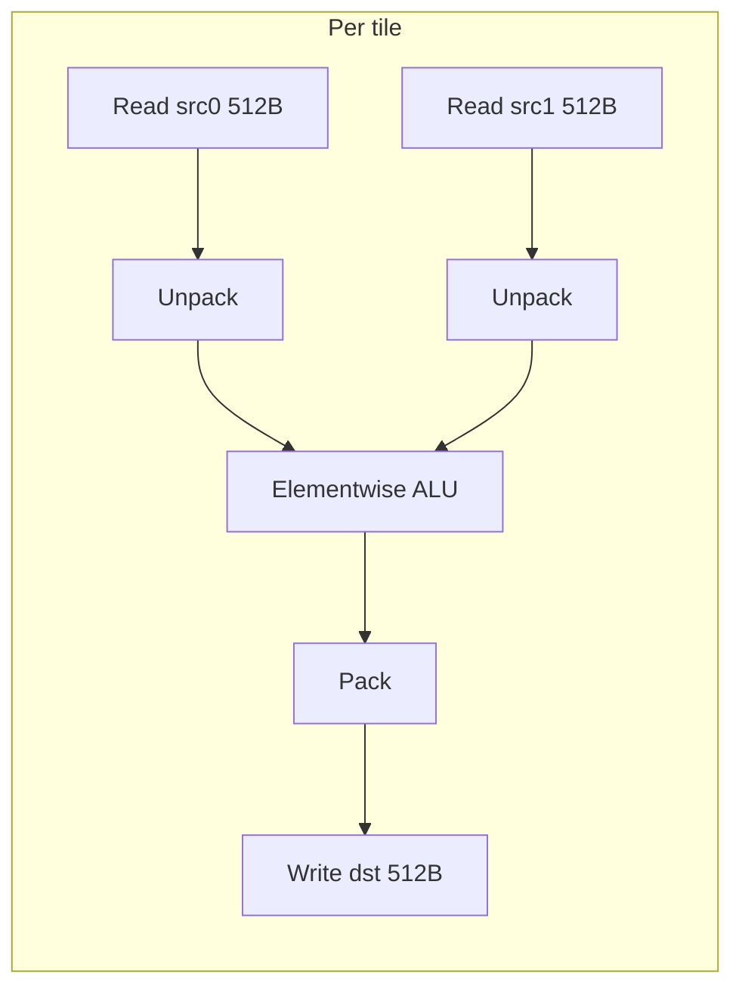
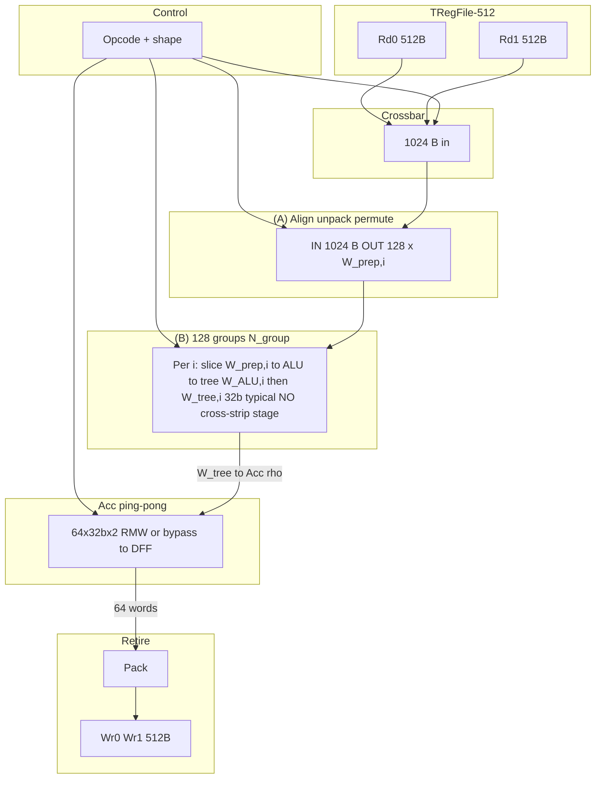
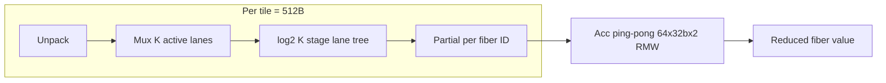

# VEC-512: Vector Unit for 512 B PTO Tiles (PTO ISA Subset)

## 1. Purpose and Scope

This document specifies a **vector execution unit (VEC-512)** that implements the same **software-visible subset** of the PTO Tile Lib ISA as [`vector4k.md`](vector4k.md) — elementwise tile–tile ops, tile–scalar ops, axis reduce / expand, and selected **complex** instructions (**TMRGSORT**, **TSORT32**, **TGATHER**, **TCI**) — but paired with a **tile register file (TRegFile-512)** whose **tile size is 512 B** (**8× smaller** than VEC-4K).

**Non-goals (this document, as in [`vector4k.md`](vector4k.md)):** matrix multiply (**TMATMUL** / **TGEMV**), global-memory **TLOAD/TSTORE**, and **comm** collectives.

**Why 512 B tiles?** A 512 B tile is **exactly one physical strip** at the reference **512 B port width**. Collapsing **tile = strip** removes the **8-cycle** strip walker, the **cross-strip** merger, the **strip-pair calendar**, and the **multi-epoch** replay logic that dominates **`TCOL*`** and large-fiber reductions in **VEC-4K**. The comparison of **datapath complexity** and **per-instruction cycle count** against VEC-4K is given in **§10**.

---

## 2. Tile and Format Model

### 2.1 Storage Invariant

Each logical tile occupies exactly **512 bytes** in the TRegFile. The logical shape is **R × C** with **R** and **C** powers of two (and **R·C = N = 512 / E**).

**Row-major** layout (same rule as VEC-4K §2.1).

Let **E** be the **storage bytes per logical element**. **Only two storage widths are supported** — FP32 and FP16 / BF16. Smaller-precision formats (FP8, MXFP4, HiFP4) are explicitly **out of scope** for VEC-512, just as for VEC-4K §2.1:

| Logical format | `E` (B/elem) | Elements per 512 B tile (**N = 512/E**) | Max(R, C) |
|----------------|--------------|-----------------------------------------|-----------|
| FP32           | 4            | **128**                                 | 128       |
| FP16 / BF16    | 2            | **256**                                 | 256       |

Internal ALU / reducer operands are widened to FP32 where required by ISA numerics; pack / unpack is narrow-to-narrow only (FP16 ↔ FP32 cast per `TCVT`). There are **no packed-nibble lanes** anywhere in the datapath.

**Valid shape examples** (each `R·C = N`):

- FP32: 1×128, 2×64, 4×32, 8×16, 16×8, 32×4, 64×2, 128×1 (**8** shapes).
- FP16 / BF16: 1×256, 2×128, 4×64, 8×32, 16×16, 32×8, 64×4, 128×2, 256×1 (**9** shapes each).

### 2.2 Metadata

Each issued op carries **format**, **R**, **C**, and **opcode**. Microcode derives:

- `strip_count = 512 / 512 = 1` — **one** physical strip per tile. **No strip walker** needed.
- `elem_per_strip = elem_per_tile = 512 / E`.
- `row_B = 512 / R`, `col_B = R · E` (both **≤ 512 B**, so both axes fit in one strip).

---

## 3. TRegFile Interface (TRegFile-512)

### 3.1 Ports (Design Assumption)

| Direction | Width | Count | Aggregate |
|-----------|-------|-------|-----------|
| Read      | 512 B | 2     | **1024 B/cycle** = **2 tiles/cycle** |
| Write     | 512 B | 2     | **1024 B/cycle** = **2 tiles/cycle** |

One **read port** delivers **a full tile per cycle**. Dual reads therefore deliver **both operands of a binary elementwise op in one cycle** (vs. **8 cycles** of strip-pair reads in VEC-4K §3.2).

**Read semantics:** Each read port presents the whole 512 B of a tile — **no gather**, same as VEC-4K §3.1. **`TCOL*`** still performs **column selection in VEC** (strip-buffer → column mux), but now against **one** 512 B strip, never across multiple strips of a single tile.

**Minimum streaming latency:**

- **Unary** (both ports idle or merged): **1 cycle** to read a full tile.
- **Binary elementwise** (`src0`, `src1`): **1 cycle** to ingest both full tiles.

### 3.2 Physical Strip

A **strip** is a contiguous **512-byte** chunk — **identical to a tile**. The strip index **`s`** ranges over **`{0}`** only (**S = 1**). All references in §4–§5 drop strip walks and strip calendars.

### 3.3 Epoch / Calendar

Because **one tile = one port beat**, the TRegFile does **not** need an **8-cycle rotating calendar**. The simplest implementation uses **2R+2W SRAM banks** at **512 B width**, accepting a **new `reg_idx` every cycle** per port. No pending→active promotion is required. Port latency is a single read cycle plus pipeline alignment.

**Optional high-density variant:** repurpose the [`tregfile4k.md`](tregfile4k.md) 64-bank array as **2048 × 512 B tiles** (each tile = 1 bank-group = 64 B × 8). In that mode the rotating calendar is **inverted**: a port can issue a **different `reg_idx` every cycle**, so tile throughput matches the simple variant.

### 3.4 On-Chip Buffers

- **A strip buffer** and **B strip buffer** (512 B each, Rd0 / Rd1). **No double-buffering required** for strip pipelining within a single tile, though double-buffering is still useful to overlap two **independent** instructions.
- **Acc** — **64 × 32 b × 2** ping-pong (**N_run = 128**, §4.1 / §9.3.2).
- **Scalar broadcast register**.

---

## 4. Vector Datapath Overview

### 4.1 Block Diagram (dataflow level)

Reference micro-architecture (per-cycle counts for scheduling / §5.3.2 **`N_tree`**):

```text
  ┌────────────────────────────────────────────────────────────────────┐
  │                     TRegFile-512 (512 B tiles)                       │
  │              Rd0 (512 B)              Rd1 (512 B)                  │
  └──────────────────┬──────────────────────────┬──────────────────────┘
                     │                          │
                     └──────────┬───────────────┘
                                │ 1024 B / cycle = 2 full tiles
                                ▼
  ┌────────────────────────────────────────────────────────────────────┐
  │  Instruction opcode + shape (format, R, C, …)  ──►  CONTROL         │
  └────────────────────────────────────────────────────────────────────┘
                                │
                                ▼
              ┌─────────────────────────────────────┐
              │  CROSSBAR                           │
              │  1024 B in → distribute to compute  │
              └─────────────────┬───────────────────┘
                                │
              ┌─────────────────▼───────────────────────────────────────────┐
              │  (A) ALIGN / UNPACK / PERMUTE  (control-selected)          │
              │  IN:  1024 B / cycle from crossbar                          │
              │  OUT: 128 slices  (slice i width = W_prep,i bits)           │
              └─────────────────┬───────────────────────────────────────────┘
                                │ 128 parallel slice buses
                                ▼
              ┌─────────────────▼───────────────────────────────────────────┐
              │  (B) N_group = 128  INDEPENDENT COMPUTE GROUPS  i = 0…127   │
              │  ┌─────────────────────────────────────────────────────┐   │
              │  │  Group i (representative):                          │   │
              │  │    IN:   W_prep,i                                   │   │
              │  │    ┌──────────────────┐      ┌────────────────────┐  │   │
              │  │    │ Elementwise ALU  │ ───► │ Reduction tree     │  │   │
              │  │    │ OUT:  W_ALU,i    │      │ OUT:  W_tree,i     │  │   │
              │  │    └──────────────────┘      └─────────┬──────────┘  │   │
              │  │    Tree depth D_lane,i ≤ ⌈log₂ 1024⌉ = 10           │   │
              │  │    NO cross-strip stage (S = 1)                     │   │
              │  └─────────────────────────────────────────────────────┘   │
              │  Typical: W_tree,i = 32 b (FP32-shaped partial → Acc)        │
              └─────────────────┬───────────────────────────────────────────┘
                                │ 128 × W_tree,i to Acc per beat
                                ▼
              ┌─────────────────────────────────────┐
              │  ACCUMULATOR (DFF, ping-pong)       │
              │  64 × 32 b × 2 halves  ≈ 512 B      │
              │  per slot: DFF + optional combine    │
              │    • RMW: adder (new ⊕ feedback DFF)  │
              │    • BYPASS: new → DFF (no combine) │
              │  N_run = 128 logical slots (§9.3.2) │
              └─────────────────┬───────────────────┘
                                │ mux: one 64-word half
                                ▼
              ┌─────────────────────────────────────┐
              │  Pack (FP32 → FP16 / BF16 cast, per TCVT) │
              └─────────────────┬───────────────────┘
                                │
                    ┌───────────▼───────────┐
                    │ Wr0 (512 B)  Wr1 (512 B) │
                    │  = 1024 B retire / phase   │
                    └───────────────────────────┘
```

**Flow:** identical modules to **VEC-4K §4.1** — the **cross-strip merger** block is **removed** (there is no cross-strip dimension). **Control** still drives crossbar routing, **(A)** unpack / permute masks, **(B)** per-group **ALU** opcode and tree depth (or **bypass**), and **Acc** addressing. The dominant change vs. VEC-4K is the **Acc** size (**512 B vs 2048 B**, **`N_run = 128` vs 512**) and the **absence** of a strip calendar.

### 4.2 "Lanes" vs "Strips"

- **SIMD lane**: one parallel datapath processing **one logical element** after unpack.
- **Strip**: 512 B — **equals the entire tile**. SIMD width = `elem_per_strip = elem_per_tile`.
- **Cross-lane** (within strip): reductions along a dimension that fits in one strip — **always** the case for VEC-512, on **either axis**.
- **Cross-strip**: **none** within a single tile. Reduce / expand ops that combine **multiple tiles** are expressed at the **ISA** level (two instructions) — not as hardware cross-strip machinery.

### 4.3 Fiber ID and strip read calendar

**`fiber_id`** retains the same meaning as VEC-4K §4.3:

| Opcode family | `fiber_id` | Range |
|---------------|------------|--------|
| **`TROW*`** (row reduce) | `r` | `0 … R−1` |
| **`TCOL*`** (column reduce) | `c` | `0 … C−1` |
| **`TROWEXPAND*`** | `r` | `0 … R−1` |
| **`TCOLEXPAND*`** | `c` | `0 … C−1` |

**Strip read calendar:** **collapses to a single beat per operand** — a one-row calendar in the shape of VEC-4K §4.3. Each cycle:

| Field | Content |
|-------|---------|
| **`t`** | Cycle index in the micro-sequence |
| **Rd0 / Rd1** | `src0` / `src1` (full 512 B tile each) or **idle** |
| **`s`** | **`0`** (only value) |
| **Lane → `(r, c)`** | §2.1 row-major map over the full tile |
| **`fiber_id`s updated this cycle** | **All rows** (if `TROW*`) or **all columns** in the active band (if `TCOL*`) |
| **Acc** | **RMW** at decoded slot for each retiring partial |

There is **no notion of "strip `s` contributes to fiber `r`"** — **every fiber that exists in the tile** is visited in the **single** compute cycle (modulo `TCOL*` banding, §5.3.2 / §4.4 Example F-512).

### 4.4 Epoch-aligned fiber calendars vs TRegFile-512 (four worked examples)

TRegFile-512 does **not** carry an 8-cycle calendar; **there is no `e`**. Each read port delivers a full tile on cycle **`t`**. The tables below therefore collapse to a **single** operand-ingest cycle followed by **compute / retire** stages (the number of retire cycles depends on **`#W`** for `TCOL*`; **§5.3.2**).

**Port binding for the tables:**

| Logical name | Read port | Delivered per cycle |
|--------------|-----------|---------------------|
| **Port A**   | **Rd0**   | one **512 B** tile  |
| **Port B**   | **Rd1**   | one **512 B** tile  |

**Column shorthand:**

| Column | Meaning |
|--------|---------|
| **`t`** | Core cycle from op start. |
| **Port A / B** | **`T`** = tile `reg_idx` T (full 512 B), **`—`** = port idle. |
| **Fibers (this beat)** | `fiber_id` values touched this cycle. |
| **#elem** | Logical elements per fiber contributing this cycle. |
| **Reduce / expand** | Arithmetic summary. |

---

#### Example A-512 — `TROWSUM`, **FP32**, **8×16** (`C = 16`, single tile)

**Geometry:** `row_B = 512/8 = 64 B`, **8** rows per tile, **16** FP32 elements per row.

| `t` | Port A | Port B | Fibers | #elem | Reduce |
|----:|--------|--------|--------|------:|--------|
| 0 | `src` | — | `r = 0…7` | 16 each | **8** lane-trees (`K = 16`, `D_lane = 4`) → **Acc** `r = 0…7` |

**Unique ingest complete at `t = 0`**. Compare: VEC-4K Example B (32×32) needs **8 cycles** of strip reads.

---

#### Example B-512 — `TROWSUM`, **FP32**, **32×4** (`C = 4`, narrow row)

**Geometry:** `row_B = 16 B`, **32** rows per tile, **4** elements per row.

| `t` | Port A | Port B | Fibers | #elem | Reduce |
|----:|--------|--------|--------|------:|--------|
| 0 | `src` | — | `r = 0…31` | 4 each | **32** lane-trees (`K = 4`, `D_lane = 2`) → **Acc** `r = 0…31` |

**All 32** output fibers finalized in one beat. Compare: equivalent VEC-4K `TROWSUM` on 32×32 uses **8 strip cycles** + per-strip horizontal trees.

---

#### Example C-512 — `TROWEXPANDADD`, **FP32**, **8×16**

**`v` tile:** 8 FP32 row scalars = **32 B** at byte offset 0. Loaded once (pre-cycle, or on Port B of same cycle that Port A reads `src`).

| `t` | Port A | Port B | Fibers | #elem | `v[fiber_id]` | Expand |
|----:|--------|--------|--------|------:|---------------|--------|
| −1 *(pre)* | — | `v@0` | — | — | latch `v[0…7]` | prefetch |
| 0 | `src` | — | `r = 0…7` | 16 each | latched | **`src + v[r]`** across all 128 lanes |

Alternative **zero-prefetch** schedule: Port A = `src`, Port B = `v` in **the same** cycle — the unpack stage (A) extracts `v[r]` from Port B's 32 B window while Port A feeds lanes; **1 cycle** total. VEC-4K (Example C) needs a **pre-epoch** beat + **4 cycles** of strip-pair ingest.

---

#### Example D-512 — `TROWSUM`, **FP16**, **32×8**

**Geometry:** `row_B = 8 · 2 = 16 B` = **8** FP16 elements per row, **32** rows per tile (`N = 256`). `K = 8`, `D_lane = 3`.

| `t` | Port A | Port B | Fibers | #elem | Reduce |
|----:|--------|--------|--------|------:|--------|
| 0 | `src` | — | `r = 0…31` | 8 each | **32** lane-trees (`K = 8`, `D_lane = 3`) → **Acc** `r = 0…31` |

Every fiber retired in **one** beat (contrast VEC-4K Example D which, even after the 128×16 FP16 rewrite, still takes **4** strip-pair cycles across dual ports). **BF16 32×8** behaves identically (same `E`, same byte layout).

---

#### Example E-512 — `TCOLSUM`, **FP16**, **8×32** (`R = 8`, `C = 32`, native row-major, single-wave)

**Geometry:** `row_B = 32 · 2 = 64 B` = **32** FP16 elements/row; **8** rows per tile. Column reduce produces **32** fibers.

**Hardware parallelism (inherits §5.3.2 symbols):**
- **`N_tree = 128`** trees, **`N_acc = 128`** Acc slots, **`N_run = 128`**, **`P_beat = 128`**.
- **`#W = max(⌈C / N_acc⌉, ⌈C / (N_tree · f)⌉, ⌈C / N_run⌉)`**. With `C = 32 ≤ N_run`, `f ≥ 1`: **`#W = 1`** — **one** pass suffices.

| `t` | Port A | Rows | `fiber_id` band | Samples/c this `t` | Acc |
|----:|--------|------|------------------|-------------------:|-----|
| 0 | `src` | **0–7** | `c ∈ [0, 31]` (all) | **8 per c** | `Acc[c] += sum_r M[r,c]` over all 8 rows |

**1 ingest + 1 retire cycle** covers the whole `TCOLSUM`. Compare VEC-4K Example E (FP16 16×128, `#W = 2`): **2** waves × **4** strip-pair cycles = **≥ 8** beats, plus epoch turnarounds.

---

#### Example F-512 — `TCOLSUM`, **FP16**, **1×256** (extreme: `C = 256 > N_run`)

**Geometry:** `row_B = 256 · 2 = 512 B` = 256 FP16 elements/row; **1** row per tile. **`C = 256 > N_run = 128`** ⇒ `TCOL*` needs **`#W = ⌈256 / 128⌉ = 2`** waves — the **only** wave-generating shape in the FP32 + FP16 / BF16 set on VEC-512. (With `R = 1`, the column reduce is degenerate — one addend per fiber — so the Acc RMW is essentially a straight copy, but it still exercises the wave-splitter in control.)

**Calendar per wave `k` (column band `c ∈ [128·k, 128·k + 127]`):**

| `t` | Port A | Rows | `fiber_id` band | Samples/c this `t` | Acc |
|----:|--------|------|------------------|-------------------:|-----|
| 0 | `src` | **0** | `[128·k, 128·k + 127]` | **1 per c** | `Acc[c] ← M[0, c]` for that band (R = 1 ⇒ direct write) |
| 1 | — (or next wave) | — | — | — | retire band-k to Wr0 / Wr1 |

**Total:** **`#W × 2 = 4`** cycles. This is the **worst-case** `TCOL*` latency under the simplified format set; removing FP8 / FP4 caps `N` at **256** and therefore `#W` at **2**. **BF16 1×256** behaves identically.

---

## 5. Instruction Categories and Cycle Sketches

Same operand-count conventions as VEC-4K §5; **S = 1** everywhere.

### 5.1 Elementwise (Tile–Tile)

**Representative:** `TADD`, `TMUL`, `TAND`, `TCMP`, `TCVT`.

**Dataflow (non-pipelined sketch):**

1. `read_pair` loads `src0` and `src1` in **one cycle** → unpack → SIMD op → pack into `dst` staging.
2. Retire `dst` on **the next** cycle via `write_pair` (or through same-cycle pass-through on simpler pipelines).

**Latency (typical):** **~3 cycles** (read → compute → write), vs. **~10–12 cycles** on VEC-4K. Pipelined throughput: **1 binary op / cycle**.

**Cross-lane:** none. **Cross-strip:** **N/A** (S = 1).



### 5.2 Tile–Scalar / Tile–Immediate

**Representative:** `TADDS`, `TMULS`, `TCMPS`, `TEXPANDS`.

- Scalar loaded into broadcast register once; each cycle applies `lane_i = f(tile_i, scalar)`.
- **Latency:** **~2 cycles** (unary read + retire). Throughput: **1 op / cycle**.

### 5.3 Axis Reduce

**Key geometric fact (new):** for a 512 B tile, **every row and every column fits inside one strip**, so **`rS = cS = 1`** for all shapes. There is **no cross-strip merger**, **no staged partials across strips**, and **no partial-state SRAM beyond Acc**.

#### 5.3.1 Row-wise reduce (e.g. `TROWSUM`)

For each **row `r`**, compute `acc[r] = reduce_c M[r, c]`.

**Phase A (only phase):** after unpack, a horizontal SIMD tree of depth **`D_lane = ⌈log₂ C⌉`** reduces the row segment directly into **Acc[`r`]**. Every FP32 shape has `R ≤ 128 = N_run`; every FP16 / BF16 shape has `R ≤ 256`, so only the single shape `256×1` exceeds `N_run`. **No waves** are needed for any other shape.

| Phase | Action |
|-------|--------|
| 1 | Read tile on Rd0. |
| 2 | Unpack → **`R`** parallel lane trees of width `C` → **`R`** Acc writes (one per row). |
| 3 | For `dst = R×1` vector tile, **Pack** + **Wr0** emit the R-way result. |

**`TROWARGMAX` / `TROWARGMIN`:** each lane tree carries **(value, col_index)**; same single-cycle structure.

**When `R > N_run`:** the only legal shape that hits this branch under the simplified format set is FP16 / BF16 **`256×1`**, where `K_outer = ⌈256 / 128⌉ = 2`. Microcode re-reads the same tile on each pass, as in VEC-4K §5.3.2. **Cost: `K_outer` re-reads of a 512 B tile**, which is **one cycle each**.

#### 5.3.2 Column-wise reduce (e.g. `TCOLSUM`, `TCOLMAX`)

**Architectural rule (carries over from VEC-4K §5.3.2):** `TCOL*` runs on the operand's **native row-major** layout. **No transpose scratchpad**. TRegFile has **no gather** (§3.1). Column selection happens in **VEC** (strip buffer → unpack → column mux).

**Parallelism symbols** (same definitions as VEC-4K §5.3.2):

| Symbol | VEC-512 value |
|--------|---------------|
| **`N_tree`** | **128** |
| **`N_acc`** | **128** (= `N_run`) |
| **`N_run`** | **128** |
| **`P_beat`** | `min(N_tree, N_acc) = 128` |

**Wave count:**

**`#W = max(⌈C / N_acc⌉, ⌈C / (N_tree · f)⌉, ⌈C / N_run⌉)`**

Because **tile = 1 strip**, **`f ≥ 1`** is trivially achievable: a single tile read exposes **all R row samples** of every column in the band simultaneously, so a single tree invocation can sustain one commit per column per scan. For the reference values above:

| `C` | `⌈C / N_acc⌉` | `⌈C / N_run⌉` | `#W` | Example legal shapes (FP32 / FP16–BF16) |
|----:|--------------:|--------------:|-----:|-----------------------------------------|
| ≤ 128 | 1 | 1 | **1** | All FP32 shapes (`C ≤ 128`); all FP16 / BF16 shapes with `C ≤ 128` |
| 256 | 2 | 2 | **2** | FP16 / BF16 `1×256` only |

Larger `C` values are not reachable because `N ≤ 256` under the two supported storage widths.

**No tile replay from RF is required** for the lane-tree pass itself — each wave **re-reads the same `reg_idx` once** (1 cycle per wave), against **VEC-4K** where **each wave is 4 strip-pair cycles + epoch turnaround**.

**Row-axis mirror (`TROW*`):**

**`#W_trow = max(⌈R / N_acc⌉, ⌈R / (N_tree · f)⌉, ⌈R / N_run⌉)`**

Same table with `R` substituted for `C`.

**Cycle lower bound:** **`#W × 1 + retire_tail`**, typically **`#W + 1…2`** cycles total.

### 5.4 Axis Expand / Broadcast

**Row expand** (`TROWEXPAND*`): load **per-row `v[r]`** from a narrow vector tile (or Acc after an in-place reduce); splat across column lanes; combine with `src`; pack; write.

**Column expand:** same **no-transpose-scratch** rule as `TCOL*` (§5.3.2). Single-strip column addressing is **one** mux stage, not a multi-strip scatter.

**Cycles:** **~2 cycles** (read + write) when `v` fits alongside `src` on dual ports, or **~3 cycles** with a prefetch beat.

### 5.5 Complex Instructions

#### 5.5.1 `TSORT32`

- With **128** FP32 or **256** FP16 / BF16 elements in one tile, the number of **32-element blocks** per tile is **4** (FP32) or **8** (FP16 / BF16) respectively.
- All blocks sort **in parallel** via pipelined bitonic / odd-even networks of depth O(log² 32).
- **No cross-strip stitching** (every block is fully in-tile).
- **Cycles:** depth-dominated (tens of cycles for sort-network pipeline); ingest is **1 cycle**.

#### 5.5.2 `TMRGSORT`

Multi-list merge. Because each list-head tile is 512 B, **list headers can be loaded in one port beat each**; the merge front has **lower fanout pressure** per cycle, but throughput per emitted output tile remains merge-depth bound.

- **Cross-lane:** per-element compare in k-way tree.
- **Cross-strip:** **none within a tile**; the global merge state spans **multiple tiles** in RF as before.

#### 5.5.3 `TGATHER` / `TGATHERB` / `TSCATTER`

- Index-driven byte mux within a **single 512 B** buffer → **one-level** crossbar (no cross-strip fanout).
- **Cycles:** **~2–4 cycles** typical (1 index + 1 data + pack), vs. worst-case per-element serialization on VEC-4K.

#### 5.5.4 `TCI`, `TTRI`, `TPART*`

- **`TCI`:** `base + stride` index generation — **1 cycle**.
- **`TTRI`:** row/col counter compare to mask — **1 cycle**.
- **`TPART*`:** elementwise + predicate gating — **1–2 cycles**.

#### 5.5.5 `TQUANT` / `TDEQUANT`

Two-phase: (1) reduce for scale/exp (**1 cycle**, §5.3); (2) elementwise scale (**1 cycle**, §5.1). **Total ~3–4 cycles** vs. **~16–20 cycles** on VEC-4K.

---

## 6. Cross-Lane and Cross-Strip Summary

| Category | Cross-lane (within 512 B strip = tile) | Cross-strip (within a tile) |
|----------|-----------------------------------------|------------------------------|
| Elementwise tile–tile | Independent lanes | **N/A** |
| Tile–scalar | Independent | **N/A** |
| Row reduce | Horizontal tree across `C` lanes (`D_lane = ⌈log₂ C⌉`) | **N/A** |
| Column reduce | **VEC column mux** across `R` row samples in buffer (`D_lane = ⌈log₂ R⌉`) | **N/A** |
| Row / column expand | Splat across row / column segment | **N/A** |
| `TSORT32` | Sort network per 32-block, all in-tile | **N/A** |
| `TMRGSORT` | Per-element compare in merge tree | **N/A** within a tile (cross-tile lives at ISA level) |
| `TGATHER` | Mux selected elements within 512 B | **N/A** |

**Contrast VEC-4K §6:** every **"Heavy"** cross-strip entry in VEC-4K becomes **N/A** here.

---

## 7. Datapath Diagram — Row Reduce (single strip)



Compare with VEC-4K §7: the **8-strip serial walk**, the **cross-strip tree**, and the **`256×32b×2`** Acc all shrink — the **cross-strip tree vanishes** and Acc is **4×** smaller.

---

## 8. Implementation Notes

1. **Opcode decode** produces control for the crossbar, **(A)** unpack/permute, **(B)** 128 groups, Acc ping-pong (RMW / bypass-to-DFF), Wr half-select, and a **single-beat** operand calendar (no strip walker, no epoch). Parameters: **`TCOL*`** wave count **`#W`** (§5.3.2), `K_outer` when **`max(R, C) > N_run = 128`**, splat / merge `k`, §9 `r*` / `c*` template id.
2. **Determinism:** PTO ops retire atomically as in VEC-4K §8.
3. **Resource conflicts:** with 2R+2W, two **independent** instructions can overlap if they do not share Acc halves or write ports. No multi-epoch ping-pong is needed within a single instruction.
4. **Numerics:** FP16 / BF16 reductions are evaluated with an FP32-widened accumulator and rounded per `TCVT` / ISA rules on retire, same as VEC-4K §8.

---

## 9. Legal `(format, R×C)` enumeration and axis-reduce complexity

### 9.1 Enumeration rules

- Tile storage: **512 B**, row-major, **R** and **C** powers of two.
- **N = R·C = 512 / E** (**only two supported storage widths**):
  - **FP32:** `E = 4`, `N = 128`, **8** shapes.
  - **FP16** and **BF16:** `E = 2`, `N = 256`, **9** shapes each (**18** rows).

**Master table rows:** **26** (vs. **35** in VEC-4K §9.1). **Unique `(E, R, C)` geometries:** **17** (vs. **23**).

`elem_per_strip = elem_per_tile = 512 / E` — **128** FP32 elements or **256** FP16 / BF16 elements per tile.

### 9.2 Row-axis metrics (`TROW*`)

For each **row** fiber, reduce **C** elements. **Bytes per row:** `row_B = 512 / R`.

| Sym | Definition | Value range |
|-----|------------|-------------|
| **rS** | Strips per row `= ⌈row_B / 512⌉` | **= 1 always** |
| **rK** | Elements in lane segment: `C` (since `rS = 1`) | `1 … 256` |
| **rDl** | Cross-lane depth `= max(0, ⌈log₂ rK⌉)` | `0 … 8` |
| **rDc** | Cross-strip depth `= max(0, ⌈log₂ rS⌉)` | **= 0 always** |
| **rW** | Per-strip serial work: `rDl` (since `row_B ≤ 512`) | `0 … 8` |
| **rLB** | `1 + rDl` (ingest 1 cycle + lane tree) | `1 … 9` |
| **rUB** | `1 + rW + R_wave_tail` (single shared tree pipelined over packed fibers) | `1 … (8 + K_outer)` |
| **rAccB** / **rStgUB** | `4·R` / `4·R·rS = 4·R` (no strip staging) — **logical**; physical running = **`min(R, N_run = 128)`** |

### 9.3 Column-axis metrics (`TCOL*`)

For each **column** fiber, reduce **R** elements. **Logical bytes per column:** `col_B = R·E`.

| Sym | Definition | Value range |
|-----|------------|-------------|
| **cS** | `⌈col_B / 512⌉` | **= 1 always** (`col_B = R·E ≤ 512`) |
| **cK** | `R` | `1 … 256` |
| **cDl** | `⌈log₂ cK⌉` | `0 … 8` |
| **cDc** | `⌈log₂ cS⌉` | **= 0 always** |
| **cW** | `cDl` | `0 … 8` |
| **cLB** | `1 + cDl` | `1 … 9` |
| **cUB** | `1 + cW + C_wave_tail` | `1 … (8 + #W)` |
| **cAccB** / **cStgUB** | `4·C` logical; physical running = **`min(C, N_run = 128)`** |

**Row-major hardware path:** single-beat read, lane tree, **VEC column mux** over the 512 B buffer. **No transpose scratch** (§5.3.2). **No multi-epoch replay** from the RF within a wave; multi-wave **re-reads the same `reg_idx`** across cycles when `C > N_run` (1 extra read cycle per wave).

### 9.3.1 Partial accumulator state

Assumption A — associative reduce (max / min / sum):

| Symbol | Formula | Meaning |
|--------|---------|---------|
| **rAccB** | `4·R` | Logical per-row state (bytes). Physical = `min(R, N_run = 128) × 4 B`. |
| **cAccB** | `4·C` | Logical per-column state. Physical = `min(C, N_run = 128) × 4 B`. |

Assumption B — **not applicable**: `rS = cS = 1`, so `rStgUB = rAccB`, `cStgUB = cAccB`. **No strip-staging buffer needed.**

**`TROWARG*` / `TCOLARG*`:** value∥index doubles the per-slot width as in VEC-4K §9.3.1.

### 9.3.2 Accumulator organization (ping-pong DFF, `N_run = 128`)

The running partial store is **two** ping-pong halves of **64 × 32 b** each (**256 B / half**, **512 B total**). Modes: **RMW accumulate** or **bypass-to-DFF** (identical semantics to VEC-4K §9.3.2, scaled to 64 words per half).

| Property | VEC-512 | VEC-4K |
|----------|---------|--------|
| DFF slots per half | **64** | 256 |
| Bytes per half | **256** | 1024 |
| Total Acc storage | **512 B** | 2048 B |
| **`N_run`** | **128** | 512 |
| Peak logical fiber count | **256** (FP16 / BF16) | **2048** (FP16 / BF16) |
| `N_run` vs peak | **2×** deficit (single `256×1` / `1×256` shape) | **4×** deficit (`R` or `C > 512` shapes) |

### 9.4 Cycle model (both axes)

Both axes assume §3.2 ingest: **1 cycle** to read a full tile (vs. **4 cycles** in VEC-4K).

- **Lower bound (LB):** `1 (read) + ⌈log₂ K⌉ (lane tree) + 1 (retire) ≈ 3 … 10 cycles`.
- **Upper bound (UB):** `1 (read) + W (serialized tree) + #W (waves for `N_run` overflow) + 1 (retire)`.

Compare VEC-4K §9.4: **LB = 4 + D_lane + D_cross** (= 4 + up to 11 = up to 15 cycles); **UB = 4 + 8·W + R·D_cross** which can still run into thousands for extreme FP16 shapes.

### 9.5 Reconfigurable reduction tree

The tree **simplifies** relative to VEC-4K §9.5:

1. **Unpack:** up to **256** logical lanes (FP16 / BF16) or **128** lanes (FP32) — all fibers are live in one cycle instead of spread over 8 strips as in VEC-4K.
2. **Cross-lane tree (variable `K`):** `D_lane = 0 … 8` stages.
3. **Cross-strip merger: DELETED.** No stages. Saves up to **3** compare-stage latches per group vs. VEC-4K.
4. **Temporal stretch `W`:** still applies when a single shared tree must cover multiple packed fibers (`R > 1` rows in the tile for `TROW*`). With **`N_tree = 128`** trees in parallel, `W` only activates when `R > N_tree`, i.e. the single shape **FP16 / BF16 `256×1`**.



**Cross-strip tree removed** — not drawn, not present.

#### 9.5.1 How many distinct "shapes" are needed?

| Counting notion | VEC-512 | VEC-4K |
|-----------------|--------:|--------:|
| Physical datapaths | **1** | 1 |
| Unique `(D_lane, W_strip)` tuples (no `D_cross` axis) | **9** | 22 |
| Unique `(K, D_lane)` doublets | **9** | 15 |
| Unique paired (row tuple, column tuple) | **17** | 23 |

The **reduction in scheduling-template count** (**9 vs 22**, roughly **2.5×** fewer) is the direct consequence of **removing the cross-strip axis** (`D_cross ∈ {0,1,2,3}` → `{0}`) **and** the **temporal-stretch** axis collapsing to `W = D_lane` (no row-spanning splits across strips). FP16 / BF16 shapes cover `D_lane = 0 … 8` and FP32 shapes cover `D_lane = 0 … 7`, both on the diagonal `W = D_lane`, so the union is **9** tuples.

### 9.6 Summary by format (extrema over all legal shapes)

| Format | N | # shapes | max **K** | max **D_lane** | max **S** | max **D_cross** | min *LB* | max *LB* | max *UB* | max **rAccB** / **cAccB** | max **rStgUB** / **cStgUB** |
|--------|---:|---:|---:|---:|---:|---:|---:|---:|---:|---:|---:|
| FP32         | 128  | 8  | 128  | 7  | **1** | **0** | 1 | 8  | ≤ 9  + K_outer | 512  | 512  |
| FP16 / BF16  | 256  | 9  | 256  | 8  | **1** | **0** | 1 | 9  | ≤ 10 + K_outer (K_outer ≤ 2 on `256×1`) | 1024 | 1024 |

**Logical** peak **rAccB** / **cAccB** in the table is `4·R` / `4·C` (up to **1024 B** at `R` or `C = 256`, FP16 / BF16). **VEC-512 silicon:** `N_run = 128` × 4 B = **512 B DFF**; only the single shape `256×1` (FP16 / BF16) exceeds `N_run` and uses **Acc waves** (`K_outer = 2`, §5.3.2 / §9.3.1). Every `*StgUB` equals `*AccB` (no strip staging).

Compare VEC-4K §9.6: peak `*AccB` up to **8 KiB**, peak `*StgUB` **8 KiB**; VEC-512 caps both at **1 KiB logical / 512 B physical**.

### 9.7 Legal `(format, R×C)` enumeration

**26** rows (17 unique `(E, R, C)`; FP16 vs. BF16 duplicate shapes).

| Format | E (B/elem) | N | R×C |
|--------|------------|---|-----|
| FP32 | 4   | 128  | 1×128 |
| FP32 | 4   | 128  | 2×64  |
| FP32 | 4   | 128  | 4×32  |
| FP32 | 4   | 128  | 8×16  |
| FP32 | 4   | 128  | 16×8  |
| FP32 | 4   | 128  | 32×4  |
| FP32 | 4   | 128  | 64×2  |
| FP32 | 4   | 128  | 128×1 |
| FP16 | 2   | 256  | 1×256 |
| FP16 | 2   | 256  | 2×128 |
| FP16 | 2   | 256  | 4×64  |
| FP16 | 2   | 256  | 8×32  |
| FP16 | 2   | 256  | 16×16 |
| FP16 | 2   | 256  | 32×8  |
| FP16 | 2   | 256  | 64×4  |
| FP16 | 2   | 256  | 128×2 |
| FP16 | 2   | 256  | 256×1 |
| BF16 | 2   | 256  | 1×256 |
| BF16 | 2   | 256  | 2×128 |
| BF16 | 2   | 256  | 4×64  |
| BF16 | 2   | 256  | 8×32  |
| BF16 | 2   | 256  | 16×16 |
| BF16 | 2   | 256  | 32×8  |
| BF16 | 2   | 256  | 64×4  |
| BF16 | 2   | 256  | 128×2 |
| BF16 | 2   | 256  | 256×1 |

---

## 10. Comparison: VEC-512 vs VEC-4K

This section compares the two designs directly: **datapath complexity** (§10.1), **per-instruction cycle counts** (§10.2), and **aggregate throughput** per unit of data (§10.3). Metric names inherit from §9 / [`vector4k.md`](vector4k.md) §9.

### 10.1 Datapath complexity

Both designs share the same **reference** compute engine (crossbar → (A) align/unpack → (B) 128 groups of ALU + reduce tree → Acc ping-pong → Pack → Wr0/Wr1). The differences are **how many auxiliary structures** each design needs and **how big** each one is.

| Structure | VEC-4K | VEC-512 | Net change |
|-----------|--------|---------|------------|
| Strips per tile (**S**) | 8 | **1** | –8× |
| Strip walker FSM | required | **removed** | – |
| Strip read calendar (cycle ↔ `s` mapping) | required, 8-cycle template | **removed** (1-beat ingest) | – |
| Strip buffers A / B | **512 B × 2** (often double-buffered) | 512 B × 2 (single) | simpler control |
| Cross-strip reduction tree | `⌈log₂ S⌉ = 3` stages, per-group | **removed** (`D_cross = 0`) | –3 stages × 128 groups |
| Staged strip-partial SRAM (`rStgUB`/`cStgUB`) | up to **8 KiB** (FP16 / BF16 `256×8` or `8×256`) | **0 B** (equal to Acc) | –8 KiB worst |
| Accumulator DFF (ping-pong) | **256 × 32 b × 2 = 2048 B** | **64 × 32 b × 2 = 512 B** | –4× |
| **`N_run`** | 512 | **128** | –4× |
| **`N_acc`** | ≤ 512 | 128 | proportional |
| **`N_tree`** | 128 (ref) | 128 (ref) | unchanged |
| TRegFile port width × count | 2R+2W × 512 B | 2R+2W × 512 B | unchanged |
| TRegFile 8-cycle rotating calendar | required (tregfile4k §2) | **removed** (1 tile / port / cycle) | large simplification |
| TRegFile per-port pending/active register | required | **removed** | – |
| `TCOL*` tile replays `#W` (§5.3.2) | `max(⌈C/N_acc⌉, ⌈C/(N_tree·f)⌉, ⌈C/N_run⌉)` × **4 strip-pair cycles** each | `#W × 1 cycle` each | –4× per wave |
| `TCOL*` f parameter (commits/tree/scan) | complex, RTL-measured | trivially `f ≥ 1` (single strip) | – |
| `K_outer` outer-loop nest (§5.3.2) | triggered for `R`/`C > 512` (FP16 / BF16 `1024×2`, `2048×1`, `1×2048`, `2×1024`) | triggered for `R`/`C > 128` (single shape: FP16 / BF16 `256×1` or `1×256`) | more frequent but 8× cheaper per iteration |
| Write-side staging across outer loops | required for merged `dst` | optional (waves typically write disjoint bands) | – |
| Distinct scheduling templates (§9.5.1 unique tuples) | **22** | **9** | –~2.5× |
| Master table rows in §9.7 | 35 (23 unique `(E,R,C)`) | 26 (17 unique) | –26% |

**Qualitative summary:** VEC-512 removes the **two orthogonal temporal axes** that dominate VEC-4K's control logic — (i) the **8-strip walk per tile** and (ii) the **`#W` multi-epoch tile replay** for wide column / row reductions. What remains is essentially the **per-strip** core of VEC-4K, scaled to **¼** Acc capacity. Scheduling templates collapse from **22** to **9** because the `(D_cross, W_strip_packing)` product of axes disappears, leaving only the diagonal **`W = D_lane ∈ {0, …, 8}`** (covering FP32 `D_lane ≤ 7` and FP16 / BF16 `D_lane ≤ 8`).

### 10.2 Per-instruction cycle count (typical representative shapes)

Numbers below are **minimum cycle counts** under the common reference parameters (`N_tree = 128`, `N_acc = 128`, dual-port reads, pipelined tree). "VEC-4K" numbers are taken from [`vector4k.md`](vector4k.md) §4.4 / §5 / §9.

**Notation:** `Cin` = ingest cycles, `Tree` = tree-stage cycles (pipelined, amortized), `Retire` = write-back cycles, **`Total`** = `Cin + Tree + Retire` when no waves, else include wave multiplier.

| Op | Shape (VEC-4K / VEC-512) | VEC-4K `Cin` + `Tree` + `Retire` + waves | **VEC-4K Total** | VEC-512 `Cin` + `Tree` + `Retire` + waves | **VEC-512 Total** | Speedup |
|----|-------|------------------------------------------|-----------------:|-------------------------------------------|------------------:|--------:|
| `TADD` (FP32) | 32×32 / 8×16 | 8 + 1 + 1 + 0 | **10** | 1 + 1 + 1 + 0 | **3** | **3.3×** |
| `TADD` (FP16) | 32×64 / 16×16 | 8 + 1 + 1 + 0 | **10** | 1 + 1 + 1 + 0 | **3** | **3.3×** |
| `TABS` (FP32, unary) | 32×32 / 8×16 | 4 + 1 + 1 + 0 | **6** | 1 + 1 + 1 + 0 | **3** | **2×** |
| `TADDS` (scalar) | any | 4 + 1 + 1 + 0 | **6** | 1 + 1 + 1 + 0 | **3** | **2×** |
| `TROWSUM` (FP32) | 8×128 / 8×16 | 4 + 7 + R-stream ≈ **12** | **12** | 1 + 4 + 1 | **6** | **2×** |
| `TROWSUM` (FP32) | 32×32 / 32×4 | 4 + 5 + R-stream ≈ **10** | **10** | 1 + 2 + 1 | **4** | **2.5×** |
| `TROWSUM` (FP16) | 128×16 / 32×8 (VEC-4K Ex. D) | 4 + 4 + R-stream ≈ **10** | **10** | 1 + 3 + 1 | **5** | **2×** |
| `TROWSUM` (FP16) | 256×8 / 32×8 (R > 128 on 4K, R ≤ 128 on 512) | 4 + 3 + **K_outer = 1** × R-stream ≈ **12** | **12** | 1 + 3 + 1 | **5** | **2.4×** |
| `TROWSUM` (FP16) | 2048×1 / 256×1 (`R > N_run` both sides) | 4 + 0 + `K_outer ≈ 4` × R-stream ≈ **24+** | **≥ 24** | 1 + 0 + `K_outer = 2` × R-stream ≈ **5** | **~5** | **~4.8×** |
| `TCOLSUM` (FP32) | 32×32 / 8×16 | 4 × `#W=1` + tree + retire ≈ **10** | **10** | 1 + 4 + 1 | **6** | **1.7×** |
| `TCOLSUM` (FP16) | 16×128 / 8×32 (VEC-4K Ex. E) | **#W = 2** × 4 + tree + retire ≈ **14** | **14** | 1 + 5 + 1 (single wave, `C = 32 ≤ N_run`) | **7** | **2×** |
| `TCOLSUM` (FP16) | 8×256 / 1×256 (extreme C at each tile size) | **#W = 4** × 4 + 2 ≈ **20** | **20** | `#W = 2` × (1 + 0 + 1) ≈ **4** | **~4** | **~5×** |
| `TROWEXPANDADD` | 8×128 / 8×16 | 1 (prefetch) + 4 + 1 ≈ **6–8** | **6–8** | 1 + 1 | **2–3** | **~3×** |
| `TCVT` (FP16 → FP32, FP32 → BF16) | any | **8–12** | **~10** | **2–3** | **~3** | **~3×** |
| `TSORT32` | all | **4 + ~20** (sort network pipe) | **~24** | **1 + ~20** | **~21** | **~1.15×** (sort-network-bound) |
| `TMRGSORT` (k=4) | per emitted tile | many × 4 + k·depth | **high** | many × 1 + k·depth | **lower** | 2–4× typical |
| `TGATHER` (random) | any | worst ≈ per-element serialization | **high** | single-strip mux, **~4** | **low** | **large** |
| `TCI` / `TTRI` | any | 4 + 1 ≈ **5** | **5** | 1 + 1 | **2** | **~2.5×** |
| `TQUANT` / `TDEQUANT` (FP32 ↔ FP16 / BF16) | any | **≈ 16–20** | **~18** | **3–4** | **~4** | **~4.5×** |

**Takeaways:**

- **Elementwise and scalar ops** (≥ 60 % of typical workload mix) run **2×–3.3× fewer** cycles per instruction. The improvement comes almost entirely from collapsing **ingest** from 4–8 strip cycles to **1**.
- **Axis reduces** see **1.5×–2.5×** speedups for typical shapes, dominated by the removal of the **cross-strip combine** phase and the trivialization of `#W`.
- **Wide-axis extremes** now only reach `C = 2048` (FP16 `1×2048`) on VEC-4K and `C = 256` (FP16 `1×256`) on VEC-512 — with FP8 / FP4 removed, **VEC-512 never runs slower per instruction than VEC-4K** on any supported shape. The extreme column reduce row in the table demonstrates this: VEC-512's 2-wave replay still beats VEC-4K's 4-wave strip-pair walk.
- **Complex instructions** (`TGATHER`, `TMRGSORT`, `TQUANT`, `TSORT32`) benefit from **~2–4×** lower per-instruction latency; sort-network depth still dominates `TSORT32`.

### 10.3 Aggregate throughput (per unit of data)

The preceding per-instruction numbers can mislead when workloads span large operand sets. To process **4 KB of data**:

| Scenario | VEC-4K | VEC-512 |
|----------|--------|---------|
| Instructions required | **1** tile-op | **8** tile-ops |
| Cycles per op (typical elementwise) | ~10 | ~3 |
| Cycles for 4 KB (serial) | **~10** | **~24** |
| Cycles for 4 KB (pipelined, 1 op/cy throughput) | **~10** | **~8 + 3 = 11** |
| Read port bandwidth utilized | ≥ 80 % (strip-packed) | ≤ 25 % per isolated op; up to 100 % with back-to-back independent ops |

**Rules of thumb:**

- **Data-bandwidth-bound workloads** (dense elementwise over large activations) favor **VEC-4K**: **fewer instructions**, **higher sustained port utilization**, and **amortized** control overhead. A single `TADD` on 4 KB completes in ~10 cycles vs ~24 cycles of 8 separate `TADD`s on 512 B tiles, **unless** the VEC-512 scheduler can **fully pipeline** (1 op/cy) which brings VEC-512 to **~11 cycles** — competitive but **no throughput advantage**.
- **Latency-critical, small-operand, or irregular workloads** (short sequences, attention over small K/V tiles, per-token quantization, sort / gather on small blocks) favor **VEC-512**: **faster wall-clock per instruction**, **no `#W` replay**, **smaller Acc DFF** (lower leakage / area).
- **`TCOL*`-heavy kernels** (layernorm, softmax reductions across features) benefit from VEC-512 when `C ≤ 128`; the only wave-generating shape (FP16 / BF16 `1×256`) still beats the VEC-4K equivalent because the 2 VEC-512 waves each cost 1 ingest cycle instead of 4.
- **Programming model cost:** VEC-512 needs **8× more tile-level instructions** per unit of data compared to VEC-4K. This shifts pressure onto **dispatch / decode / scheduling**. A narrow-issue core may not sustain 1 op/cycle throughput on VEC-512.

### 10.4 When to choose which

| Design goal | Preferred unit | Reason |
|-------------|----------------|--------|
| Peak **throughput** on large dense tensors | **VEC-4K** | 8× fewer instructions, high port utilization |
| Minimum **per-op latency** | **VEC-512** | 1-cycle ingest, no strip walk, no `#W` replay |
| **Silicon area / leakage** at similar performance | **VEC-512** | 4× Acc, no cross-strip tree, no calendar FSM |
| **Worst-case `TCOL*`** on FP16 `1×256` / `2×128` shapes | **VEC-512** | `#W ≤ 2` × 1-cycle ingest beats VEC-4K `#W × 4` strip-pair cycles |
| Fine-grain **scheduling flexibility** (many small tiles in flight) | **VEC-512** | 8× more tile addresses, 1-cycle port turnaround |
| Simplified **RTL verification scope** | **VEC-512** | 9 templates vs 22, no multi-epoch corner cases |
| **TRegFile** simplicity | **VEC-512** | no 8-cycle calendar, no pending/active registers |

### 10.5 Hybrid / intermediate tile sizes

The two designs are **endpoints** of a family parameterized by `S`. Tiles of **1 KB** (`S = 2`) or **2 KB** (`S = 4`) retain some strip-walk cost but reduce Acc and `#W` pressure relative to 4 KB. Those points are not analyzed here; the comparison tables in §10.1 / §10.2 can be linearly extrapolated by `S` for first-order estimates (`S = 2`: halve the strip-related rows of §10.1, halve the ingest columns in §10.2, keep the cross-strip tree at `⌈log₂ 2⌉ = 1` stage).

---

## 11. Related Documents

- [`vector4k.md`](vector4k.md) — 4 KB tile sibling design; §10 of the present document draws numbers and terminology from `vector4k.md` §3–§9.
- [`tregfile4k.md`](tregfile4k.md) — 4 KB tile RF (8R/8W, 8-cycle epoch). VEC-512 assumes a **TRegFile-512** variant described in §3 above; a detailed spec is out of scope here.
- [`outerCube.md`](outerCube.md) — MXU / outer-product engine (independent of tile size chosen here).
- [`PTOISA/README.md`](PTOISA/README.md) — authoritative ISA list.

---

## Document History

| Version | Date | Notes |
|---------|------|-------|
| 0.1 | 2026-04-20 | Initial VEC-512 architecture derived from [`vector4k.md`](vector4k.md) v0.23. §1–§9 ported with **S = 1** simplifications (strip walker, cross-strip tree, epoch calendar removed; **Acc = 64×32b×2 ping-pong**, **`N_run = 128`**). §10 quantitative comparison vs VEC-4K across datapath complexity, per-instruction cycle counts, aggregate throughput, and design-goal selection. |
| 0.2 | 2026-04-20 | **Format simplification**: drop **FP8 / MXFP4 / HiFP4**; supported storage widths are now **FP32 (E=4)** and **FP16 / BF16 (E=2)** only. §2.1 / §4.4 (Example D → FP16 `TROWSUM` 32×8, Example E → FP16 `TCOLSUM` 8×32, Example F → FP16 `TCOLSUM` 1×256 two-wave) / §5.3 / §8 / §9.1 / §9.5.1 / §9.6 / §9.7 (26 rows, 17 unique shapes) / §10.1–§10.4 updated. Peak **K = 256**, **D_lane = 8**, only wave-generating shape is FP16 / BF16 `1×256` (`#W = 2`). |
