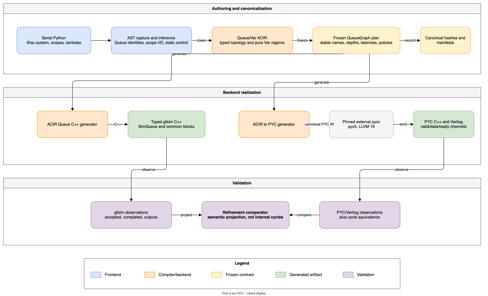

# Agentic Circuit Queue/Var v0.2 Specification Manual

| Field | Value |
| --- | --- |
| Specification | Serial Python, Queue/Var ACIR, typed gfsim, and PYC refinement |
| Target contract epoch | `0.2` |
| Status | Candidate implementation specification; epoch `0.2` is active on the upgrade branch |
| Public namespace | `ac` |
| Audience | Frontend, compiler, simulator, and RTL contributors |
| Design background | [Queue/Var v0.2 proposal](agentic-circuit-queue-var-v0.2-proposal.md) |
| Executable examples | [v0.2 examples](../../examples/v02/README.md) |

## Purpose

Agentic Circuit v0.2 lets an author describe a static circuit as serial-looking
Python. The author names values and lexical scopes; the compiler infers queue
connections, scope boundaries, typed payloads, and common hardware building
blocks. The same frozen ACIR graph can generate:

- a deterministic typed gfsim C++ model built around `SimQueue<T>`; and
- canonical PYC IR that external pinned `pycc` lowers to PYC C++ and Verilog.

This manual is the implementation-facing specification for teammates. It
defines the supported programming model, ACIR contracts, backend obligations,
examples, and current limitations. The longer
[proposal manual](agentic-circuit-queue-var-v0.2-proposal.md) records the design
reasoning and future inventory; this document records the executable v0.2
contract being stabilized.



The editable diagram source is
[`agentic-circuit-v0.2-pipeline.drawio`](images/agentic-circuit-v0.2-pipeline.drawio).

## Status and authority

The words **MUST**, **MUST NOT**, **SHOULD**, **SHOULD NOT**, and **MAY** are
normative requirements for the v0.2 candidate.

The global hard break from epoch `0.1` to `0.2` is active on the upgrade
branch. Producers emit exact epoch `0.2`; consumers reject epoch `0.1` before
interpreting the artifact. The toolchain provides no compatibility alias or
best-effort conversion.

When this manual and implementation disagree before the cutover completes, use
the following authority order:

1. machine-readable schema and MLIR ODS definitions;
2. verifier and conformance tests;
3. this manual;
4. proposal and planning documents.

The principal machine-readable and executable sources are:

- [`ACIRTypes.td`](../../include/acir/Dialect/ACIR/ACIRTypes.td) for Queue, Var,
  and collection types;
- [`ACIROps.td`](../../include/acir/Dialect/ACIR/ACIROps.td) for operation
  signatures;
- [`ACIROps.cpp`](../../lib/Dialect/ACIR/ACIROps.cpp) for semantic verification;
- [`QueueGraphPlan.cpp`](../../lib/CodeGen/QueueGraphPlan.cpp) for the frozen
  backend plan;
- [`opcodes-v0.2.json`](../../schemas/opcodes-v0.2.json) for the closed official
  building-block catalog and backend availability;
- [`queue.h`](../../include/gfsim/queue.h) and
  [`queue_blocks.h`](../../include/gfsim/queue_blocks.h) for gfsim behavior;
- [`test_queue_frontend_v02.py`](../../tests/python_frontend/test_queue_frontend_v02.py)
  for accepted and rejected Python syntax;
- [`test/ACIR`](../../test/ACIR) for ACIR conformance tests.

The live requirement-by-requirement status is tracked in the
[v0.2 issue closure matrix](../implementation/v0.2-issue-closure.md). A feature
listed in this manual is not considered issue-complete when that matrix still
marks part of its acceptance scope as partial or missing.

## Core mental model

### Serial Python elaborates a static graph

An `@ac.system` body is not an imperative program that runs once per simulated
cycle. The frontend parses its Python AST and treats statements as graph
construction in source order.

```python
@ac.system
def pipeline() -> None:
    incoming = ac.source(int)
    adjusted = incoming.apply(lambda item: item + 1)
    ac.sink(adjusted)
```

This source creates two Queue values and one persistent transform block:

```text
incoming Queue -> transform(item + 1) -> adjusted Queue -> sink
```

The frontend does not require explicit module input or output declarations.
`ac.source(...)` and `ac.sink(...)` define the current executable boundary, and
lexical uses determine scope inputs and outputs.

### Queue is state; Var is combinational value

`!ac.queue<T>` is a finite, typed, stateful FIFO channel. It has positive depth,
positive latency, occupancy, backpressure, stable identity, and commit-time
effects.

`!ac.var<T>` is an immutable, zero-latency value. It has no occupancy, capacity,
push, pop, or independent runtime identity. Lambda arguments, constants,
arithmetic results, comparisons, field projections, and immutable field updates
are Vars.

```text
!ac.queue<i64>                         stateful channel
!ac.var<i64>                           combinational scalar
!ac.queue<!ac.struct<@types::@Item>>   stateful typed channel
!ac.var<!ac.struct<@types::@Item>>     immutable token value
```

A Queue MUST have latency of at least one. A zero-latency Queue is invalid;
zero-latency logic belongs in a Var region.

### Mutable channel, immutable token

Queue state changes at commit. Token payloads do not mutate in place.

```python
# Valid: creates a new immutable token value.
next_item = item.with_fields(remaining=item.remaining - 1)

# Invalid: mutates the input object.
item.remaining -= 1
```

The frontend and backends MAY copy or move an immutable token internally, but
they MUST NOT expose mutable aliases that change a token already stored in a
Queue.

### Opcodes are common building blocks

The public `ac.*` inventory is closed and repository-owned. Users compose
common transport, computation, state, boundary, and observation blocks. They
MUST NOT define private opcodes, C++ providers, PYC providers, or raw Verilog
providers.

Application stages such as `decode`, `rename`, `dispatch`, and `retire` are
scope names or compositions. They are not generic ACIR opcodes.

Generate the canonical catalog directly from the shared backend contract table:

```sh
build/dev-llvm22/bin/acir-opcode-catalog
agentic-circuit schema opcode ac.transform
```

## Python authoring contract

### System declaration

A Queue/Var system uses `@ac.system` and takes no parameters. Inputs and outputs
are inferred from the body.

```python
import agentic_circuit as ac


@ac.system
def pipeline() -> None:
    value = ac.source(int)
    ac.sink(value)
```

The source file is compiled through AST capture. The queue primitives inside
the system body are syntax markers; ordinary Python execution of the body is
not the compilation path.

### Payload structures

Use `@ac.struct` to define a compile-time token layout.

```python
@ac.struct
class WorkItem:
    value: ac.u32
    route: ac.u2
    remaining: ac.u16
    valid: bool
```

The current frontend accepts these scalar field spellings:

| Python spelling | ACIR element type |
| --- | --- |
| `bool` | `i1` |
| `int` | `i64` |
| `ac.u1`, `ac.u2`, `ac.u4` | `i1`, `i2`, `i4` |
| `ac.u8`, `ac.u16`, `ac.u32`, `ac.u64` | corresponding integer width |
| `ac.s8`, `ac.s16`, `ac.s32`, `ac.s64` | corresponding integer width |

Field order is declaration order. Fields MUST be unique and annotated. The
current ACIR integer type freezes width but not signedness as a distinct type;
do not rely on unsigned comparison semantics until the signedness contract is
made explicit.

### Source and sink

`ac.source(T, depth=N, latency=L)` creates a Queue boundary with payload `T`.
`depth` and `latency` default to one and MUST be positive compile-time integers.

```python
incoming = ac.source(WorkItem, depth=8, latency=1)
ac.sink(incoming)
```

`ac.sink(queue)` consumes tokens from a Queue. A system MUST contain at least
one source Queue and at least one sink.

### Transform with `apply`

`queue.apply(lambda item: expression, depth=N, latency=L)` creates an
`ac.transform` block and one output Queue.

```python
updated = incoming.apply(
    lambda item: item.with_fields(
        value=(item.value + 1) * 2,
        remaining=item.remaining - 1,
    ),
    depth=4,
    latency=2,
)
```

The current lambda subset supports:

- the lambda parameter itself;
- integer and Boolean constants;
- structure field reads;
- `+`, `-`, and `*` over identical Var types;
- `==`, `!=`, `<`, `<=`, `>`, and `>=`;
- immutable `with_fields(...)` updates.

The lambda MUST take exactly one argument and MUST return the Queue payload
type. Function calls other than `with_fields`, mutation, I/O, allocation,
ambient state access, and arbitrary Python expressions are rejected.

### Lexical scope and inferred boundaries

`with ac.scope("name"):` defines ownership and hierarchy. It does not declare
ports.

```python
incoming = ac.source(int)

with ac.scope("frontend"):
    adjusted = incoming.apply(lambda item: item + 1)
    with ac.scope("inner"):
        completed = adjusted.apply(lambda item: item * 2)

ac.sink(completed)
```

The compiler infers:

- `incoming` as a borrowed input of `/frontend`;
- `adjusted` as a Queue owned inside `/frontend`;
- `completed` as an exported output of `/frontend/inner` and `/frontend`;
- parent ownership for an interconnect at the lowest common lexical ancestor.

Scope names MUST be non-empty, and one lexical path MUST NOT be declared twice.

### Multiple consuming uses

Queue consumption is destructive. If one Queue variable feeds multiple
`apply` statements, the frontend inserts `ac.broadcast` at the lexical lowest
common ancestor.

```python
incoming = ac.source(int)
left = incoming.apply(lambda item: item + 1)
right = incoming.apply(lambda item: item + 2)
```

The inserted broadcast is strict and atomic: it pops the input only when every
output can accept the token. It has no hidden per-output progress state.

### Explicit decoupled fork

Use `fork` when outputs may accept the token on different cycles.

```python
left, right = incoming.fork(outputs=2, depth=2, latency=1)
```

`ac.fork` retains one token and a per-output delivered mask until every output
has accepted that token. Each output receives the token exactly once. The input
is popped only after delivery to all outputs completes.

This distinction is normative:

| Block | Acceptance rule | Hidden progress state |
| --- | --- | --- |
| `ac.broadcast` | all outputs accept in one atomic firing | none |
| `ac.fork` | outputs may accept independently | per-token delivered mask |

### Route

`route` sends one token to exactly one statically declared output.

```python
scalar, vector, cube, tma = prepared.route(
    outputs=4,
    key=lambda item: item.route,
    depth=2,
    latency=1,
)
```

The output tuple arity MUST equal `outputs`. The selector lambda returns an
integer or enum-like Var. A selector outside `[0, outputs)` is a deterministic
runtime failure named `route_selector_out_of_range`; it is not wrapped or
clamped.

### Merge

`merge` combines two or more Queues with identical payload types.

```python
completed = scalar_done.merge(
    vector_done,
    cube_done,
    tma_done,
    policy="round_robin",
    depth=8,
    latency=1,
)
```

Supported policies are:

- `priority`: select the first ready input in source order;
- `round_robin`: begin from a committed cursor and advance the cursor after a
  successful transfer.

The output Queue applies ordinary capacity and latency rules.

### Reorder

`reorder` accepts out-of-order completions and releases them in monotonically
increasing key order. It is the generic ordering primitive used to compose a
ROB-like retirement path; `retire` itself remains an application scope.

```python
retired = completed.reorder(
    key=lambda item: item.sequence_id,
    capacity=64,
    start=0,
    depth=8,
    latency=1,
)
```

The key lambda MUST return an integer Var no wider than 64 bits. `capacity`,
`start`, output `depth`, and output `latency` are compile-time constants. The
non-negative `start` value MUST fit the key width. The
block backpressures when every entry is occupied and emits only the token whose
key equals the committed next key. Duplicate, negative, or already retired keys
are invalid.

### Observation

`ac.observe(queue)` reads the committed Queue head without consuming it and
without participating in backpressure.

```python
ac.observe(completed)
ac.sink(completed)
```

An observation-only use does not cause broadcast insertion. Observations may
record a new head when the token or committed pop count changes, but MUST NOT
alter functional state.

### Atomic group

Each ordinary `apply` is an atomic input-pop/output-push firing. Use
`with ac.atomic():` to group at least two independent direct Queue transforms.

```python
left = ac.source(int)
right = ac.source(int)

with ac.atomic():
    left_next = left.apply(lambda item: item + 1)
    right_next = right.apply(lambda item: item * 2)
```

All input Queues in the group MUST be unique. The grouped transform fires only
when every input can pop and every output can push; all effects commit or none
commit.

### Bounded feedback

The current runtime-loop form is one Queue rebinding through one `apply`.

```python
current = ac.source(WorkItem)

while current.remaining > 0:
    current = current.apply(
        lambda item: item.with_fields(
            value=item.value + 1,
            remaining=item.remaining - 1,
        ),
        depth=2,
        latency=1,
    )

ac.sink(current)
```

The frontend lowers this form to `ac.feedback` with a stateful feedback Queue.
The current compiler freezes `max_iterations = 1024`. When the condition is
false, the current token exits unchanged. When it is true, the immutable update
is recirculated. Exceeding the bound reports `feedback_iteration_limit`.

### Static collections

Queue collections have compile-time shape and membership.

```python
lanes = ac.array(
    2,
    lambda lane: ac.source(int, depth=lane + 1),
)
named = ac.map({"right": lanes[1], "left": lanes[0]})
active = ac.set({named["right"], named["left"]})

for lane in active:
    ac.sink(lane)
```

The current frontend supports:

- `ac.array(extent, lambda index: ...)` with positive static extent;
- `ac.map({...})` with unique compile-time `bool`, `int`, or non-empty `str`
  keys;
- `ac.set({...})` over unique Queue or nested collection members;
- nested collections;
- static indexing;
- compile-time iteration over a collection.

Map keys and set members are canonicalized. Frozen QueueGraph planning flattens
collections into statically named Queue members; it never creates a runtime
Queue pointer or host-order container dependency.

### Static control

`if True` and `if False` are elaborated statically. `for` over
`range(constant)` or a static Queue collection is expanded at compile time.

```python
if True:
    selected = incoming.apply(lambda item: item + 1)

for index in range(2):
    ac.sink(lanes[index])
```

A runtime Queue condition may use the symmetric form below. The condition MUST
lower to `ac.var<i1>`, both branches MUST consume the same Queue through one
`apply`, and both branches MUST assign the same fresh result name.

```python
if incoming.route == 0:
    selected = incoming.apply(
        lambda item: item.with_fields(value=item.value + 10)
    )
else:
    selected = incoming.apply(
        lambda item: item.with_fields(value=item.value + 20)
    )
```

The frontend lowers this statement to an official two-way `ac.route`, two
branch transforms, and a mutually exclusive priority `ac.merge`. More complex
runtime Queue control remains explicit through `route`/`merge`. Runtime topology
allocation is forbidden.

## ACIR type contract

### Immutable payload types

`!ac.var<T>` and `!ac.queue<T>` require an immutable ACIR payload type. They
MUST NOT recursively carry Queue, mutable list, function, channel, endpoint, or
other runtime-reference types.

Valid examples:

```mlir
!ac.var<i32>
!ac.queue<i32>
!ac.var<!ac.struct<@types::@WorkItem>>
!ac.queue<!ac.struct<@types::@WorkItem>>
```

Invalid examples:

```mlir
!ac.queue<!ac.var<i32>>
!ac.var<!ac.queue<i32>>
!ac.queue<!ac.list<i32>>
!ac.queue<(i32) -> i32>
```

### Static collection types

ACIR provides statically shaped collection types:

```mlir
!ac.array<4 x !ac.queue<i32>>
!ac.map<["cube", "scalar", "vector"], !ac.queue<i32>>
!ac.set<4 x !ac.var<i16>>
```

Array and set lengths MUST be positive. ACIR map keys are non-empty unique
strings in strict lexicographic order. Collection elements MUST be Queue, Var,
or another supported static collection with a valid fixed shape.

## ACIR operation contract

### Implemented common building blocks

The official graph-level catalog contains exactly these operations. Every entry
has both a typed gfsim realization and a PYC realization.

| Operation | Role | Queue arity | Static parameters | Core behavior |
| --- | --- | --- | --- | --- |
| `ac.source` | design | none to one | `depth`, `latency` | boundary producer |
| `ac.sink` | design | one to none | none | consuming boundary |
| `ac.observe` | observation | one to none | `name` | non-consuming, non-backpressuring probe |
| `ac.transform` | design | one or more to one or more | output depths and latencies | pure Var region plus atomic Queue transfer |
| `ac.broadcast` | design | one to two or more | output depths and latencies | strict atomic fanout |
| `ac.fork` | design | one to two or more | output depths and latencies | decoupled exactly-once fanout |
| `ac.route` | design | one to two or more | output depths and latencies | selector-controlled demultiplexing |
| `ac.merge` | design | two or more to one | `policy`, `depth`, `latency` | priority or round-robin arbitration |
| `ac.reorder` | design | one to one | `capacity`, `start`, `depth`, `latency` | bounded key-ordered retirement |
| `ac.feedback` | design | one to one | `depth`, `latency`, `max_iterations` | bounded stateful loop |
| `ac.scope` | design | variadic to variadic | symbol name | hierarchy boundary; PYC elaboration flattens it |

`ac.firing`, `ac.queue.peek`, `ac.queue.pop`, and `ac.queue.push` are lower-level
transactional primitives. They are normative ACIR operations, but they are not
independent QueueGraph building blocks and therefore do not appear in the
graph-level opcode catalog.

The closed inventory will grow with other common hardware blocks. New
application-specific opcodes and private provider identities are not an
extension mechanism.

### Transform example

The following excerpt is the canonical shape produced for a structure update:

```mlir
%output = ac.transform %input depths [2] latencies [1] {
^transform(%item: !ac.var<!ac.struct<@types::@Item>>):
  %value = ac.var.get %item field "value"
    : !ac.var<!ac.struct<@types::@Item>> -> !ac.var<i64>
  %one = ac.var.constant 1 : i64 as !ac.var<i64>
  %next_value = ac.var.add %value, %one : !ac.var<i64>
  %next = ac.var.with %item, %next_value field "value"
    : !ac.var<!ac.struct<@types::@Item>>, !ac.var<i64>
      -> !ac.var<!ac.struct<@types::@Item>>
  ac.transform.yield %next : !ac.var<!ac.struct<@types::@Item>>
} {ac.name = "output"}
  : (!ac.queue<!ac.struct<@types::@Item>>)
    -> !ac.queue<!ac.struct<@types::@Item>>
```

The region MUST have one Var block argument for each input Queue. All body
operations before `ac.transform.yield` MUST be pure. Yielded Var types MUST
match the payload types of the corresponding output Queues.

Input and output arity are independent. This two-input, one-output transform
consumes both heads and publishes the sum as one atomic transaction:

```mlir
%sum = ac.transform %left, %right depths [2] latencies [1] {
^transform(%left_item: !ac.var<i64>, %right_item: !ac.var<i64>):
  %value = ac.var.add %left_item, %right_item : !ac.var<i64>
  ac.transform.yield %value : !ac.var<i64>
} {ac.output_names = ["sum"]}
  : (!ac.queue<i64>, !ac.queue<i64>) -> !ac.queue<i64>
```

Neither backend may consume only one input or publish a partial output set.
The transform fires only when every input is valid and every output can accept
its corresponding result.

### Explicit firing example

Low-level Queue effects are legal only inside `ac.firing`.

```mlir
ac.firing(%input, %output) {
  %head = ac.queue.peek %input
    : !ac.queue<i32> -> !ac.var<i32>
  %value = ac.queue.pop %input
    : !ac.queue<i32> -> !ac.var<i32>
  ac.queue.push %output, %value
    : !ac.queue<i32>, !ac.var<i32>
  ac.firing.yield
} : (!ac.queue<i32>, !ac.queue<i32>)
```

Firing Queue operands MUST be unique. Every Queue effect MUST reference a
listed operand. One Queue may be popped at most once and pushed at most once in
one firing. A firing MUST contain at least one pop or push. `peek` reads the
same committed head without consuming it.

### Frozen logical identity

Every Queue-producing operation MUST carry exact frozen logical output names
before QueueGraph extraction:

- one result uses non-empty `ac.name`;
- multiple results use exact `ac.output_names` in result order;
- names are unique across the system;
- each Queue records payload type, scope path, depth, and latency.

The canonical QueueGraph JSON uses schema
`agentic-circuit-queue-graph-plan`, version `0.2`. Its ordering and bytes MUST
not depend on host addresses, hash iteration, allocation order, or checkout
path.

### Queue graph verification

A backend-ready Queue graph MUST satisfy:

- every Queue has exactly one producer;
- a Queue has no more than one consuming block;
- `ac.observe` does not count as a consuming block;
- fanout is represented by `ac.broadcast` or `ac.fork`;
- merge is represented by `ac.merge`, not multiple producers on one Queue;
- key-ordered retirement is represented by bounded `ac.reorder` state;
- every Queue depth and latency is positive;
- Queue logical identities are non-empty and unique;
- every Var region uses only supported pure operations and structured yields;
- topology and collection shape are compile-time fixed.

The current planner permits an otherwise unused Queue, although authoring code
SHOULD connect every functional path to a sink or another consuming block.

## Runtime execution contract

### Snapshot, proposal, arbitration, and Xfer

At one active epoch, gfsim follows this state discipline:

1. blocks read committed Queue state;
2. blocks propose pushes and pops without publishing them;
3. Queue-local arbitration resolves deterministic FIFO proposals;
4. Xfer commits accepted changes;
5. consumers observe committed results no earlier than the required later
   epoch.

One block MUST NOT observe another block's uncommitted proposal in the same
epoch. Independent Work order MUST NOT change architectural results,
diagnostics, committed statistics, or refinement observations.

### Capacity and latency

`SimQueue<T>` counts committed entries, delayed entries, and push proposals
against capacity. It rejects a push proposal that would exceed entry or byte
capacity.

Latency is exact and positive. A token accepted at epoch `t` by a Queue with
latency `L` becomes visible to downstream committed-state reads no earlier than
the boundary corresponding to `t + L`. Latency one is still stateful; it is not
a combinational wire.

### Atomic transfer

A transform fires only when all required input pops and output pushes can be
proposed. It computes output Vars from immutable input heads, proposes every
output, proposes every input pop, and commits the complete transaction through
Xfer.

No legal lowering may commit an input pop while a required output push is
rejected.

## Typed gfsim C++ lowering

The C++ backend MUST generate statically typed, queue-wired code.

```cpp
struct WorkItem {
  std::uint32_t value;
  std::uint8_t route;
  std::uint16_t remaining;
};

gfsim::SimQueue<WorkItem> input_queue_;
gfsim::SimQueue<WorkItem> output_queue_;
```

The generated system owns interconnect Queues. Child scope modules and common
blocks borrow typed Queue references. Sibling blocks MUST NOT own duplicate
instances of the same interconnect.

The implementation currently provides reusable templates for transform,
atomic transform, sink, observe, broadcast, fork, route, merge, and feedback.
Generated dispatch is static; generated runtime code MUST NOT discover opcodes
by strings, walk schemas, construct topology dynamically, or depend on Python
or MLIR libraries.

## PYC and Verilog lowering

Agentic Circuit owns `frozen ACIR -> canonical PYC IR`. A pinned external
`pycc` owns PYC verification, C++ emission, and Verilog emission. The pin is
recorded in [`pyc-v0.2.lock.json`](../../toolchains/pyc-v0.2.lock.json).

The current hardware lowering maps:

| ACIR concept | PYC/RTL realization |
| --- | --- |
| scalar or structure Var | combinational value or packed bundle |
| Queue | valid/data/ready channel with fixed storage |
| Queue depth and latency | fixed register/FIFO stages |
| transform | combinational data logic plus atomic handshakes |
| broadcast | all-output ready conjunction |
| fork | delivered-mask registers and independent output handshakes |
| route | selector decoder, valid demultiplexing, ready multiplexing |
| priority merge | fixed-priority selection |
| round-robin merge | selection plus committed cursor register |
| bounded feedback | committed valid/data/iteration registers and limit assertion |
| scope | static module hierarchy |
| observe | non-functional probe boundary |

PYC C++ and Verilog generated from the same PYC IR MUST be cycle equivalent.
Feedback uses explicit sequential state in PYC IR; it is not a combinational
unroll or a backend-specific loop.

## Cross-backend refinement

Typed gfsim and PYC/Verilog have different internal IR and may have different
internal cycle structures. Cross-backend validation compares a declared
semantic projection, including:

- input transaction sequence;
- accepted and completed transaction identities;
- output transaction sequence;
- architectural state and memory-visible effects when present;
- declared assertions and runtime failures.

Cross-backend refinement does not require equality of:

- internal Queue implementation;
- gfsim deltas;
- PYC registers and wires;
- every internal stage cycle;
- abstract versus detailed pipeline latency that is outside the declared
  observation contract.

## End-to-end example

The executable
[`davincioo_queue_model.py`](../../examples/v02/davincioo_queue_model.py)
uses only serial Python and common building blocks.

```python
import agentic_circuit as ac


@ac.struct
class WorkItem:
    value: int
    route: int
    remaining: int


@ac.system
def davincioo_queue_model() -> None:
    trace = ac.source(WorkItem, depth=8, latency=1)

    with ac.scope("frontend"):
        prepared = trace.apply(
            lambda item: item.with_fields(value=item.value + 1),
            depth=4,
            latency=1,
        )

    with ac.scope("dispatch"):
        scalar, vector, cube, tma = prepared.route(
            outputs=4,
            key=lambda item: item.route,
            depth=2,
            latency=1,
        )

    scalar_done = scalar.apply(lambda item: item.with_fields(value=item.value + 1))
    vector_done = vector.apply(lambda item: item.with_fields(value=item.value + 2))
    cube_done = cube.apply(lambda item: item.with_fields(value=item.value + 3))
    tma_done = tma.apply(lambda item: item.with_fields(value=item.value + 4))

    completed = scalar_done.merge(
        vector_done,
        cube_done,
        tma_done,
        policy="round_robin",
        depth=8,
        latency=1,
    )

    ac.sink(completed)
```

The checked-in executable adds explicit engine and retirement scopes. The
inferred graph is:

```text
trace -> frontend transform -> four-way route
                                  | scalar engine
                                  | vector engine
                                  | cube engine
                                  | tma engine
                             round-robin merge -> retire -> sink
```

### Generate canonical ACIR, QueueGraph JSON, and gfsim C++

Configure and build the native tools first:

```sh
scripts/bootstrap-dev.sh
cmake --preset dev-llvm22
cmake --build --preset dev-llvm22
```

Generate all canonical Queue artifacts:

```sh
PYTHONPATH=src .venv/bin/python tools/ac-queue-cxxgen.py \
  examples/v02/davincioo_queue_model.py \
  --system davincioo_queue_model \
  --acir-output build/davincioo_queue_model.ac.mlir \
  --plan-output build/davincioo_queue_model.queue-plan.json \
  --acir-opt build/dev-llvm22/bin/acir-opt \
  --queue-plan-tool build/dev-llvm22/bin/acir-queue-plan \
  --queue-cxxgen-tool build/dev-llvm22/bin/acir-queue-cxxgen \
  --output build/davincioo_queue_model.cpp
```

Check that the generated C++ is valid for the local compiler:

```sh
c++ -std=c++20 -I include -fsyntax-only build/davincioo_queue_model.cpp
```

### Generate PYC, PYC C++, and Verilog

Use the exact pyCircuit commit and LLVM version in the toolchain lock. Given a
matching local pyCircuit installation, run the canonical bundle command:

```sh
PYC_TOOLCHAIN_ROOT=/path/to/pycircuit/toolchain/install

.venv/bin/python tools/ac-queue-pyc-build.py \
  build/davincioo_queue_model.ac.mlir \
  --pycgen-tool build/dev-llvm22/bin/acir-queue-pycgen \
  --pycc "$PYC_TOOLCHAIN_ROOT/bin/pycc" \
  --toolchain-lock toolchains/pyc-v0.2.lock.json \
  --toolchain-metadata \
    "$PYC_TOOLCHAIN_ROOT/share/pycircuit/toolchain-metadata.json" \
  --cxx "$(command -v c++)" \
  --verilator "$(command -v verilator)" \
  --pyc-output build/davincioo_queue_model.pyc \
  --cpp-output-dir build/davincioo_queue_model-pyc-cpp \
  --verilog-output-dir build/davincioo_queue_model-verilog \
  --manifest build/davincioo_queue_model-pyc-manifest.json
```

The command validates the toolchain lock, emits PYC C++ and Verilog, runs C++
syntax checking and Verilator lint, and records deterministic artifact hashes.
Output paths MUST not already exist.

## Rejected examples

### Explicit system ports

```python
@ac.system
def illegal(input_queue):
    ...
```

Queue/Var system boundaries are inferred. A system with parameters is rejected.

### Zero-latency Queue

```python
incoming = ac.source(int, latency=0)
```

Use Var computation inside a lambda for latency-zero logic.

### Runtime topology

```python
for _ in range(item.value):
    queues.append(ac.source(int))
```

Queue count and collection shape MUST be known during AST elaboration.

### Runtime Queue condition

```python
if incoming:
    selected = incoming.apply(lambda item: item + 1)
```

Use `route` for runtime token selection.

### Dynamic Queue handle

```python
selected_queue = queues[item.route]
```

Runtime selection MUST lower to `route`, select, or arbitration logic. It MUST
NOT materialize a runtime Queue pointer.

### Private opcode or backend

```python
@ac.opcode
def private_scheduler(...):
    ...

ac.raw_verilog("assign ...")
```

Both forms are forbidden. Add a reusable common building block to the
repository-owned inventory with ACIR, gfsim, PYC, and conformance definitions.

## Diagnostics

Frontend Queue diagnostics use the `ACPY-QUEUE-*` family. They SHOULD identify
the source construct, violated static rule, and repair. Important current codes
include:

| Code | Meaning |
| --- | --- |
| `ACPY-QUEUE-001` | invalid system, assignment, statement, or positive constant |
| `ACPY-QUEUE-002` | unsupported payload or structure declaration |
| `ACPY-QUEUE-003` | invalid lambda or Var expression |
| `ACPY-QUEUE-004` | duplicate scope path |
| `ACPY-QUEUE-005` | invalid static collection or reference |
| `ACPY-QUEUE-006` | invalid route declaration |
| `ACPY-QUEUE-007` | invalid bounded feedback loop |
| `ACPY-QUEUE-008` | invalid merge |
| `ACPY-QUEUE-009` | invalid atomic group |
| `ACPY-QUEUE-010` | forbidden user opcode or backend provider |
| `ACPY-QUEUE-011` | runtime `if` is not a symmetric Boolean Queue branch |
| `ACPY-QUEUE-012` | invalid fork |

Native QueueGraph/backend diagnostics use the `ACLOWER-QUEUE-*` family and
MUST reject an invalid graph before emitting partial backend artifacts.

## Determinism requirements

Canonical ACIR, QueueGraph JSON, generated C++, PYC IR, manifests, and
observations MUST NOT depend on:

- Python hash iteration order;
- host pointer values or allocation order;
- unordered C++ traversal order;
- ambient checkout path;
- process ID or wall-clock time;
- runtime plugin discovery;
- arbitrary Python or Verilog execution.

Canonical ordering uses source occurrence, static collection order, frozen
logical identity, and declared arbitration policy.

## Current implementation boundary

The following v0.2 slices are implemented and tested:

- AST-based serial Python capture;
- immutable scalar and structure payloads;
- Queue/Var types and pure Var expressions;
- scopes with inferred Queue boundaries;
- transform, strict broadcast, decoupled fork, route, merge, reorder, observe,
  sink, explicit atomic transform, and bounded feedback;
- static arrays, maps, sets, static `if`, static loops, and symmetric runtime
  Queue `if` lowering through route/transform/merge;
- canonical QueueGraph extraction;
- typed gfsim C++ generation;
- PYC/Verilog lowering for transform, broadcast, fork, route, merge, reorder,
  bounded feedback, elaboration-time scope flattening, packed structures,
  atomic handshakes, and exact Queue latency;
- PYC C++ versus Verilog cycle equivalence and gfsim/PYC projected transaction
  comparison.

The following work remains before v0.2 is complete:

- finish lowercase component naming and removal of the remaining provider
  surfaces after the epoch and `ac.std.*` hard break;
- freeze the remaining common building-block inventory for state, memory,
  scheduling, reservation, credits, and barriers;
- preserve explicit signedness semantics beyond integer width;
- lower the remaining state, memory, and resource blocks through PYC;
- complete the DavinciOO functional and performance refinement contract;
- remove all transition-only provider and compatibility surfaces;
- run the complete release, sanitizer, install, determinism, replay, PYC,
  Verilog, and refinement audit.

The checked-in DavinciOO-like model now proves topology, typed payloads, finite
Queues, backpressure, deterministic C++ generation, the 15-record softmax
opcode/completion/retirement projection, and the 453-cycle bounded oracle. The
same frozen ACIR produces PYC C++ and Verilog with cycle-identical hardware
observations and the same projected output transactions. Dependency-wait time
is currently carried as an explicit per-token feedback budget; internal
rename/issue/ROB occupancy equivalence remains a future refinement layer.

## Contributor checklist

A change to the v0.2 public contract is complete only when it updates all
affected layers:

- Python accepted and rejected syntax;
- ACIR ODS type or operation definition;
- verifier and diagnostic;
- QueueGraph canonical plan;
- gfsim runtime semantics and typed C++ emission;
- PYC lowering or an explicit backend rejection;
- positive, negative, determinism, and round-trip tests;
- this manual and the relevant machine-readable schema;
- exact contract epoch and capability declarations when public syntax changes.

Do not document a backend-specific behavior as shared ACIR semantics. Do not
add an alias to ease the v0.2 hard break. Git history and release tags preserve
the old contract.
